---

copyright:

  years:  2016, 2019

lastupdated: "2019-05-07"

subcollection: vmware-solutions

---

# 前言
{: #vcscar-preface}

## 滑板運動語言簡介
{: #vcscar-preface-intro}

滑板玩家將移動及子移動組合成技巧，這些技巧採行的文法或語法係根據實際發生之動作的物理學而來；化學專門術語基於類似原因，也是這樣演變的。現在，地球某一端的滑板玩家可以透過文字將技巧的名稱傳送給另一端的另一位滑板玩家，並瞭解其複雜的移動。

語言的豐富性是由滑板運動本身的複雜度所造成。滑板的移動十分複雜，以可透過多種方式完成的許多基礎技巧為基礎，並透過數個變數反覆運算，以產生大量的組合。每個元件的字首-根-字尾結構都指出每個元素或移動的連結方式，並對應至滑板及其玩家的一組實際動量。力量的實際方向及機制決定可一起使用及不可一起使用的項目，即哪個項目採用該語法。

技巧可以透過板尾或板頭完成（*豚跳* 或*反豚跳*），而它們對應至玩家的前腳或後腳。滑板會以任一方向（順時鐘方向或逆時鐘方向）反覆運算三個軸的組合來進行翻轉、轉動及翻觔斗。玩家接著會將移動與滑板的移動配對，以根據方向、旋轉、「站立姿勢」以及跟著滑板翻轉轉動還是不跟著滑板翻轉轉動，將多個維度新增至反覆運算。

最後兩個變數應該會有一些其他說明。首先，*站立姿勢* 很容易與線性方向性混淆。滑板玩家全部都有原始站立姿勢（左腳或右腳往前）；因此，做出*反腳正滑* 技巧（反腳正滑站立姿勢）表示它是它的鏡像，與棒球中左右打擊位置都能擊球的打擊手類似。向後方向是因肢體動作而定；主要差異是「習慣使用左手或右手」或「習慣使用左腳或右腳」。因此，任何完成*反腳正滑* 的技巧都應該有更高的積分，不是因為它是向後的，而是因為所有運動功能都會回復至您較弱的一側或「錯誤」的腳。若只要做出技巧，往後或「正腳倒滑」只是將減號放在方向上，並包含所有相同的運動功能，這只是稍微困難一點。

對更高階滑板玩家而言重要的第二個細微差別套用至*向內* 或*向外* 翻轉，視滑板相對於身體的翻轉及旋轉方式（2 軸）而定。翻轉技巧會從滑板任一邊緣轉動腳的任一側：*腳尖翻板* 可以順時鐘方向轉動足尖，而*腳跟翻板* 執行相反動作，即跟著移動的自然流向翻轉，或不跟著移動的自然流向翻轉。因此，向內翻轉由於不大自然，而理所當然地採用不同的詞彙，稱為*滑板側翻加直翻*。因此，*反豚跳-向內-腳尖翻板* 與*反豚跳-滑板側翻加直翻* 相同；但由於它們所根據的精細度，需要更為精準的定義。

因此，這個字首-根-字尾結構的每個元件都可以分成三個二元元素：旋轉、方向及站立姿勢；有些技巧需要指定向內還是向外翻轉。如果沒有結合技巧的可能性，滑板將是小孩子的遊戲，而結合技巧使得反覆運算次數像滾雪球一樣地增加。多個基礎技巧可以組合成單一叢集，其中包含二個、三個或甚至多達五六個高階專業技巧。

到目前為止，實際反覆運算次數為數百次，而這只不過是一個開始；實際上的複雜性在於*滑板跑酷*，這讓組合數目爆炸成長為數以千計。

回到 90 年代早期，滑板玩家採用早期平地技巧，並將它們投射到「既有組織」環境：樓梯、架狀突出物、欄杆、堤岸、屋脊、扁鋼、野餐桌、花盆；這一切開啟了定義它們的維度。可將技巧及地形組合至陰陽連結的方式有無限多種，這可讓滑板玩家忙碌數十年。這也適用於*垂直滑板*，Tony Hawk 用斜坡及水池成為其典範。

雖然這些年來，已經確立大部分基礎技巧，但還是可以結合及調整它們，而這通常會優於專業人員本身的原有能力。這也是滑板不只是運動而是藝術的另一個原因。個別表現總是比原始表現出色。它也是已建立 Activision 野生成功影片遊戲經銷權的藝術家 *Tony Hawk 專業滑板玩家* 的加強引擎燃料，這幾乎持續十年，也同時從*電子藝術* 提升為競爭遊戲。

藉由訓練 Watson Assistant 模擬高階專業人員的思考過程，我們可以提供功能強大的工具，讓任何滑板玩家的創意思維更為進階，特別是在高階層次。雖然滑板運動的其餘部分較不複雜，但它是滑板運動具有不成比例影響的證明，而且它們也會採用使用慣例。因此，Watson Assistant 可能不只是輔助（如果不能轉變）這個新採用「奧林匹克」運動的創意表示，還會影響其他的藝術工作。

## 語言編纂
{: #vcscar-preface-codification}

與任何語言一樣，我們已開發一段時間，並挑選新的單字和用法，同時呈現偶發的冗餘和異常狀況。也就是說，此術語非常地一致、持久且具體。這具有指示性嚴謹且一致性，可透過機器學習轉換似乎無法解決的連續鏡頭轉換為文字問題。對於滑板玩家，複雜移動的每個細微差異都會建置到術語本身。事實上，此語言相當健全，因此不只只有滑雪者採用，衝浪者也會採用。

然而，對於所有這種複雜性及能力，語言編纂相當直接明確且精簡。每個*基礎技巧* 都有*方向性* 及*旋轉性* 元件，以及*落地* 元件，可決定它是否與下一個基礎技巧連結及其連結方式來形成組合，而這些是第四個*核心元素*。已附加另外兩個*修飾元*：一個*轉動字首* 設定玩家旋轉方向（順時鐘或逆時鐘方向），而另一個*倒板* 元件指定滑板如何相對於身體旋轉（向內或向外）。使用此編纂，可以遞迴地套用簡要規則集，容許任意長度的組合。

## 其他環境變數
{: #vcscar-preface-env-var}

現在，專業人員通常會花很多力氣來尋找他們練習技巧的地點。事實上，識別任何滑板玩家的項目有部分是將技巧調整為全新且具創造力之方式的創意能力，這通常會將滑板玩家帶到全世界。雖然有一些型錄地點（由社群饋入資訊）絕不會有的滑板運動應用程式，但已有建立可在此創意過程輔助任何滑板玩家（特別是專業人員）之應用程式的構想或技術。

本參照架構示範 Watson 及雲端如何使用滑板玩家在 YouTube、Google Images、線上雜誌（Thrasher、Transworld）、滑板玩家及視訊遊戲討論區上的大量線上出現狀況，最重要的是每天在全球最新技巧社交媒體上都會有無限制的技巧討論串，特別是在 Instagram 上。此外，沒有翻譯問題；此國際語言與電腦語言或數學類似，在全世界都會無縫地使用相同的名稱及使用慣例。

Watson Knowledge Studio 會根據特定滑板玩家的查詢，使用技巧說明、媒體構件、位置（地點）資訊等項目來更新 Discovery Service。聊天機器人的交談次數有限，而交談是由根據經驗豐富專業滑板玩家的任何創意及務實推理技巧所造成。因此，Assistant 可以回覆最近或最佳地點（位置）來執行特定技巧，或不僅針對該技巧回覆更廣泛的地形，使用相同根（即變異）完成的其他技巧也是一樣。

例如，滑板玩家可以要求 Watson Assistant 列出 *hardflip-to-backside-5-0* 的所有可能變異。此要求會從「語音轉文字」轉換為 Discovery Service，這不只回覆 *hardflip-to-grind* 變異，也會回覆變異所擷取的各種地形清單，因此，有助於其他項目，其可包括要依當地郵遞區號、依大小甚至可用性所叢集化的欄杆清單（例如在校園或公司）。系統位於可評估遭侵入風險的現有應用程式資料內。這類協助會對階式變數結果（例如這些結果）造成大量影響，以協助所有專業滑板玩家的創意生活。

## 雲端平台
{: #vcscar-preface-cloud-platform}

IT 系統產生新組合的創意層會提及滑板運動核心。不管我們在哪裏，它都可以跨全球帶入創意生活來激勵創新。
沒有 {{site.data.keyword.cloud}}，就無法達到此目的。

## 相關鏈結
{: #vcscar-preface-related}

* [vCenter Server on {{site.data.keyword.cloud_notm}} with Hybridity Bundle 概觀](/docs/services/vmwaresolutions/archiref/vcs?topic=vmware-solutions-vcs-hybridity-intro)
