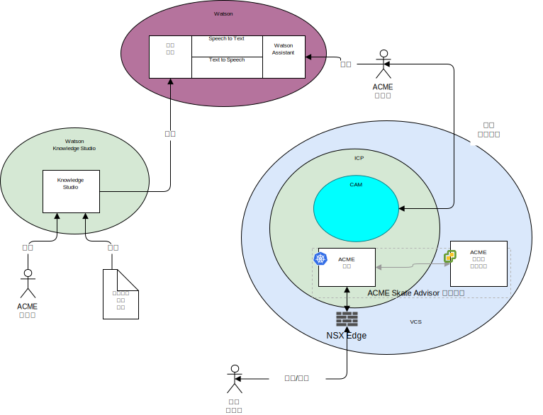

---

copyright:

  years:  2016, 2019

lastupdated: "2019-08-05"

subcollection: vmware-solutions

---

# 系統環境定義
{: #vcscar-syscontext}

下圖顯示此參照架構的系統環境定義。系統環境定義圖是一個圖表，它定義系統的主要元素、系統界限、與它互動的實體以及互動。它是高階圖，提供讀者系統起始視圖。

{: caption="圖 1. 系統環境定義" caption-side="bottom"}

以下是系統環境定義的核心元件：
- vCenter Server - VMware vCenter Server on {{site.data.keyword.cloud_notm}} 是 {{site.data.keyword.cloud_notm}} for VMware Services 實例，而此實例是從內部部署環境移轉虛擬機器 (VM) 的目標。它與內部部署「虛擬化」一起使用成為混合式環境，讓 VM 可以從某個環境移至另一個環境。
- {{site.data.keyword.icpfull_notm}} - {{site.data.keyword.icpfull_notm}} 是一個應用程式平台，用於開發及管理容器化應用程式。{{site.data.keyword.icpfull_notm}} 環境是整合環境，其中包括容器編排程式 Kubernetes、專用映像檔儲存庫、管理主控台、監視架構和圖形使用者介面，您可以集中在此介面中部署、管理、監視及調整應用程式。
- {{site.data.keyword.cloud_notm}} Automation Manager - CAM 是準備供企業使用的現成「基礎架構即程式碼」平台，其提供單一窗格來同時佈建 VM 型工作負載與 Kubernetes 型工作負載（自動化工作負載佈建），不論 VM 或容器和其基礎架構必要條件為何。
- Watson - Watson 是 IBM 的人工智慧及認知解決方案平台。
- Watson Knowledge Studio - Watson Knowledge Studio 提供一個模型供 Watson Discovery 使用。

## 動作者
{: #vcscar-syscontext-actors}

系統環境定義圖識別下列動作者：
* Acme 管理者 - 管理者負責應用程式的進行中部署及維護，包括下列進行中作業：
  - 訓練聊天機器人
  - 訓練 Discovery Service。
* 系統使用者 - 系統使用者是系統的使用者。使用者透過具有瀏覽器功能之裝置的瀏覽器，與系統通訊。

## 系統
{: #vcscar-syscontext-systems}

系統環境定義圖識別下列系統：
* Knowledge Studio - Watson Studio 是一種工具，用來設計系統的滑板運動語言，並使用此語言從實作滑板運動語言的 Web 中辨識文件。
* Speech to Text - 將語音轉錄為文字。此元件可接受來自正在執行聊天機器人之裝置的音訊，並將其轉換為文字，供 Watson 處理。
* Text to Speech - 將文字合成為語音。此元件接受來自 Skate Advisor 應用程式的文字，並將其轉換為語音，供正在執行聊天機器人的裝置播放。
* Discovery Service - 系統使用 Watson Discovery Service 來擷取符合所要求參數的「滑板運動記錄」。範例可能是 `List all records for the Casper Trick`。
* Watson Assistant - 系統使用 Watson Discovery Service 來擷取符合所要求參數的滑板運動相關內容。範例可能是 `List all records for the Casper Trick`。Watson Discovery 使用進階機器學習技術顯現來自所汲取內容的最相關通道。
* 資料庫 - Acme Skate Advisor 資料庫是在 vCenter Server 所管理的虛擬機器上進行管理。
* 應用程式容器 - 這些應用程式完成應用程式現代化旅程，且目前作為容器執行。對於此參照架構和此 Acme Skateboards 範例，其中一個容器化應用程式是 Web 伺服器，它是線上呈現工作負載的一部分。ACME 容器管理 Acme Web 應用程式及 ACME Skate Advisor 應用程式。
* NSX Edge - NSX Edge 是虛擬應用裝置，管理進出 vCenter Server 實例的南北向資料流量。
