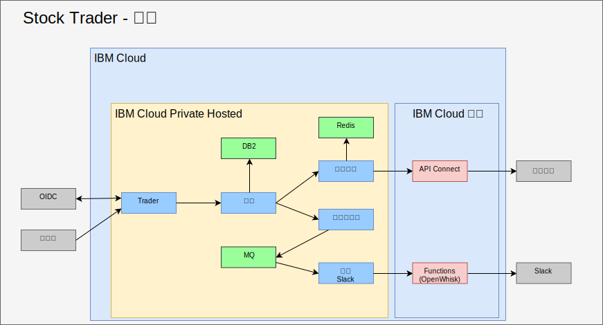
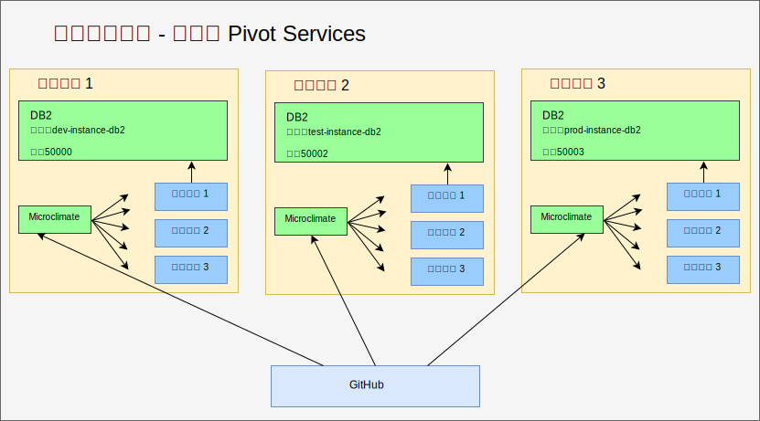
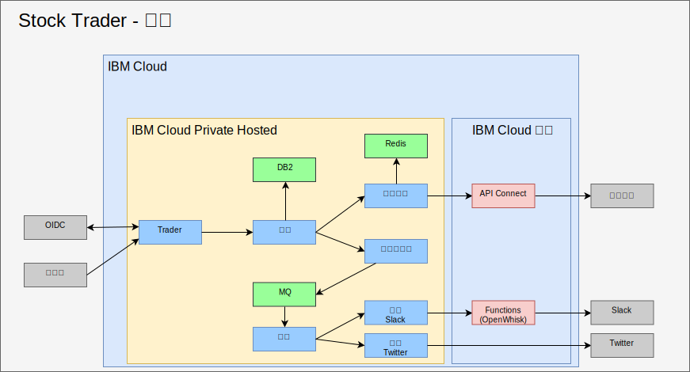

---

copyright:

  years:  2016, 2019

lastupdated: "2019-05-08"

subcollection: vmware-solutions

---

# 將中介軟體重構及新增至 IBM Cloud Private
{: #vcscontent-addmidware}

既然 Stock Trader 正在容器中執行，而且 Jane 滿意現行微服務，她及 Todd 就可以處理如何利用額外的功能來加強應用程式。藉由重構 Stock Trader 微服務來處理增加的活動及可調整性，他們都會看到將中介軟體新增至 {{site.data.keyword.cloud}} Private 的需求。某個中介軟體已存在於其資料中心，因此，在新增某個新中介軟體的情況下，會成為更換平台練習。

此解決方案重構可讓一般平台執行應用程式及必要服務，並引入更簡單的管理平面。

## 內容選項
{: #vcscontent-addmidware-content-choices}

{{site.data.keyword.cloud_notm}} Private 具有各種內容選擇，而 Todd 及 Jane 需要決定哪一個最符合其需求。Todd 查看 {{site.data.keyword.cloud_notm}} Private 型錄時，可試用大部分內容，但部分內容需要從 Passport Advantage 採購及下載。

* 工具鏈及運行環境
  - UrbanCode Deploy
  - Microclimate
  - Jenkins（開放程式碼）
  - IBM WebSphere Liberty（MicroProfile、Web 設定檔、Java Platform Enterprise Edition 設定檔）
  - Open Liberty（開放程式碼）
  - Node.js 運行環境（開放程式碼）
  - Swift 運行環境（開放程式碼）
  - nginx（開放程式碼）
  - IBM WebSphere Application Server for {{site.data.keyword.cloud_notm}} Private VM Quickstarter Community Edition

* 整合
  -	IBM Integration Bus
  -	IBM Integration Bus for Developers
  -	IBM DataPower Gateway Virtual Edition
  -	IBM DataPower Gateway for Developers
  -	IBM API Connect Professional
  -	IBM API Connect Enterprise
  -	IBM App Connect Enterprise Developer Edition
  -	IBM App Connect Enterprise 11.0.0

* 資料科學及商業分析
  -	IBM Data Science Experience Local
  -	IBM Data Science Experience Developer Edition
  -	IBM Watson Explorer Deep Analytics Edition
  -	IBM PowerAI（ILAN 授權，支援供應項目可用）
  - IBM PowerAI Vision

* 資料控管及整合
  -	IBM InfoSphere Information Server for evaluation Mobile
  -	IBM Mobile Foundation

* 連線功能
  -	IBM Voice Gateway Developer Trial

* 應用程式現代化工具
  -	IBM Transformation Advisor

* 傳訊
  -	IBM MQ Advanced
  -	IBM MQ Advanced for Developers
  -	Rabbit MQ（開放程式碼）
  -	IBM Event Streams Tech Preview（根據 Apache Kafka）

* 數位商業自動化
  -	IBM Operational Decision Manager
  -	IBM Operational Decision Manager for Developers
  -	IBM FileNet Content Manager 5.5
  -	IBM Content Foundation 5.5

* 資料服務
  -	IBM Db2 Direct Advanced Edition/AESE（含 Data Server Manager）
  -	IBM Db2 Dev-C
  -	IBM Data Server Manager（適用於 Db2 Dev-C）
  -	IBM Db2 Warehouse Enterprise
  - IBM Db2 Warehouse Dev-C
  -	IBM Cloudant Developer Edition
  -	MongoDB（開放程式碼）
  -	PostgreSQL（開放程式碼）
  -	MariaDB（開放程式碼）
  -	Galera 叢集作業（含 MariaDB）（開放程式碼）
  -	Redis（開放程式碼）

* HPC/HPDA
  -	IBM Spectrum LSF Community Edition
  -	IBM Spectrum Symphony Community Edition
  -	IBM Spectrum Conductor Technical Preview

* 多雲端管理
  -	{{site.data.keyword.cloud_notm}} Automation Manager

* Watson
  -	IBM Watson Compare & Comply: Element Classification
  -	Compliance Assist

* 管理
  -	IBM Netcool - 整合（Probe for {{site.data.keyword.icpfull_notm}} Services - 記載事件及監視警示）
  - {{site.data.keyword.cloud_notm}} App Management 2018.2.0
  -	IBM Netcool - 整合（探測以管理「{{site.data.keyword.icpfull_notm}} 事件」。隨 IBM Netcool Insights 產品銷售）
  - {{site.data.keyword.cloud_notm}} Event Management for IBM Cloud Private（ILAN 授權從型錄探索及試用）
  - IBM Operations Analytics Predictive Insights Mediation Pack（管理 {{site.data.keyword.icpfull_notm}} 監視度量值。ILAN 授權從型錄探索及試用）-	IBM Operations Analytics Predictive Insights Mediation Pack（隨 Predictive Insights 產品銷售）

* 網路
  -	F5 BIGIP Controller（開放程式碼）
  -	Calico BGP-Peer（開放程式碼）
  -	strongSwan IPSec VPN（開放程式碼）

* Storage
  -	IBM PowerVC FlexVolume Driver（開放程式碼，並受 PowerVC 產品支援）
  - 含 Heketi 生命週期管理的 GlusterFS 儲存空間叢集（開放程式碼）
  -	容器儲存空間介面 (CSI) 範例 NFS
  -	驅動程式（開放程式碼）
  -	Rook Ceph Cluster（開放程式碼）

* 工具
  -	Web Terminal（開放程式碼）
  -	Skydive - 網路分析器（開放程式碼）

對於 Stock Trader，根據 Jane 的解決方案架構，Todd 將從 [Db2](https://cloud.ibm.com/catalog/services/db2-hosted)、[MQ](https://cloud.ibm.com/catalog/services/mq) 及 [Redis](https://cloud.ibm.com/catalog/services/databases-for-redis) 開始。

## 新增中介軟體
{: #vcscontent-addmidware-add-middleware}

若要將中介軟體新增至 {{site.data.keyword.cloud_notm}} Private，請在型錄中尋找 [Helm 圖表](https://github.com/IBM/charts/blob/master/stable/ibm-microclimate/README.md)，並閱讀 Readme 檔，然後繼續安裝。

對於 Stock Trader，Todd 決定新增所有中介軟體。下列資訊彙總 Todd 必須針對他想要 Jane 使用之每個中介軟體所執行的作業。

### Db2
{: #vcscontent-addmidware-db2}

Todd 從 Db2 開始，因為他們已使用 Db2，而且可以針對每個解決方案專用容器型 Db2。

Todd 已備妥 {{site.data.keyword.icpfull_notm}}，因此已定義其 Pod 安全原則。Todd 可以專注於建立 Docker 映像檔取回密碼：

`kubectl create secret docker-registry db2dockerregistry
--docker-username=dockeruser
--docker-password=XXXXXXXX-XXXX-XXXX-XXXX-XXXXXXXXX
--docker-email=dockeruser@email.com --namespace=default`

最後，Todd 在決定使用 NFS 之後，根據 Readme 檔需求來建立 NFS 磁區：

請移至 {{site.data.keyword.icpfull_notm}} 儀表板，並建立「持續性磁區」。多大？請查看 Readme 檔以瞭解：

`capacity=20Gi
RWO
type=NFS
server = nfs.server.ip.address
path = /shared/db2trader1`

在型錄使用者介面中，搜尋 "Db2"，然後按一下 ibm-db2oldp-dev
請檢閱 Readme 檔，然後按一下「配置」。

在「配置」區段中，有一個「快速入門」區段及「所有參數」區段。開啟「所有參數」，因為 Todd 需要輸入其他配置：

*	版本名稱 = db2trader1
*	名稱空間 = default
*	同意授權
*	資料庫名稱 = trader
*	密碼名稱 = db2dockerregistry
*	服務名稱 = db2trader1-ibm-db2oltp-dev
*	服務類型 = NodePort
*	埠 = 50000
*	db2 實例名稱 = db2inst1
*	db2 實例名稱的密碼 = xxxxxx
*	是（勾選）啟用此部署的持續性

在 Db2 執行之後，Todd 或 Jane 需要建立 Stock Trader 解決方案所使用的表格。

### MQ
{: #vcscontent-addmidware-mq}

Todd 及 Jane 需要傳訊軟體，而且，因為他們已使用 MQ，所以這是一個絕佳選項。此外，它還可以在小覆蓋區中執行，並可針對每個「開發人員」啟動開發版本，以節省寶貴的「正式作業」資料流量。安裝 MQ 相當簡單。Todd 建立儲存空間的方式就像使用 Db2 時一樣，然後安裝 Helm 圖表：

{{site.data.keyword.icpfull_notm}} 儀表板 > 型錄 > 開始在 MQ 中鍵入 > 選取 ibm-mqadvanced-server-dev 請檢閱 Readme 檔，然後按一下「配置」
提供或驗證下列輸入值：

`release name = mqtrader1
target namespace = stock-trader
accept license
enable persistence
data PVC size = 2Gi
Service type = NodePort
Queue manager name = stocktrader
Admin pw = mq1pw
App password = LEAVE BLANK`

Todd 一開始會從使用者介面中選取要在中介軟體取得的 NodePort。最後，Todd 可以使用 ClusterIP，只讓叢集內的 Pod 到達中介軟體。

若要配置 MQ 以使用 Stock Trader，Todd 會開啟「MQ 管理」使用者介面，而這與 VM 版本的名稱完全相同。

### Redis
{: #vcscontent-addmidware-redis}

即使 Stock Trader 正在 {{site.data.keyword.cloud_notm}} Private Hosted 上執行，只要他們真正關注的是大部分工作在前一天結束時的股票，他們還是會擔心股票報價服務延遲。為了協助改善效能，他們新增 Redis 快取。

此部署使用 ibm-charts 中的 ibm-redis-ha-dev 圖表。

依預設，此圖表會安裝六個 Pod：一個主節點、兩個從屬節點及三個 Sentinel。這是 Kubernetes 中的一個不錯的備援範例，其中，有多個 Pod 在多個工作者節點之間共同運作，即使工作者節點位於多個子網路時也一樣。

配置很簡單，因此 Todd 會輸入要在其中安裝的名稱空間，並開始安裝。

## 重構 Stock Trader
{: #vcscontent-addmidware-refactor-stock-trader}

重構 Stock Trader 是 Jane 的重要步驟。Todd 在忙著將中介軟體新增至 {{site.data.keyword.cloud_notm}} Private 的同時，Jane 已重構她的解決方案，以針對 Kubernetes 及雲端行為進行最佳化。

例如，Jane Jane 在轉變 Stock Trader 時，她已取得 .war 檔案，並將每個 .war 檔案新增至 Liberty 容器，但使用 WebSphere Application Server Network Deployment 配置指向資料來源。它是一個不錯的起點，而且 Jane 的應用程式會立即排定及編排 Kubernetes 的值。

有許多其他好處來自 Kubernetes 世界並由 Jane 提供的微服務（重新編碼及建置）。

為了最佳化，Jane 已採取下列步驟：
-	更新她在程式碼儲存庫中的程式碼（Jane 已使用 GitHub Enterprise）
-	已新增管線（Jane 已使用 Jenkins）
-	使用 Maven 所建置

下列是 Jane 的[程式碼儲存庫](https://github.com/IBMStockTrader/) 範例，以及 Jenkins 檔案、server.xml 及其他檔案。備妥之後，Jane 可以透過密碼自由地編碼額外功能，以存取 ODM 及 Watson 這類服務以及作為 GitHub 中個別儲存庫的其他微服務。

### 新增密碼
{: #vcscontent-addmidware-add-secrets}

既然 Jane 已重構 Stock Trader 微服務，她就需要一種摘錄服務名稱、使用者 ID 及密碼的方法，讓其應用程式在部署時可以在未將特定名稱寫在程式並重新建置應用程式的情況下挑選服務的唯一詳細資料。

使用 Kubernetes 密碼，Jane 在每個密碼內配置一個明確定義的密碼名稱及參數，以確保在部署微服務時，會挑選唯一的主機名稱、使用者 ID、密碼或任何其他機密認證，讓其應用程式成為可攜式。

Jane 想要統一的程式碼庫，即使 Stock Trader 可在多個雲端上執行也是一樣。下圖中的密碼 Db2 具有不同的遞送詳細資料，但格式相同。Jane 的組合微服務在部署時會尋找 Db2 密碼端點參數，以連接至適當的 Db2 實例。Stock Trader 應用程式不在意它在 VMware 虛擬機器中、容器化服務中執行，還是作為雲端管理的服務執行。

## 結果
{: #vcscontent-addmidware-result}

因為 Jane 已確定重構其 Stock Trader 解決方案，而且 Todd 將中介軟體安裝至 {{site.data.keyword.cloud_notm}} Private Hosted，所以所有核心 Stock Trader 解決方案都是在專用雲端中執行。Jane 現在新增更多微服務，例如 Twitter 通知服務。Istio 遞送規則透過內部 Slack 頻道或公用 Twitter 頻道，啟用動態忠誠度層次傳訊。

## 相關鏈結
{: #vcscontent-addmidware-related}

* [vCenter Server on {{site.data.keyword.cloud_notm}} with Hybridity Bundle 概觀](/docs/services/vmwaresolutions/archiref/vcs?topic=vmware-solutions-vcs-hybridity-intro)
