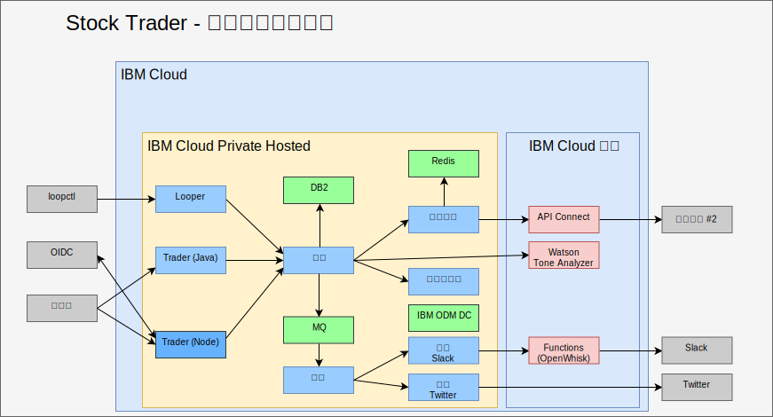

---

copyright:

  years:  2016, 2019

lastupdated: "2019-08-05"

subcollection: vmware-solutions

---

# 使用 AI、分析及其他公用雲端服務強化
{: #vcscontent-aianalytics}

強化 Stock Trader 不是一次性步驟。對於 Todd 及 Jane，這是反覆運算處理程序。在下圖中，您會看到 Jane 已使用 ODM 決策中心來新增 Watson Tone Analyzer 服務及忠誠度層次規則。下列項目強調顯示如何強化 Stock Trader。

## AI Watson Tone Analyzer
{: #vcscontent-aianalytics-ai-watson}

下列範例是強化應用程式的簡單方法，但功能更為強大。Jane 瀏覽 [{{site.data.keyword.cloud}} 型錄](https://cloud.ibm.com/catalog)中的 [AI](https://cloud.ibm.com/catalog?category=ai) 及 [Analytics](https://cloud.ibm.com/catalog?category=analytics) 服務，並找到內容豐富的型錄。

Jane 選取 [Tone Analyzer](https://cloud.ibm.com/catalog/services/tone-analyzer)（選擇「標準」方案），然後提供要呼叫的認證。

Jane 已重構 Stock Trader，而且只會建立 Tone Analyzer 的 Kubernetes 密碼。因此，即使 Jane 變更方案或地區，還是不需要重建程式碼。

透過重構，Jane 已在不干擾使用者體驗的情況下，實驗各種使用者介面架構。因此，有新的使用者介面可供使用，而且可用來協助瞭解使用者意見的語氣。

在未來，Jane 可以根據可用於在專用雲端實例 ({{site.data.keyword.cloud_notm}} Private) 中執行的各種分析服務，提供預測股票建議。

## 忠誠度層次商業規則
{: #vcscontent-aianalytics-loyalty-rule}

一開始，Jane 在程式碼中有其邏輯，可判斷可能提高忠誠度的貨幣金額。不過，重複收到來自 Stock Trader 行銷總監的範圍變更要求之後，Jane 已決定將該決策卸載到行銷總監可在沒有 Jane 參與的情況下進行變更的商業規則。

Jane 已與新增[服務](https://cloud.ibm.com/catalog/services/decision-optimization)的 Todd 討論，然後建立出該決策。

現在，只要行銷活動不需要變更任何程式碼即可繼續，行銷總監 Margaret 就可以登入及變更忠誠度層次範圍。

## 新的股票服務
{: #vcscontent-aianalytics-new-stock-service}

您可能注意到股票服務已變更。當公用服務變更擁有者或其 API 結構時，就可能發生此情況。值得慶幸的是，Jane 使用了 [API Connect](https://cloud.ibm.com/catalog/services/api-connect)。
一開始，她使用 API Connect 來簡化原始股票服務的回應，因為很難從給予她的原始 API 接收及格式化她想要的資料。

現在，Jane 很滿意，因為當她變更股票服務時，就已變更它與她所建立的簡化 API 的對映方式，而且她的程式碼甚至不需要重新啟動。Stock Trader 解決方案只會持續從相同的 API 要求資料，就像它未變更一樣。所有 API 變更都是在幕後遮罩處理。

此外，透過 API Connect 中的監視和計量，Jane 可以追蹤誰正在使用她的簡化 API。
