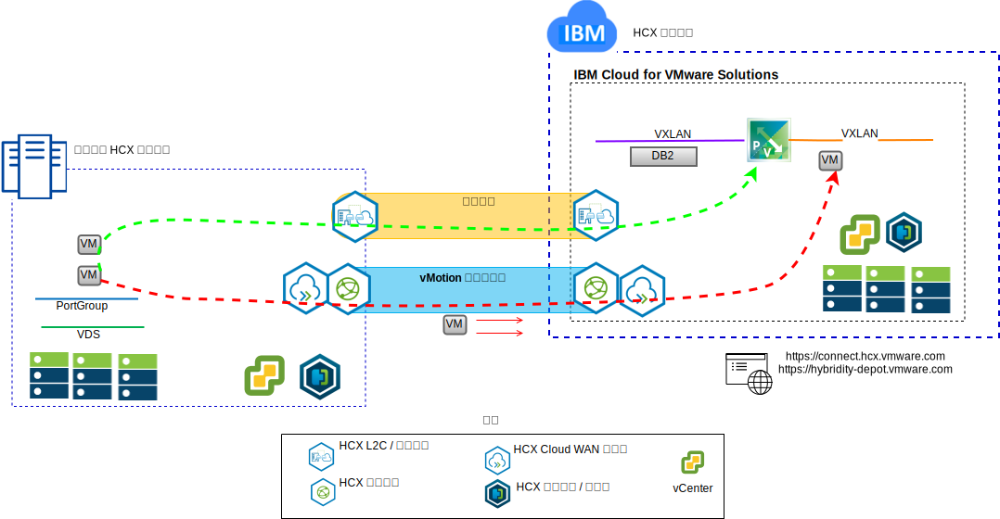

---

copyright:

  years:  2016, 2019

lastupdated: "2019-02-15"

subcollection: vmware-solutions

---

# 將 Stock Trader VM 提昇及轉移至 IBM Cloud
{: #vcscontent-hcx}

Todd 想要將其內部部署 VMware SDDC 實例無縫延伸到 VMware vCenter Server on {{site.data.keyword.cloud}}，以作為其現代化旅程中的第一個步驟。企業必須持續啟動及執行，而且關閉時間必須保持最低。

VMware vCenter Server on {{site.data.keyword.cloud_notm}} with Hybridity Bundle 能夠在 vCenter Server 實例與內部部署 VMware 虛擬化資料中心之間建立無縫連線。

vCenter Server with Hybridity Bundle 元件（其部署為 {{site.data.keyword.cloud_notm}} VMware 目標網站中的虛擬機器）能夠建立與安裝至對等節點內部部署來源網站之 HCX 元件的連線。

圖 1. vCenter Server with Hybridity Bundle

Hybridity 會建立內部部署與 {{site.data.keyword.cloud_notm}} 之間的鬆散耦合交互連接，並啟用下列功能：

* 簡單交互連線 - 可透過任何實體連線（包括公用網際網路、專用 VPN 或直接鏈結），輕鬆建立邏輯網路連線。
* 第 2 層延伸 - 內部部署網路延伸至雲端，並包括內部部署子網路及 IP 定址。
* 加密 - 在兩端之間安全地加密網路資料流量。
* 最佳化網路 - 選取最佳連線，並有效率地溢滿連線，讓網路資料流量儘可能地快速移動。
* 刪除重複資料 - 可讓網路資料流量減少達 50%。
* 智慧型遞送 - 當工作負載移動時，鄰近遞送可以變更網路閘道，讓網路資料流量使用目標站台閘道，而不會回流到起始站台。
* 零關閉時間移轉 - 可以使用 vMotion 將執行中系統移至雲端（或從雲端移回）。
* 排定的移轉 - 可以將任意數目的虛擬機器抄寫至目的地站台，然後在該站台上依指定時間啟動，並取代起始站台上所執行的系統。
* 安全原則的移轉 - 如果在內部部署使用 NSX，則任何安全原則、防火牆及其他安全項目都會隨著工作負載一起移動。

Todd 可以將 Stock Trader 從其內部部署 VMware 環境移轉至 VMware on {{site.data.keyword.cloud_notm}} 環境，並滿足極短或沒有任何關閉時間且不需重新配置應用程式的需求。

## 相關鏈結
{: #vcscontent-hcx-related}

* [vCenter Server on {{site.data.keyword.cloud_notm}} with Hybridity Bundle 概觀](/docs/services/vmwaresolutions/archiref/vcs?topic=vmware-solutions-vcs-hybridity-intro)
