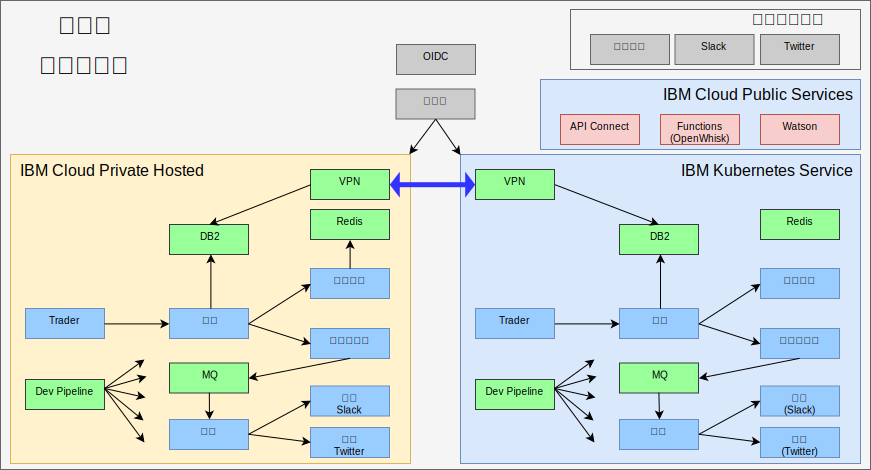

---

copyright:

  years:  2016, 2019

lastupdated: "2019-08-05"

subcollection: vmware-solutions

---

# 使用 IBM Cloud Kubernetes Service 的 True Hybrid 
{: #vcscontent-iks}

隨著 Jane 的測試團隊擴充，她想要提供一個測試環境來執行應用程式主要部分，但仍然使用其環境中原有的資料。Jane 想要讓她的測試團隊專注於測試應用程式，而不是管理 Kubernetes 叢集。Jane 及 Todd 決定使用 [{{site.data.keyword.cloud}} Kubernetes Service](https://www.ibm.com/cloud/container-service) 實例，而且 Jane 在未變更程式碼的情況下於其中部署 Stock Trader。

Todd 接著新增 strongSwan VPN，以在每個叢集的專用網路之間進行連接。

