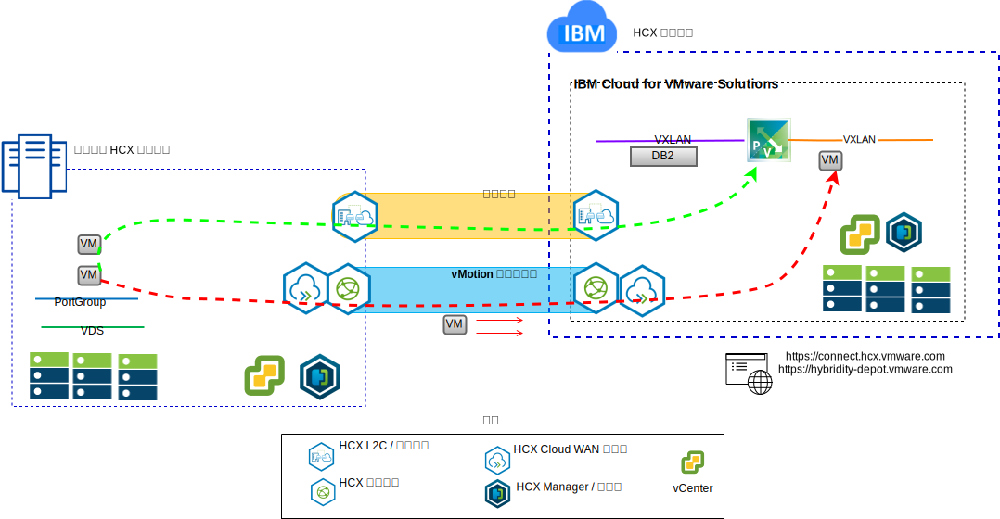

---

copyright:

  years:  2016, 2019

lastupdated: "2019-02-16"

---

# VMware 混合雲端服務簡介
{: #vcshcx-intro}

VMware 混合雲端服務 (HCX) 可讓 vSphere 軟體定義的資料中心 (SDDC) 的不同實例在各種網路類型之間交互作業。這些包括 LAN 或 WAN（無論在公用網際網路上是否受到保護）。HCX 設計的宗旨是要解決安全、相容性、複雜性和效能問題，當您嘗試達到多重實例、多網站部署 vSphere，跨越內部部署和雲端提供者界限進行延伸時，會遇到這些問題。

圖 1. VMware 混合雲端服務

因此，HCX 是在 {{site.data.keyword.cloud}} 內的完全自動化 vSphere 供應項目與 vSphere 的任何其他已部署實例之間進行交互作業的較好方法。HCX 現在是 {{site.data.keyword.vmwaresolutions_short}} 內一個完整整合的供應項目。

本手冊是專門針對 HCX 的部署和作業而提供，其中包括目前大家所接受和瞭解的最佳作法及疑難排解。由於 HCX 是利用敏捷開發方法而開發，因此，請勿使用本手冊作為受支援版本或受支援平台的事實上來源。

## 相關鏈結
{: #vcshcx-intro-related}

* [vCenter Server on {{site.data.keyword.cloud_notm}} with Hybridity Bundle 概觀](/docs/services/vmwaresolutions/archiref/vcs?topic=vmware-solutions-vcs-hybridity-intro)   
