---

copyright:

  years:  2016, 2018

lastupdated: "2018-10-30"

---

# 應用程式現代化概觀

下圖顯示 Acme Skateboards 將部署的應用程式現代化參照架構，在此系列文件中會有深入說明。

圖 1. 架構概觀圖

此混合式架構可讓 Acme Skateboards 執行下列作業：
- 以極少的關閉時間或不需要關閉時間，即可將 VMware VM 從內部部署移轉到 IBM Cloud，且不需要重新配置應用程式。
- 可讓 Acme Skateboards 專注在將較簡單的 Web 介面和中介軟體容器化，同時允許較複雜的資料庫保持作為 VM，而開始應用程式現代化旅程。
- 運用 Cloud Automation Manager (CAM) 來編寫 Infrastructure as Code (IaC)，以組合並編排從 VM 和容器建立的服務，使其與 DevOps 工具鏈和 ITSM 解決方案整合。

參照架構具有下列主要元件：
- **內部部署虛擬化** -  這是目前管理 Acme Skateboards VM 的 VMware 叢集。目前就是由這些 VM 來管理將要現代化的應用程式。此叢集必須符合 [VMware HCX on IBM Cloud 解決方案架構](https://www.ibm.com/cloud/garage/files/HCX_Architecture_Design.pdf)的必要條件，才能執行 HCA。HCX 會將內部部署網路延伸至 IBM Cloud 中，讓客戶可以將 VM 移轉至在 IBM Cloud 上執行的 VMware vCenter Server on IBM Cloud (VCS) 實例中，並視需要移轉回來。

- **IBM Cloud for VMware Solutions** – VCS 實例提供必要的基礎 VMware 構成要素，例如 vSphere、vCenter Server、NSX-V 和儲存空間選項（包括 vSAN 或 IBM Cloud Endurance 儲存空間），以自動部署「VMware 軟體定義資料中心 (SDDC)」解決方案。VMware 叢集是移轉 VM 的目標，也是 ICP 所管理容器中部分現代化應用程式的目標。VCS 中的主要元件如下：
    - **NSX-V** - NSX-V 是 VCS 中的網路虛擬化層級，可為 Acme Skateboards VM 提供網路層疊。NSX-V 會啟用 BYOIP，並將工作負載網路與 IBM Cloud 網路隔離開來。NSX-V 是由 HCX 進行程式設計，以建立 Acme Skateboards 要從內部部署延伸的網路。

    - **NSX-T** - NSX-T 提供一組通用的工具，可為容器和 VM 進行網路和安全管理。NSX-T 與 Kubernetes Container Networking Interface (CNI) 完全相容，並與 CNI 整合以提供容器網路。NSX-T 提供讓現代化應用程式使用的層疊網路，並取代 ICP 和 IKS 原本使用的 Calico。

- **IBM Cloud Private** - ICP 是用來開發及管理容器化應用程式的應用程式平台。ICP 是整合的環境，其中包括容器編排程式 Kubernetes、專用映像檔儲存庫、管理主控台、監視架構，以及圖形使用者介面，Acme Skateboards 可以集中在此介面中部署、管理、監視及調整其應用程式。VCS 實例會管理 ICP 元件、主節點、工作者節點等等，並且以 VM 的形式執行它們。ICP 可管理：
    - **IBM Cloud Automation Manager** – CAM 是準備供企業使用的現成 Infrastructure as Code (IaC) 平台，它提供單一窗格，可以直接使用範本將 VM 工作負載以內部部署方式佈建或是佈建在 VCS 上，同時將 Kubernetes 工作負載佈建在 ICP 或 IKS 中。CAM 是在 ICP 之上執行的 Docker 化應用程式，針對授權、角色型存取控制 (RBAC) 和其他功能緊密整合。
    - 想要部署在這個環境中的容器化 Acme Skateboards 應用程式。

- **IBM Kubernetes Service** – IKS 可讓 Acme Skateboards 將其現代化的應用程式部署在執行於 Kubernetes 叢集的 Docker 容器中。主節點完全由 IBM 管理，而工作者節點儲存區中的工作者節點會部署到與其 VCS 實例相同的 IBM Cloud 帳戶中。工作者節點可以是：裸機、公用或專用的虛擬伺服器實例。Calico 會自動安裝並配置在 IKS 中。Calico 為容器提供安全的網路連線功能，而且配置在 IKS 中，可將 IP-in-IP 封裝用於在子網路之間傳輸的封包，並針對從容器送出的連線使用 NAT。

- **Direct Link** – IBM Cloud Direct Link 使用 Acme Skateboards 的 WAN 提供者將其資料中心連接至 IBM Cloud，以提供可靠、低延遲、安全的網路連線。此連線提供：
    - 從企業使用者存取雲端管理的應用程式。
    - 內部部署 VM 與雲端 VM 之間的 VM 間資料流量。
    - 內部部署資料中心與雲端 VM 中，舊式系統之間的資料流量。

## Acme Skateboards 的主要優點

VMware vCenter Server on IBM Cloud (VCS) 提供 VMware vSphere、vCenter Server、NSX 和共用儲存空間選項（包括 vSAN）等必要的基礎構成要素，以彈性架構最適合客戶工作負載的「VMware 軟體定義資料中心 (SDDC)」解決方案。

總結來說，IBM Cloud for VMware 供應項目會：

* 將採購、架構、實作及部署資源所需的時間從數週或數個月縮減為數小時，以加速將 IT 專案交付給開發人員和事業單位。
* 利用受管理專用雲端中的專用 Bare Metal Server 來加強安全，包括將專用端點部署至 IBM Cloud 服務（包括 IKS 和 KMIP）。
* 提供虛擬化管理的完整管理存取權，而能夠對所部署的混合式雲端進行一致的管理與控制，進而保留您現有的 VMware 工具、Script 和訓練投資。
* 透過遍佈全世界 30 個以上 IBM Cloud Data Center 的 IBM Professional Services 與 Managed Services，以全球的規模利用 VMware 專業知識。

朝向雲端原生應用程式平台（例如 ICP 和 IKS）移動的客戶著重於速度與創新，而不必隨時心中掛記著安全與網路。服務網路或安全團隊以佈建負載平衡器、防火牆、交換器和路由器等服務，縮短應用程式創造價值的時間。此參照架構顯示 VCS、ICP 和 IKS 如何安全地推動 Acme Skateboards 的應用程式現代化旅程。

## 相關鏈結

* [VCS Hybridity Bundle 概觀](../vcs/vcs-hybridity-intro.html)
