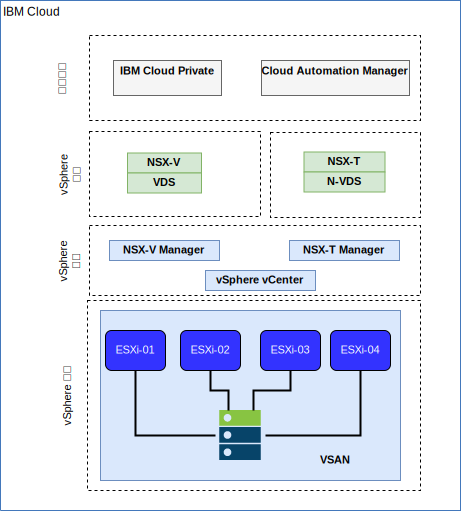

---

copyright:

  years:  2016, 2018

lastupdated: "2018-10-30"

---

# IBM Cloud 網路和基礎架構

## 虛擬遞送及轉遞 (VRF)

IBM Cloud 帳戶也可以配置為 VRF 帳戶。如此可以提供與 VLAN Spanning 類似的功能，而能夠在子網路 IP 區塊之間自動遞送。所有具有 Direct Link 連線的帳戶都必須轉換或建立為 VRF 帳戶。

## Direct Link

IBM Cloud Direct Link Connect 提供專用存取權，可讓您透過本端 IBM Cloud Data Center 來存取 IBM Cloud 基礎架構，以及鏈結至「網路服務提供者」的任何其他雲端。此選項最適合在單一環境中建立多雲端連線功能。我們使用共用頻寬拓蹼將客戶連接至 IBM Cloud 專用網路。如同所有 Direct Link 產品一樣，您可以新增廣域遞送，讓專用網路的資料流量能夠傳輸至所有 IBM Cloud 位置。

## 虛擬專用網路

### strongSwan VPN

strongSwan IPSec VPN 服務在網際網路上，提供以業界標準「網際網路通訊協定安全 (IPSec)」通訊協定套組為基礎的安全端對端通訊通道。

### Hybridity (HCX)

VCS Hybridity Bundle on IBM Cloud 服務可以將內部部署資料中心的網路無縫延伸至 IBM Cloud，這容許虛擬機器 (VM) 可以移轉進/出 IBM Cloud，而不需要進行任何轉換或變更。

## 實體結構

將 IBM Cloud Private (ICP) 正式作業實例部署在 VMware vCenter Server on IBM Cloud (VCS) 叢集上所需的實體基礎架構，需要下列最低規格。

表 1. ICP 的 VCS 規格

| NFS 部署  |  vSAN 部署 |
:--|:----:|:----:
伺服器數目  |  3 |  4
CPU | 28 核心 2.2 GHz | 28 核心 2.2 GHz
記憶體 | 384 GB | 384 GB
儲存空間 | 2000 GB 2IOPS/GB 管理，2000-GB 4IOPS/GB 工作負載，4000 GB 4IOPS/GB ICP | 至少 960-GB SSD x 2

除了 IBM Cloud Private 硬體需求之外，您還必須在 ICP 環境中建立持續性磁區，以儲存 Cloud Automation Manager (CAM) 資料庫和日誌資料。雖然 CAM 可支援 ICP 支援的所有持續性磁區類型，但建議用於 CAM 的兩種儲存空間配置為 NFS 和 GlusterFS。

## 虛擬結構

圖 1. VCS 和 ICP 部署的實體結構

在 VCS 實例中，會以專用的 NSX Edge Services Gateway (ESG) 和「分散式邏輯路由器 (DLR)」來部署 ICP 實例。ICP 安裝會載入至上述元件中定義的 VXLAN 子網路中。

ESG 的配置，會具有來源 NAT 規則 (SNAT) 以容許出埠資料流量，如此可啟用網際網路連線功能以便下載 ICP 必要條件，也能連接至 GitHub 和 Docker。或者，您可以使用 Web Proxy 以使用網際網路連線功能。ESG 也會配置為提供對 DNS 和 NTP 服務的存取權。

ESG 的配置也會具有對於從 IBM Cloud 10.x 網路之 ICP 主節點/Proxy 虛擬 IP 位址到 VXLAN 環境的目的地 NAT 規則 (DNAT)。

### 相關鏈結

* [VCS Hybridity Bundle 概觀](../vcs/vcs-hybridity-intro.html)
