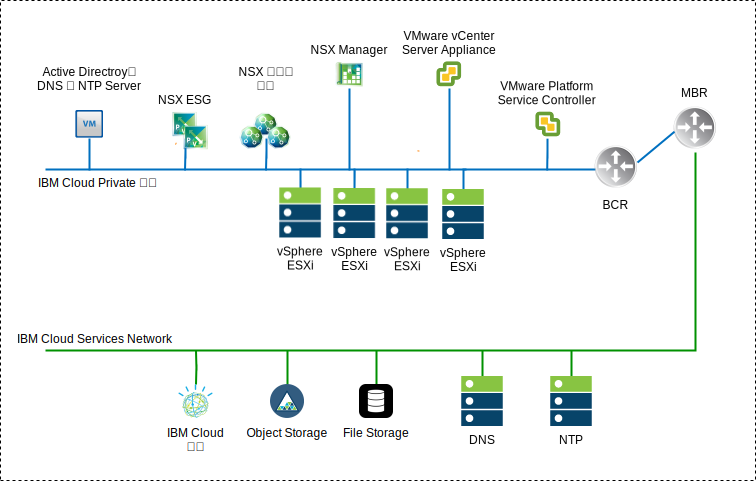
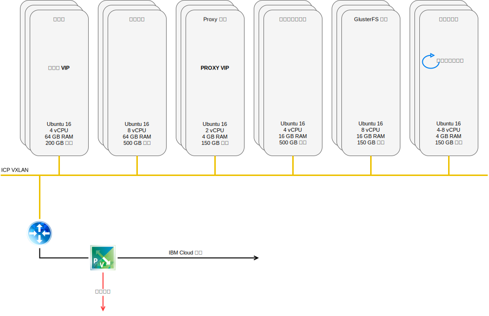
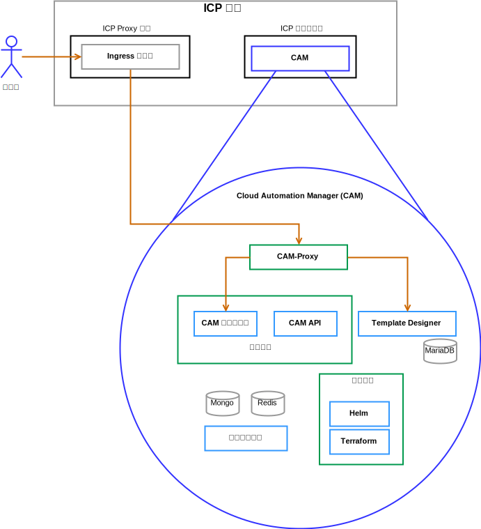

---

copyright:

  years:  2016, 2018

lastupdated: "2018-11-06"

---

# 解決方案元件

## VCS 元件

圖 1. VCS 環境圖

### 平台服務控制器

在與管理虛擬機器相關聯的專用 VLAN 中，VCS 部署使用安裝在可攜式子網路上的單一外部平台服務控制器。其預設閘道設為後端客戶路由器 (BCR)。

### vCenter Server 

與平台服務控制器一樣，vCenter Server 部署為應用裝置。此外，vCenter Server 是安裝在與管理虛擬機器相關聯之專用 VLAN 上的可攜式子網路。其預設閘道設為該特定子網路之 BCR 上所指派的 IP 位址。

### NSX Manager

NSX Manager 部署在起始叢集上。此外，NSX Manager 會獲指派專用可攜式位址區塊中的 VLAN 支援 IP 位址（這個區塊已指定給管理元件並已配置 DNS 和 NTP 伺服器）。

### NSX Controller

{{site.data.keyword.cloud}} 自動化會在起始叢集內部署三個 NSX 控制器。控制器會獲指派專用可攜式子網路中的 VLAN 支援 IP 位址（這個子網路已指定給管理元件）。

### NSX Edge / DLR

已部署 NSX Edge Services Gateway (ESG) 配對。無論如何，都會將一個閘道配對用於來自位於專用網路之自動化元件的出埠資料流量。對於 vCenter Server 和 ICP，會部署稱為 ICP 管理邊緣的第二個閘道，並為其配置連往公用網路的上行鏈路，以及指派給專用網路的介面。管理者可以配置任何必要的 NSX 元件，例如「分散式邏輯路由器 (DLR)」、邏輯交換器和防火牆。[vCenter Server 網路手冊](../vcsnsxt/vcsnsxt-intro.html)提供有關網路設計的更多詳細資料。

下表彙總 ICP ESG / DLR 規格。

表 1. ICP ESG 規格

 屬性            | 規格                           
--|--
Edge Services Gateway  | 虛擬應用裝置 
邊緣大小為「大型」 |   vCPU 數目為	2
記憶體	| 1-GB 磁碟 | 本端資料儲存庫上有 1000 GB 

表 2. ICP DLR 規格

 屬性            | 規格                           
--|--|
分散式邏輯路由器 | 	 虛擬應用裝置 
邊緣大小為「精簡」 | vCPU 數目為	1
記憶體	|512 MB 的磁碟| 本端資料儲存庫上有 1000 GB 

## ICP 元件
{{site.data.keyword.cloud_notm}} Private 是用來開發及管理內部部署容器化應用程式的應用程式平台。它是用來管理容器的整合環境，其中包括容器編排程式 Kubernetes、專用映像檔儲存庫、管理主控台和監視架構。

圖 2. 使用 VCS 的虛擬 ICP 部署

###	啟動節點

啟動或引導節點（選用）用來執行安裝、配置、節點調整和叢集更新。任何叢集都只需要一個啟動節點。您可以將單一節點同時用於主節點和啟動節點。

### 主節點

主節點提供管理服務，並且控制叢集裡的工作者節點。主節點會管理負責資源配置、狀態維護、排程及監視的處理程序。因為高可用性 (HA) 環境包含多個主節點，所以如果首要主節點故障，失效接手邏輯就會自動將另一個節點提升為主節點角色。可以用來作為主節點的主機稱為候選主節點。

###	工作者節點

工作者節點的功能是提供用來執行作業的容器化環境。隨著需求的增加，您可以輕鬆地將更多的工作者節點新增至您的叢集，以改善效能和效率。一個叢集可以包含任意數目的工作者節點，但至少需要一個工作者節點。

### Proxy 節點

Proxy 節點的功能是將外部要求傳輸至在叢集內建立的服務。因為高可用性 (HA) 環境包含多個 Proxy 節點，所以如果首要 Proxy 節點故障，失效接手邏輯就會自動將另一個節點提升至 Proxy 角色。雖然單一節點可以同時用來作為主節點和 Proxy 節點，但最好是使用專用的 Proxy 節點來減輕主節點上的負載。如果叢集內部需要負載平衡，則叢集必須至少包含一個 Proxy 節點。

### 管理節點

管理節點是選用性節點，只用來管理例如監視、計量和記載等管理服務。配置專用的管理節點可以防止主節點超載。您只能在 {{site.data.keyword.cloud_notm}} Private 安裝期間啟用管理節點。

###	VA 節點

VA（漏洞警告器）節點是選用性節點，可用來執行「漏洞警告器」服務。「漏洞警告器」服務需要大量資源。如果您使用「漏洞警告器」服務，請指定專用的 VA 節點。

高可用性 ICP 實例需要的虛擬機器規格：

表 3. ICP 虛擬機器規格

節點 | 	實例	| IP	| CPU	| RAM (GB)	| 磁碟 (GB)
:-----|------------:|:----|----:|----------:|----------:|
主節點|	3	| IP (x3) VIP (x1)	| 4	| 64	| 200
管理	|3	| IP (x3)	|8	|64	|500
Proxy	| 3	| IP (x3)VIP (x1)	|2	|4	|150
漏洞警告器	|3	| IP (x3)	| 4	| 16	|500
GlusterFS	| 3	| IP (x3)	|8	|16	|150
工作者節點	| 3-6	| IP (x3)	|4-8	|4	|150

CAM 需要工作者節點具有較高的 vCPU 和記憶體配置。

表 4. ICP 虛擬機器規格

節點 | 	實例	| IP	| CPU	| RAM (GB)	| 磁碟 (GB)
:-----|------------:|:----|----:|----------:|----------:|
工作者節點  |  3 | IP (x3)  |  4-8 |16-20   |  150

## CAM 元件

{{site.data.keyword.cloud_notm}} Automation Manager (CAM) 是在 ICP 上執行的多雲端自助式管理平台，它讓開發人員與管理者能夠滿足商業需求。

圖 3. CAM 元件參照

### CAM Proxy

提供對 CAM 的 nginx proxy 存取權。

### CAM 使用者介面

使用者介面元件分散於多個容器：雲端連線使用者介面、「範本檔案庫」使用者介面，以及已部署的實例使用者介面。

### CAM API

CAM API 分散於多個容器。

### Helm

含有必要二進位檔的容器，可將 helm 圖表部署至 Kubernetes 叢集。

### Terraform

含有必要二進位檔的容器，可跨多個雲端部署 Terraform 資源。

### 日誌

容器日誌的位置。

### Mongo 資料庫

CAM 應用程式的核心資料庫。

### Redis

Redis 資料庫可用來儲存 CAM 內的階段作業快取和鎖定。

### Template Designer

用來建立 Terraform 範本的圖形使用者介面，具有 Terraform 模組的拖放功能。

### Maria DB

Template Designer 應用程式的資料庫。

### 相關鏈結

* [VCS Hybridity Bundle 概觀](../vcs/vcs-hybridity-intro.html)
