---

copyright:

  years:  2016, 2018

lastupdated: "2018-10-10"

---

# 架構概觀

IBM Cloud for VMware 供應項目可自動將 VMware 技術元件部署至全球的 IBM Cloud Data Center。架構由單一雲端地區組成，可支援延伸至位於另一個地理位置的其他雲端地區，及/或延伸至相同資料中心內的另一個 IBM Cloud Pod。

IBM Cloud Private (ICP) 和 Cloud Automation Manager (CAM) 產品可以手動部署至內部部署的虛擬化平台中，因而能夠從內部部署位置進行雲端管理。或者，ICP 和 CAM 也可以當作服務延伸提供給 IBM Cloud (VCS) 部署上的現有或新 VMware vCenter Server，透過自動化功能，從 IBM Cloud 進行雲端管理。

ICP 是用來開發及管理內部部署容器化應用程式的應用程式平台。它是用來管理容器的整合環境，其中包括容器編排程式 Kubernetes、專用映像檔儲存庫、管理主控台和監視架構。

IBM Multi-Cluster Manager (MCM) 提供使用者可見性、以應用程式為中心的管理（原則、部署、性能、作業），以及雲端與叢集之間的原則型相符性。透過 MCM，您可以控制 Kubernetes 叢集。您可以確保叢集的安全、有效的運作，以及提供在 ICP 上執行的服務管理平台，讓開發人員和管理者能夠符合商業需求。Cloud Automation Manager Service Composer 容許您在 ICP 型錄中公開混合式雲端服務。

## IBM Cloud 端的雲端管理平台

圖 1. 從雲端進行雲端管理

上圖顯示以 IBM Cloud 基礎架構部署的 ICP 和 CAM，以及部署在 IBM Cloud 上的內部部署 vCenter 和 IBM Kubernetes Service (IKS) 服務的連線。使用者可以在內部部署虛擬機器、將虛擬機器部署至 VCS 實例中，以及將容器部署至 ICP 和 IKS 叢集。

在圖表中，CAM 依邏輯建立雲端連線至 vCenter、雲端提供者、ICP 和 IKS 環境。ICP 叢集應部署至每個資料中心/雲端環境，並由 MCM 提供將 ICP 叢集連接至單一管理視圖的機制。

ICP 可以與 NSX-V 或 NSX-T 元件搭配部署。ICP 搭配 NSX-V 可讓 ICP 虛擬機器在 VXLAN 網路上執行，並使用 Kubernetes Calico 內部網路。

ICP 搭配 NSX-T 可讓使用者從中央使用者介面 (NSX-T Manager) 控制及配置網路、子網路、原則。若要瞭解 NSX-V 與 NSX-T 之間的差異，請造訪 [IBM Cloud VCS Networking 參照架構](../vcsnsxt/vcsnsxt-intro.html)。

## 內部部署雲端管理平台

圖 2. 從內部部署端進行雲端管理

上圖顯示部署在內部部署基礎架構中的 ICP 和 CAM，以及部署在 IBM Cloud 上的 vCenter 和 IKS 連線。使用者可以在內部部署虛擬機器和容器、將虛擬機器部署至 vCenter Server 實例中，以及將容器部署至 IKS 叢集。

strongSwan VPN 可用來與已部署的 IKS 容器建立連線，此連線最後可能會取代為「直接鏈結」連線。

在圖表中，CAM 依邏輯建立雲端連線至 vCenter、雲端提供者、ICP 和 IKS 環境。ICP 叢集應部署至每個資料中心/雲端環境，並由 MCM 提供將 ICP 叢集連接至單一管理視圖的機制。

### 相關鏈結

* [VMware vCenter Server on IBM Cloud with Hybridity Bundle](../vcs/vcs-hybridity-intro.html)
