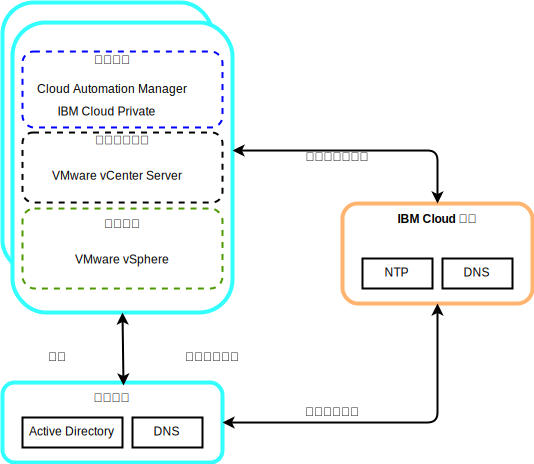
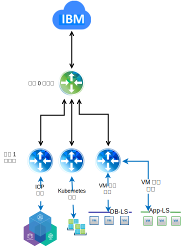

---

copyright:

  years:  2016, 2019

lastupdated: "2019-02-15"

---

# 詳細的設計
{: #vcsicp-detail-design}

## 共用服務元件
{: #vcsicp-detail-design-common-services}

共用服務提供雲端管理平台中其他服務所使用的服務。共用服務包括身分及存取服務、網域名稱服務及 NTP 服務。

圖 1. {{site.data.keyword.icpfull_notm}} 共用服務

### 身分及存取服務
{: #vcsicp-detail-design-identity}

在 VMware vCenter Server on {{site.data.keyword.cloud}} 自動化過程中，採用 Microsoft Active Directory (AD) 來進行身分管理。已部署單一 AD 虛擬伺服器實例 (VSI)。vCenter 配置為使用 AD 鑑別，而且您可以配置 {{site.data.keyword.icpfull_notm}} 進行「LDAP 鑑別」。

###	網域名稱服務
{: #vcsicp-detail-design-dns}

vCenter Server 部署會將已部署的 AD VSI 用作實例的 DNS 伺服器。所有已部署的元件（例如，vCenter、PSC、NSX 及 ESXi 主機）都會配置成指向 AD，以作為其預設 DNS。

###	NTP 服務
{: #vcsicp-detail-design-ntp}

vCenter Server 部署使用 {{site.data.keyword.cloud_notm}} 基礎架構 NTP 伺服器。所有已部署的元件都已配置成使用這些 NTP 伺服器。為了讓憑證和 AD 鑑別正常運作，使設計內的所有元件都使用相同的 NTP 伺服器十分重要。

## 網路
{: #vcsicp-detail-design-networking}

### NSX-V 網路
{: #vcsicp-detail-design-nsx-v}

NSX-V 的設計讓單一 NSX-V Manager 平台與單一 vCenter Server 實例相關聯。它將網路服務提供給在 vSphere 環境內執行的應用程式。

使用 VCS 部署中所含的 NSX-V 網路，我們可以將 {{site.data.keyword.icpfull_notm}} 部署到 VXLAN 層疊網路。

{{site.data.keyword.icpfull_notm}} 是使用 Kubernetes 的預設 Calico 網路堆疊進行部署，可在您的叢集內提供網路隔離。

圖 2. 具有 NSX-V 網路的 {{site.data.keyword.icpfull_notm}}

如需相關資訊，請參閱 [vCenter Server 網路手冊](/docs/services/vmwaresolutions/archiref/vcsnsxt?topic=vmware-solutions-vcsnsxt-intro)。

### NSX-T 網路
{: #vcsicp-detail-design-nst-t}

NSX-T 的設計讓單一網路平台可以連接到任何類型的應用程式，不論是虛擬機器型還是容器型、在 vSphere 環境內部或外部執行。

{{site.data.keyword.icpfull_notm}} 提供將 Calico 網路取代為 NSX-T 實例的選項，並提供單一位置以便管理網路和安全。

圖 3. 具有 NSX-T 網路的 {{site.data.keyword.icpfull_notm}}

## 相關鏈結
{: #vcsicp-detail-design-related}

* [vCenter Server on {{site.data.keyword.cloud_notm}} with Hybridity Bundle 概觀](/docs/services/vmwaresolutions/archiref/vcs?topic=vmware-solutions-vcs-hybridity-intro)
