---

copyright:

  years:  2016, 2018

lastupdated: "2018-11-16"

---

# 系統環境定義

圖 1. 系統環境定義圖

核心元件如下：

- **內部部署虛擬化** - 此元件是在用戶端內部部署或協力廠商上管理的 VMware 環境，目前管理執行要現代化之應用程式的虛擬機器 (VM)。內部部署虛擬化是 VM 移轉的來源環境，並且透過 VMware Hybridity (HCX) 與 {{site.data.keyword.cloud}} 實例鬆散耦合。
- **vCenter Server** - VMware vCenter Server on {{site.data.keyword.cloud_notm}} 是 {{site.data.keyword.vmwaresolutions_short}} 實例，其是從內部部署環境移轉 VM 的目標。它會與內部部署虛擬化環境一起形成混合式環境，讓 VM 能從某個站台移至另一個站台。
- **{{site.data.keyword.cloud_notm}} Kubernetes Service** - IKS 使用 Kubernetes 作為容器編排解決方案。IBM 會操作並管理 Kubernetes 主節點，而工作者節點會部署至客戶管理的基礎架構。IBM 提供用於作業系統修補程式部署、Docker 引擎升級和新 Kubernetes 版本的管理工具。IKS 提供隔離的安全平台，在發生失效接手時，用來管理具有可攜性、可延伸及自我修復能力的容器。
- **{{site.data.keyword.cloud_notm}} Private** - ICP 是用來開發及管理容器化應用程式的應用程式平台。ICP 是整合環境，其中包括容器編排程式 Kubernetes、專用映像檔儲存庫、管理主控台、監視架構和圖形使用者介面，您可以集中在此介面中部署、管理、監視及調整應用程式。
- **{{site.data.keyword.cloud_notm}} Automation Manager** - CAM 是準備供企業使用的現成「基礎架構即程式碼 (IaC)」平台，其提供單一窗格，可以同時佈建 VMware 型工作負載與 Kubernetes 型工作負載。因為已透過 CAM 實現虛擬機器、容器及其基礎架構必要條件，所以會自動化佈建工作負載。
- **IBM Multi Cloud Manager** - MCM 提供使用者可見性、以應用程式為中心的管理（原則、部署、性能、作業），以及雲端與叢集之間的原則型規範。透過 MCM，您可以控制 Kubernetes 叢集。
- **{{site.data.keyword.cloud_notm}} Services** - {{site.data.keyword.cloud_notm}} Services 是範圍廣泛的可用消耗性服務，包括分析、AI 和 IoT 供應項目。

## 動作者

表 1. 動作者

動作者  |說明       
--|--
系統管理者 | VMware vSphere 技術熟練的人力資源，負責使用 vCenter Server 來管理內部部署虛擬化和 vCenter Server 實例。
開發人員 | 容器技術熟練的人力資源，負責使用 CAM 主控台來建立及管理容器。他們會在應用程式現代化的過程中建立新的服務。開發人員會使用 CAM 將工作負載佈建在 vCenter Server、ICP 或 IKS 上、組合及編排以 VM 和容器建置的服務，以及整合 DevOps 工具鏈和 Day 2 ITSM 解決方案。
客戶 | 耗用企業服務的外部動作者。對 Acme Skateboards 而言，客戶是想要購買滑板產品的滑板玩家。客戶需要安全的網際網路來存取型錄。
IBM IKS | IBM 人力資源，負責管理該服務的「IKS 主節點」。

## 系統

表 2. 系統

動作者  |說明       
--|--
vCenter Server | 系統管理者用來在 vCenter Server 實例中管理內部部署 VM 和 {{site.data.keyword.cloud_notm}} VM 的主要介面。
內部部署 VM| 虛擬化伺服器，負責管理目標設定為要移轉至 {{site.data.keyword.cloud_notm}} 的應用程式。一開始會以 VM 方式移轉，然後從 VM 重新建構為容器，以進行應用程式現代化。
{{site.data.keyword.cloud_notm}} VM | 虛擬化伺服器，負責管理從內部部署資料中心移轉過來的應用程式。對於此參照架構和 Acme Skateboards，其中一部 {{site.data.keyword.cloud_notm}} VM 是資料庫伺服器，它是線上呈現工作負載的一部分。
企業內容型錄 | 集中位置，您可以從中瀏覽及安裝叢集中的套件。型錄中具有許多 IBM 套件，可用來建立容器以及存取 Helm 圖表。Helm 是用來管理 Kubernetes 圖表的工具。圖表是預先配置的 Kubernetes 資源套件，可讓您輕鬆版本化、包裝、發行、部署、刪除、升級甚至回復容器部署。Helm 是 Kubernetes 原生套件管理系統，可用來管理 ICP 叢集內的應用程式。
核心作業服務 |ICP 包含許多用來收集、儲存及查詢日誌和度量值的工具。這些工具為所有日誌和度量值提供一個集中儲存庫，可在存取及查詢日誌和度量值時，改善效能並提高穩定性。
管理主控台 | ICP 管理主控台可從單一、集中且安全的管理主控台來管理、監視及疑難排解應用程式和叢集。
Terraform | 使用 VMware vSphere、{{site.data.keyword.cloud_notm}}、Microsoft Azure、Amazon Web Services、Google Cloud Platform 和 OpenStack 這類提供者，來處理雲端和基礎架構資源的佈建。
HELM |  Kubernetes 的套件管理程式。Helm 圖表可用來定義 Kubernetes 資源及部署應用程式。
Chef |負責配置管理及規範自動化。Terraform 完成起始佈建之後，Chef 會部署並配置中介軟體和應用程式。
服務| 代表「服務編製器」，管理者會在這裡編寫、組合及設計從 Kubernetes 資源及一個以上 VM 建構的服務。
容器化應用程式 |已完成應用程式現代化旅程且目前執行為容器的應用程式。對於此參照架構和 Acme Skateboards，其中一個容器化應用程式是 Web 伺服器，它是線上呈現工作負載的一部分。
Watson | 對於此參照架構和 Acme Skateboards，Watson 代表「概念車」架構中使用的 AI 服務。

應用程式移轉、網路和安全往往是應用程式現代化最具挑戰性的層面。vCenter Server、VMware Hybridity、VMware NSX、ICP 和 {{site.data.keyword.cloud_notm}} Kubernetes Service 可因應這些挑戰，並讓您能建置具復原力、安全且健全的現代應用程式。

### 相關鏈結

* [vCenter Server on {{site.data.keyword.cloud_notm}} with Hybridity Bundle 概觀](../vcs/vcs-hybridity-intro.html)
