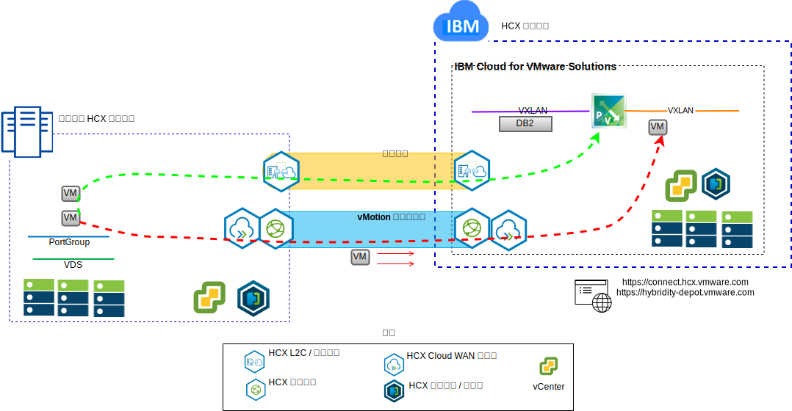
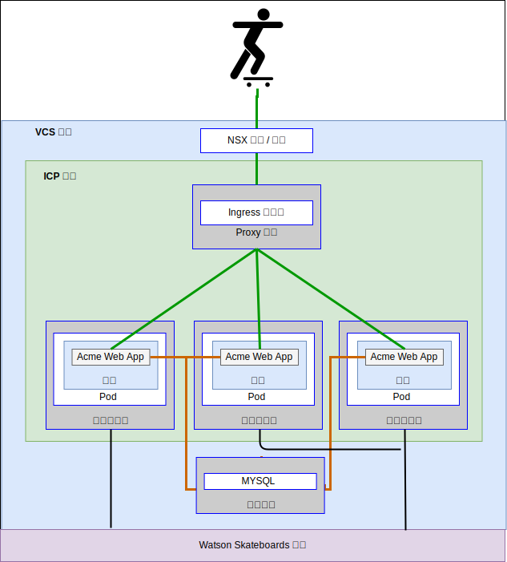

---

copyright:

  years:  2016, 2018

lastupdated: "2018-10-30"

---

# 使用案例

## 工作負載移轉至 IBM Cloud
Acme Skateboards 想要將其內部部署 VMware SDDC 無縫延伸到 IBM Cloud 上的 VCS 實例。他們需要讓業務持續運作，並使關閉時間降到最低。重新配置其應用程式以便在雲端執行並不是最佳解決方案。

VMware Hybridity on IBM Cloud 服務能夠在 IBM Cloud 與內部部署 VMware 虛擬化資料中心之間建立無縫連線。

IBM Cloud 的 vCenter Server with Hybridity Bundle 供應項目能夠促成對等內部部署來源站台與 IBM Cloud 目標站台之間的安全連線。

圖 1. VMware Hybridity 服務

這會在內部部署與 IBM Cloud 之間建立鬆散耦合的交互連線，並且促成如下功能：
- **簡單交互連線** – 可透過任何實體連線（包括公用網際網路、專用 VPN 或 IBM Cloud Direct Link），輕鬆建立邏輯網路連線。
- **第 2 層延伸** – 內部部署網路延伸至雲端，包括內部部署子網路和 IP 位址。
- **加密** – 在對等節點站台之間安全地加密網路資料流量。
- **網路最佳化** – 選取最佳連線，並有效率地溢滿連線，讓網路資料流量儘可能地快速移動。
- **刪除重複資料** – 可讓網路資料流量減少達 50%。
- **智慧型遞送** – 當工作負載移動時，鄰近遞送可以變更網路路徑（即閘道），讓網路資料流量使用目標站台閘道，而不會「回流」到起始站台。
- **零關閉時間移轉** – 可以使用 vMotion 將執行中的虛擬機器移至雲端（或從雲端移回）。
- **排定的移轉** – 可以將任何數目的虛擬機器抄寫至目的地站台，然後在該站台上依指定時間啟動，以取代在起始站台上執行的系統。
- **安全原則的移轉** – 如果在內部部署使用 NSX，則任何安全原則、防火牆等等，都會隨著工作負載一起移動。

使用這個解決方案，Acme Skateboards 已順利將其內部部署 VMware 工作負載移轉至 IBM Cloud，以滿足極短或沒有任何關閉時間且不需重新配置應用程式的需求。

## 混合式架構部署

Acme Skateboards 想要在由 VCS 和 ICP 組成的 IBM Cloud 上部署混合式架構，以進行應用程式現代化。他們的需求是在虛擬機器上執行其資料庫、在容器中執行應用程式和 Web 服務，並使用一組共用的工具來進行網路和安全管理。

圖 2. Acme Skateboards 混合式應用程式

IBM Cloud for VMware 解決方案可自動將 VMware 技術元件部署至全球的 IBM Cloud Data Center。架構由單一雲端地區組成，可支援延伸至位於另一個地理位置的其他雲端地區，及/或延伸至相同資料中心內的另一個 IBM Cloud Pod。

IBM Cloud Private (ICP) 和 Cloud Automation Manager (CAM) 產品已手動部署至內部部署的虛擬化平台中，因而能夠從內部部署位置進行雲端管理。或者，ICP 和 CAM 也可以透過自動化功能當作服務延伸提供給現有或新的 VCS 部署，因而能夠從 IBM Cloud 進行雲端管理。

下圖顯示在 VCS 實例之上執行的 ICP。NSX-V 配置了專用交換器/VXLAN、DLR，以及專門用於 ICP 層疊網路的 ESG，遞送作業設定為透過 ESG 進行，以存取基礎的網路。

使用 IBM Cloud 自動化，Acme Skateboards 可以佈建封裝 VMware on IBM Cloud 的混合式解決方案，以在 VMware on IBM Cloud 上執行其資料庫 VM 和 ICP，並在容器中執行其應用程式和前端系統 Web 服務。NSX 為其提供一組共用的管理工具，用來管理層疊網路中的網路和安全。

圖 3. 具有 ICP 的 VCS

### 相關鏈結

* [VCS Hybridity Bundle 概觀](../vcs/vcs-hybridity-intro.html)
