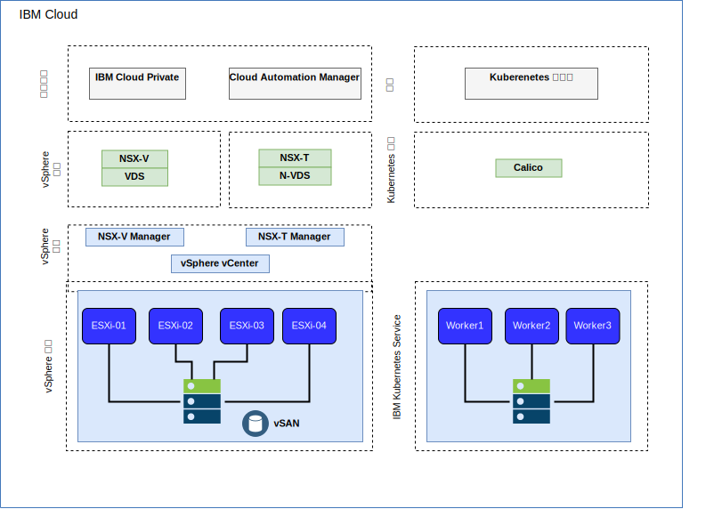
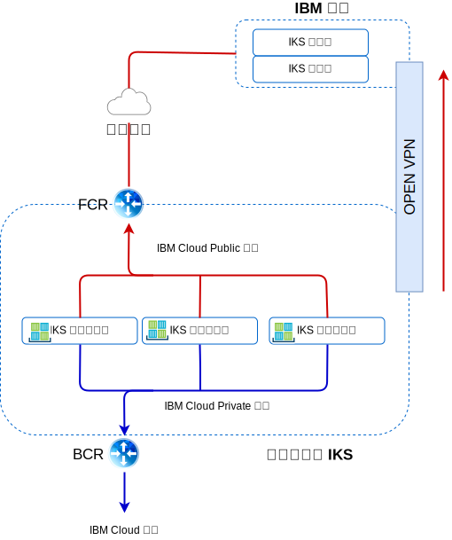

---

copyright:

  years:  2016, 2019

lastupdated: "2019-03-19"

subcollection: vmwaresolutions

---

# IBM Cloud 網路和基礎架構
{: #vcsiks-arch-overview-infrastructure}

## 虛擬遞送及轉遞
{: #vcsiks-arch-overview-infrastructure-vrf}

{{site.data.keyword.cloud}} 帳戶可以配置為「虛擬遞送及轉遞 (VRF)」帳戶。VRF 帳戶可啟用子網路 IP 區塊之間的自動廣域遞送。所有具有 Direct Link 連線的帳戶都必須轉換或建立為 VRF 帳戶。

## Direct Link
{: #vcsiks-arch-overview-infrastructure-direct-link}

{{site.data.keyword.cloud_notm}} Direct Link Connect 提供專用存取權，可讓您透過本端 {{site.data.keyword.CloudDataCent_notm}} 來存取 {{site.data.keyword.cloud_notm}} 基礎架構，以及鏈結至「網路服務提供者」的任何其他雲端。此選項最適合在單一環境中建立多雲端連線功能。我們使用共用頻寬拓蹼將客戶連接至 {{site.data.keyword.cloud_notm}} Private 網路。如同所有 Direct Link 產品一樣，您可以新增廣域遞送，讓專用網路的資料流量能夠傳輸至所有 {{site.data.keyword.cloud_notm}} 位置。

## 虛擬專用網路
{: #vcsiks-arch-overview-infrastructure-virt-private-network}

### strongSwan VPN
{: #vcsiks-arch-overview-infrastructure-strongswan}

strongSwan IPSec VPN 服務在網際網路上，提供以業界標準「網際網路通訊協定安全 (IPSec)」通訊協定套組為基礎的安全端對端通訊通道。

### Hybridity (HCX)
{: #vcsiks-arch-overview-infrastructure-hcx}

VMware vCenter Server on {{site.data.keyword.cloud_notm}} with Hybridity Bundle 可以將內部部署資料中心的網路無縫地擴充至 {{site.data.keyword.cloud_notm}}，這容許將虛擬機器 (VM) 移轉至 {{site.data.keyword.cloud_notm}} 或從該處移轉，而不需要進行任何轉換或變更。

## 實體結構
{: #vcsiks-arch-overview-infrastructure-physical-structure}

部署 vCenter Server 叢集所需的實體基礎架構，需要下列最低規格。

表 1. vCenter Server 規格

  | NFS 部署 | VSAN 部署
---|---|---
伺服器數目 | 3 | 4
CPU | 28 核心 2.2GHZ | 28 核心 2.2GHZ
記憶體 | 384 GB | 384 GB
儲存空間 | 管理：2 TB 2 IOPS、工作負載：2 TB 4 IOPS|最小 SSD：960 GB(x2)   

根據您的工作者節點需求，{{site.data.keyword.containerlong_notm}} 部署選項會不同。

表 2. {{site.data.keyword.containerlong_notm}} 規格

  | 虛擬機器 | 裸機
--|---|--
伺服器數目 | 3 | 3
CPU | 2 - 56 核心 | 4 - 28 核心
記憶體 | 4 GB - 242 GB | 32 GB - 512 GB
儲存空間 | 100 GB |  SATA：2 TB/SSD：960 GB

## 虛擬結構
{: #vcsiks-arch-overview-infrastructure-virtual-structure}

圖 1. {{site.data.keyword.containerlong_notm}} 和 {{site.data.keyword.icpfull_notm}} 部署的實體結構

在 vCenter Server 實例內，客戶 VMS 會部署至專用 NSX Edge Services Gateway (ESG) 及「分散式邏輯路由器 (DLR)」。

ESG 配置成具有來源 NAT 規則 (SNAT) 以容許出埠資料流量，這會啟用網際網路連線功能來下載 {{site.data.keyword.icpfull_notm}} 必要條件，以及連接至 GitHub 及 Docker。或者，您也可以使用 Web Proxy 來提供網際網路連線功能。ESG 配置成透過專用網路來存取 DNS 及 NTP 服務。透過 vCenter Server 實例與 {{site.data.keyword.containerlong_notm}} 之間的 {{site.data.keyword.cloud_notm}} 網路，可以與 {{site.data.keyword.containerlong_notm}} 實例整合。

## vCenter Server 元件
{: #vcsiks-arch-overview-infrastructure-vcs-comp}

圖 2. vCenter Server 平台元件

### Platform Service Controller
{: #vcsiks-arch-overview-infrastructure-psc}

在與管理 VM 相關聯的專用 VLAN 中，vCenter Server 部署使用安裝在可攜式子網路上的單一外部平台服務控制器 (PSC)。其預設閘道設為後端客戶路由器 (BCR)。

### vCenter Server 
{: #vcsiks-arch-overview-infrastructure-vcs}

與 PSC 一樣，vCenter Server 部署為應用裝置。此外，vCenter 會安裝在與管理 VM 相關聯之專用 VLAN 的可攜式子網路上。其預設閘道設為 BCR。

### NSX Manager
{: #vcsiks-arch-overview-infrastructure-nsx-manager}

NSX Manager 部署在起始 vCenter Server 叢集上。此外，NSX Manager 會獲指派指定給管理元件之專用可攜式位址區塊中的 IP 位址。

### NSX Controller
{: #vcsiks-arch-overview-infrastructure-nsx-controllers}

{{site.data.keyword.cloud_notm}} 自動化會在起始叢集內部署三個 NSX 控制器。控制器會獲指派指定給管理元件之專用可攜式子網路中的 IP 位址。

### NSX ESG/DLR
{: #vcsiks-arch-overview-infrastructure-nsx-esg}

已部署 NSX Edge Services Gateway (ESG) 配對。無論如何，都會將一個閘道配對用於來自位於專用網路之自動化元件的出埠資料流量。對於 vCenter Server 及 {{site.data.keyword.icpfull_notm}}，會部署稱為 ICP 管理邊緣的第二個閘道，並為其配置連往公用網路的上行鏈路，以及指派給專用網路的介面。管理者可以配置任何必要的 NSX 元件，例如「分散式邏輯路由器 (DLR)」、邏輯交換器和防火牆。如需已部署為解決方案一部分之 NSX Edge 的相關資訊，請參閱 [vCenter Server 網路手冊](/docs/services/vmwaresolutions/archiref/vcsnsxt?topic=vmware-solutions-vcsnsxt-intro)。

下列各表格彙總 {{site.data.keyword.icpfull_notm}} ESG/DLR 規格。

表 3. {{site.data.keyword.icpfull_notm}} ESG 規格

 屬性            | 規格                           
--|--
Edge Services Gateway| 虛擬應用裝置 
邊緣大小為「大型」 |   vCPU 數目為	2
記憶體	| 1 GB 
磁碟 | 本端資料儲存庫上有 1000 GB 

表 4. {{site.data.keyword.icpfull_notm}} DLR 規格

 屬性            | 規格                           
--|--|
分散式邏輯路由器 |	 虛擬應用裝置 
邊緣大小為「精簡」 | vCPU 數目為	1
記憶體	| 512 MB
磁碟 | 本端資料儲存庫上有 1000 GB 

## IBM Cloud Kubernetes Service 元件
{: #vcsiks-arch-overview-infrastructure-iks-comp}

圖 3. {{site.data.keyword.containerlong_notm}} 元件
 

### Kubernetes 主節點
{: #vcsiks-arch-overview-infrastructure-kube-master}

Kubernetes 主節點負責管理叢集中的所有運算、網路及儲存空間資源。Kubernetes 主節點確保您的容器化應用程式和服務平均部署至叢集中的工作者節點。

###	工作者節點
{: #vcsiks-arch-overview-infrastructure-worker-node}

每個工作者節點都是在雲端環境的實體硬體上執行的實體機器（裸機）或 VM。當您佈建工作者節點時，要判斷該工作者節點上管理之容器可用的資源。工作者節點預設都已設定 IBM 管理的「Docker 引擎」、個別運算資源、網路及磁區服務。內建安全特性提供隔離、資源管理功能及工作者節點安全法規遵循。

## 相關鏈結
{: #vcsiks-arch-overview-infrastructure-related}

* [vCenter Server on {{site.data.keyword.cloud_notm}} with Hybridity Bundle 概觀](/docs/services/vmwaresolutions/archiref/vcs?topic=vmware-solutions-vcs-hybridity-intro)
