---

copyright:

  years:  2016, 2019

lastupdated: "2019-05-08"

subcollection: vmware-solutions

---

# 架構概觀
{: #vcsiks-arch-overview}

{{site.data.keyword.vmwaresolutions_full}} 供應項目提供自動化，以在全球的 {{site.data.keyword.CloudDataCents_notm}} 中部署 VMware 技術元件。架構由單一雲端地區組成，可支援延伸至位於另一個地理位置的其他雲端地區，或延伸至相同資料中心內的另一個 {{site.data.keyword.cloud_notm}} Pod。

您可以將 {{site.data.keyword.icpfull_notm}} 及 Cloud Automation Manager (CAM) 產品手動部署至內部部署虛擬化平台，因而能夠從內部部署位置進行雲端管理。或者，{{site.data.keyword.icpfull_notm}} 及 CAM 也可以當作服務延伸提供給現有或新的 VMware vCenter Server on {{site.data.keyword.cloud_notm}} 部署，透過自動化功能，從 {{site.data.keyword.cloud_notm}} 進行雲端管理。

{{site.data.keyword.icpfull_notm}} 是一個應用程式平台，用於開發及管理內部部署容器化應用程式。{{site.data.keyword.icpfull_notm}} 是用來管理容器的整合環境，其中包括容器編排程式 Kubernetes、專用映像檔儲存庫、管理主控台和監視架構。

IBM Multi-Cluster Manager 提供使用者可見性、以應用程式為中心的管理（原則、部署、性能、作業），以及雲端與叢集之間的原則型法規遵循。透過 IBM Multi-Cluster Manager，您可以控制 Kubernetes 叢集。您可以確保叢集安全、有效率地運作，並且提供應用程式所預期的服務水準。

{{site.data.keyword.cloud_notm}} Automation Manager 是在 {{site.data.keyword.cloud_notm}} Private 上執行的多重雲端自助式管理平台，讓開發人員與管理者能夠滿足商業需求。Cloud Automation Manager 服務編製器可讓您在 IBM Cloud Private 型錄中公開混合式雲端服務。

## IBM Cloud 端的雲端管理平台
{: #vcsiks-arch-overview-ibm-cloud-side}

下圖顯示的 {{site.data.keyword.icpfull_notm}} 及 CAM 已部署 {{site.data.keyword.cloud_notm}} 基礎架構，並具有 {{site.data.keyword.cloud_notm}} 上所部署之內部部署 vCenter 及 {{site.data.keyword.containerlong_notm}} 服務的連線。使用者可以在內部部署虛擬機器 (VM)、將 VM 部署至 vCenter Server 實例，以及將容器部署至 {{site.data.keyword.icpfull_notm}} 及 {{site.data.keyword.containerlong_notm}} 叢集。

在圖表中，CAM 邏輯地建立與 vCenter、雲端提供者、{{site.data.keyword.icpfull_notm}} 及 {{site.data.keyword.containerlong_notm}} 環境的雲端連線。「{{site.data.keyword.icpfull_notm}} 叢集」必須部署至每個資料中心或雲端環境，並由 MCM 提供將 {{site.data.keyword.icpfull_notm}} 叢集連接至單一管理視圖的機制。

{{site.data.keyword.icpfull_notm}} 可以與 NSX-V 或 NSX-T 元件搭配部署。{{site.data.keyword.icpfull_notm}} 搭配 NSX-V 可讓 {{site.data.keyword.icpfull_notm}} VM 在 VXLAN 網路上執行，並使用 Kubernetes Calico 內部網路。

{{site.data.keyword.icpfull_notm}} 搭配 NSX-T 可讓使用者從中央使用者介面 (NSX-T Manager) 控制及配置網路、子網路、原則。如需 NSX-V 與 NSX-T 差異的相關資訊，請參閱 [{{site.data.keyword.cloud_notm}} VCS 網路參照架構](/docs/services/vmwaresolutions?topic=vmware-solutions-vcsnsxt-intro#vcsnsxt-intro)。

## 內部部署雲端管理平台
{: #vcsiks-arch-overview-on-premises}

下圖顯示內部部署基礎架構中所部署的 {{site.data.keyword.icpfull_notm}} 及 CAM，以及 {{site.data.keyword.cloud_notm}} 上所部署之 vCenter 及 {{site.data.keyword.containerlong_notm}} 的連線。使用者可以在內部部署 VM 和容器、將 VM 部署至 vCenter Server 實例，以及將容器部署至 {{site.data.keyword.containerlong_notm}} 叢集。

strongSwan VPN 可用來建立與已部署 {{site.data.keyword.containerlong_notm}} 容器的連線。strongSwan 最後可能會取代為 Direct Link 連線。

在圖表中，CAM 邏輯地建立與 vCenter、雲端提供者、{{site.data.keyword.icpfull_notm}} 及 {{site.data.keyword.containerlong_notm}} 環境的雲端連線。{{site.data.keyword.icpfull_notm}} 叢集必須部署至每個資料中心或雲端環境，並由 MCM 提供將 {{site.data.keyword.icpfull_notm}} 叢集連接至單一管理視圖的機制。

## 相關鏈結
{: #vcsiks-arch-overview-related}

* [vCenter Server on {{site.data.keyword.cloud_notm}} with Hybridity Bundle 概觀](/docs/services/vmwaresolutions?topic=vmware-solutions-vcs-hybridity-intro#vcs-hybridity-intro)
