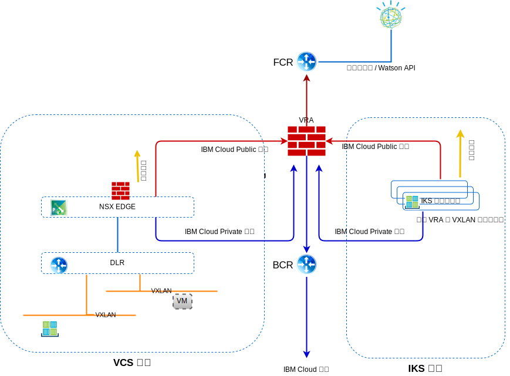

---

copyright:

  years:  2016, 2019

lastupdated: "2019-03-01"

subcollection: vmware-solutions

---

# 網路、備份、災難回復及可調整性
{: #vcsiks-overview-network}

請檢閱網路、備份、災難回復 (DR) 及可調整性的相關資訊。

## 網路
{: #vcsiks-overview-network-networking}

{{site.data.keyword.cloud}} 有兩個網路。公用網路容許從網際網路連接伺服器，而專用網路容許伺服器透過高速骨幹在所有 {{site.data.keyword.CloudDataCents_notm}} 中彼此通訊。

依預設，{{site.data.keyword.containerlong_notm}} 會使用公用 VLAN 及專用 VLAN 的存取權來設定叢集。
- 每一個工作者節點的公用 IP 位址，其為工作者節點提供公用網路介面。
  - 所有工作者節點都容許所有出埠網路資料流量。
  - 除了少數埠之外，入埠網路資料流量會遭到封鎖。會開啟這些埠讓 IBM 可以監視網路資料流量，並自動安裝 Kubernetes 主節點的安全更新項目。
- 每個工作者節點的專用 IP 位址，其為工作者節點提供專用網路介面
- 所有工作者節點與主節點之間的自動安全 OpenVPN 連線

圖 1. vCenter Server 及 {{site.data.keyword.containerlong_notm}} 網路

### IBM Cloud Kubernetes Service 與 vCenter Server 整合
{: #vcsiks-overview-network-iks-vcs-integration}

目前，下列情境整合 {{site.data.keyword.containerlong_notm}} 及 VMware vCenter Server on {{site.data.keyword.cloud_notm}} 網路：
- **VRA 遞送** - 此情境需要 {{site.data.keyword.containerlong_notm}} 工作者節點部署至與 vCenter Server 實例相同的 VLAN。這可讓 ESG 成為與 VRA 配對的 BGP，並啟用從層疊到 vCenter Server 與 {{site.data.keyword.containerlong_notm}} 間之基礎網路的遞送。在每個 VXLAN 網路的 {{site.data.keyword.containerlong_notm}} 工作者節點上都需要有靜態路徑，以將這些要求遞送回 BCR/VRA 來正確地遞送。
- **strongSwan VPN** - 此情境使用標準 {{site.data.keyword.containerlong_notm}} 對企業連線功能解決方案。strongSwan 容器提供一個 VPN 閘道，供叢集透過 IPSec 通道將封包轉遞至遠端網路，再轉遞至遠端閘道。此遠端閘道是 vCenter Server 實例上的 ESG。在閘道上，路徑配置成將所有叢集及服務 IP 範圍傳送至 StrongSwan 容器，並將所有 vCenter Server BYOIP 位址傳送至 ESG。閘道的目標 IP 位址是指派給 strongSwan 容器之負載平衡器服務的專用可攜式 IP 位址以及 ESG 的專用可攜式 IP 位址。

#### IBM Cloud Kubernetes Service 網路 VLAN
{: #vcsiks-overview-network-iks-vlans}

下列資訊適用於公用 VLAN 子網路：
- 主要公用子網路會決定在建立叢集期間指派給工作者節點的公用 IP 位址。相同 VLAN 上的多個叢集可以共用一個主要公用子網路。
- 可攜式公用子網路只會連結至一個叢集，並提供該叢集八個公用 IP 位址。三個 IP 保留給網路功能使用。一個 IP 由預設公用 Ingress ALB 使用，而四個 IP 用來建立公用負載平衡器網路服務。
- 可攜式公用 IP 為永久性的固定 IP 位址，用來透過網際網路存取負載平衡器服務。

下列資訊適用於專用 VLAN 子網路：
- 主要專用子網路會決定在建立叢集期間指派給工作者節點的專用 IP 位址。相同 VLAN 上的多個叢集可以共用一個主要專用子網路。
- 可攜式專用子網路只會連結至一個叢集，並提供該叢集八個專用 IP 位址。三個 IP 保留給網路功能使用。一個 IP 由預設專用 Ingress ALB 使用，而四個 IP 用來建立專用負載平衡器網路服務。
- 可攜式專用 IP 為永久性的固定 IP 位址，用來透過網際網路存取負載平衡器服務。

#### Calico 網路外掛程式
{: #vcsiks-overview-network-calico}

每個 Kubernetes 叢集都會設定稱為 Calico 的網路外掛程式。

設定預設網路原則，以保護 {{site.data.keyword.containerlong_notm}} 中每個工作者節點的公用網路介面。如果您有獨特的安全需求，或者您有已啟用 VLAN Spanning 或「虛擬遞送及轉遞 (VRF) 」的多區域叢集，則可以使用 Calico 和 Kubernetes 來建立叢集的網路原則。使用 Kubernetes 網路原則，您可以指定要容許或封鎖進出叢集內 Pod 的網路資料流量。

若要設定其他進階網路原則，例如封鎖入埠 (Ingress) 資料流量至 LoadBalancer 服務，請使用 Calico 網路原則。

Kubernetes 網路原則指定 Pod 如何和其他 Pod 及公用網路服務端點通訊。也可以根據 Pod 及名稱空間標籤來過濾資料流量。您可以使用 kubectl 指令或 Kubernetes API 來套用 Kubernetes 網路原則。這些原則在套用時會自動轉換為 Calico 網路原則，而 Calico 會強制執行這些原則。

Kubernetes 的 Calico 網路原則是 Kubernetes 網路原則的超集，並使用 calicoctl 指令予以套用。

Calico 原則新增下列特性：
- 不論 Kubernetes Pod 來源或目的地 IP 位址或 CIDR，都容許或封鎖特定網路介面上的網路資料流量。
- 容許或封鎖名稱空間的 Pod 之間的網路資料流量。
- 封鎖 LoadBalancer 或 NodePort Kubernetes 服務的入埠 (Ingress) 資料流量。

Calico 透過在 Kubernetes 工作者節點上設定 Linux iptables 規則，來強制執行這些原則（包括任何會自動轉換為 Calico 原則的 Kubernetes 網路原則）。iptables 規則作為工作者節點的防火牆，以定義網路資料流量必須符合才能轉遞至目標資源的特徵。

### 資料傳輸流
{: #vcsiks-overview-network-traffic-flows}

#### 網際網路上的外部使用者到 IBM Cloud Kubernetes Service 容器中管理的 Web 層級
{: #vcsiks-overview-network-web-tier-iks}

1. 外部使用者使用 URL 向 Web 層級提出要求。
2. DNS 用來判斷 IP 位址。此 IP 位址是指派給 ALB 或「Ingress 服務」之可攜式子網路上的 {{site.data.keyword.cloud_notm}} 公用位址。
3. 公用網路會自動將要求轉遞至管理 ALB 或「Ingress 服務」的工作者節點。
4. 工作者節點會將要求轉遞至 ALB 或「Ingress 服務」的內部叢集 IP 位址及埠號。這個內部叢集 IP 位址只能在叢集內部存取。
5. 在工作者節點內，kube-proxy 會將要求遞送至 ALB 或 Ingress 服務。
6. 如果應用程式位於同一個工作者節點上，則會使用 iptables 來判定用來轉遞要求的內部介面。如果應用程式位於不同的工作者節點，則只有在工作者節點位於不同的子網路時，Calico vRouter 才會使用 IP-in-IP 封裝遞送至適用的工作者節點。

#### IBM Cloud Kubernetes Service 容器中管理的 Web 層級到 vCenter Server 的虛擬機器中管理的資料庫層級
{: #vcsiks-overview-network-web-tier-vm}

建立的端點資源可詳述外部資料庫虛擬機器 (VM)，例如，其中包括 mysql 資料庫 VM 的 NAT IP 位址及埠號。

- kind: Endpoints
- apiVersion: v1
- metadata:
  - name: mysqldb
- subsets:
  - addresses:
      - ip: 10.x.x.x
  - ports:
      - port: 3306

「端點」資源可以列出數個位址，而 Kubernetes 會在那些位址之間循環。  

服務資源用來在 kube-dns 中建立服務的 IP 及 DNS 名稱：

- kind: Service
- apiVersion: v1
- metadata:
  - name: mysqldb
- labels:
  - name: mysqldb
- spec:
  - ports:
    - protocol: TCP
    - port: 3306

#### 流程
{: #vcsiks-overview-network-flow}

1. {{site.data.keyword.containerlong_notm}} 容器中執行的 Web 層級透過呼叫 mysqldb，向在 vCenter Server 實例的 VM 上執行的資料庫提出要求。Kubernetes 會將此名稱解析為 IP 位址，並使用資料庫伺服器之 NAT IP 的目的地 IP 位址 (10.x/26) 以及工作者節點的來源 IP (10.x/26) 從叢集傳送此要求。
2. 因為目的地 IP 位址不在與工作者節點相同的子網路上，所以會轉遞至 {{site.data.keyword.cloud_notm}} BCR。
3. BCR 會遞送要求，並將要求放在 customer-nsx-edge 所連接的**專用 A** VLAN（即「客戶工作負載」子網路）上。

此 NSX Edge 具有：
- 容許此連線的防火牆規則。
- DNAT 規則，會將目的地 IP 位址從 10.x 位址變更為用於資料庫伺服器的 192.168 位址。
4. 然後，ESG 轉遞至 DLR。
5. DLR 將要求置於必要的 VXLAN 上。
6. 資料庫 VM 收到要求。

## 備份及 DR
{: #vcsiks-overview-network-backup-dr}

### vCenter Server 備份
{: #vcsiks-overview-network-vcs-backup}

在 {{site.data.keyword.vmwaresolutions_short}} 中，可以選擇性地使用 VMware 叢集以外的「{{site.data.keyword.cloud_notm}} 耐久性」儲存空間，將 Veeam 備份軟體部署至 {{site.data.keyword.cloud_notm}} 虛擬伺服器實例 (VSI)。此軟體的目的是要備份此解決方案中的管理元件。

### NSX 備份
{: #vcsiks-overview-network-nsx-backup}

發生故障時，所有 NSX 元件的適當備份對於將系統還原到工作狀態而言十分重要。備份 NSX VM 還不夠。必須使用 NSX Manager 內的 NSX 備份功能，才能進行適當的備份。此備份需要指定 FTP 或 SFTP 伺服器作為 NSX 備份資料的儲存庫。NSX Manager 備份包含所有 NSX 配置，其中包括控制器、邏輯切換和遞送實體、安全、防火牆規則，以及您在 NSX Manager 使用者介面或 API 中配置的其他所有項目。vCenter 資料庫以及虛擬交換器之類的相關元素會個別備份。NSX 配置必須隨著 vCenter 備份一起備份。

### IBM Cloud Kubernetes Service 的備份及 DR
{: #vcsiks-overview-network-backup-dr-iks}

etcd 資料庫的備份會隨受管理服務提供給客戶，您必須自行備份任何應用程式資料。

## 可調整性
{: #vcsiks-overview-network-scalability}

### vCenter Server 可調整性
{: #vcsiks-overview-network-vcs-scalability}

部署起始主機之後，使用者可以從 {{site.data.keyword.vmwaresolutions_short}} 入口網站內橫向擴充運算容量。此環境橫向擴充遵循以下三種路徑之一：
- 新增由個別 vCenter Server 管理的新站台。
- 新增叢集。
- 新增主機至現有叢集。

#### 多站台部署
{: #vcsiks-overview-network-multi-site}

VMware on {{site.data.keyword.cloud_notm}} 可以使用 IBM Cloud 的全球資料中心呈現及整合式網路骨幹，讓各種跨地理位置使用案例的部署及運作時間，只需要從頭開始建置這類基礎架構時的一小部分。

#### 使用新叢集進行橫向擴充
{: #vcsiks-overview-network-scale-out-new-cluster}

使用者也可以從主控台內建立新的叢集、訂購主機，並且新主機將自動新增至叢集，以橫向擴充運算容量。此選項會在環境中建立額外的叢集，讓使用者能夠在實體上和邏輯上將管理工作負載與應用程式工作負載隔離、能夠根據其他性質（例如，Microsoft SQL 資料庫叢集）來隔離工作負載，並且能夠以高可用性拓蹼來部署應用程式。

#### 橫向擴充現有叢集
{: #vcsiks-overview-network-scale-out-existing-cluster}

使用者可以從主控台內訂購主機以橫向擴充現有叢集，新主機將會自動新增至叢集。使用者可能需要根據其保留需求來調整叢集的 HA 保留原則。

### IBM Cloud Kubernetes Service 擴充
{: #vcsiks-overview-network-iks-expansion}

使用者可以透過 {{site.data.keyword.cloud_notm}} 入口網站來佈建 {{site.data.keyword.containerlong_notm}} 環境，以擴充或使用容器環境。可以透過以下方式完成將應用程式部署至 {{site.data.keyword.containerlong_notm}}：
  - 在 CAM 中開發 {{site.data.keyword.containerlong_notm}} 連線及服務，並發佈至 {{site.data.keyword.icpfull_notm}} 型錄。
  - 未來加強 Multi-Cloud Manager，以管理 {{site.data.keyword.containerlong_notm}} 實例。
  - Helm 指令行介面。
  - 使用多區域叢集來增加高可用性。

[規劃叢集及工作者節點設定](/docs/containers?topic=containers-plan_clusters#plan_clusters)說明設計解決方案以符合需求的選項及處理程序。

## 安全與法規遵循
{: #vcsiks-overview-network-sec-compliance}

符合嚴格業界準則時，{{site.data.keyword.cloud_notm}} 會為您完成工作，以符合真正的法規遵循。[{{site.data.keyword.cloud_notm}} 的法規遵循](https://www.ibm.com/cloud/compliance)提供安全及隱私權之特定法規遵循憑證、廣域法規、協調一致及架構的詳細資料。[{{site.data.keyword.containerlong_notm}} 的安全](/docs/containers?topic=containers-security#security)詳述 {{site.data.keyword.containerlong_notm}} 安全特性。

## 相關鏈結
{: #vcsiks-overview-network-related}

* [vCenter Server on {{site.data.keyword.cloud_notm}} with Hybridity Bundle 概觀](/docs/services/vmwaresolutions/archiref/vcs?topic=vmware-solutions-vcs-hybridity-intro)
