---

copyright:

  years:  2016, 2019

lastupdated: "2019-05-08"

subcollection: vmware-solutions

---

# 應用程式現代化概觀
{: #vcsnsxt-appmod}

下圖顯示 Acme Skateboards 所部署的應用程式現代化參照架構，在此系列文件中會有深入說明。

此混合式架構可讓 Acme Skateboards 執行下列作業：
- 以極少的關閉時間或不需要關閉時間，即可將 VMware 虛擬機器 (VM) 從內部部署移轉到 {{site.data.keyword.cloud}}，且不需要重新配置應用程式。
-	可讓 Acme Skateboards 專注在將較簡單的 Web 介面和中介軟體容器化，同時也允許較複雜的資料庫保持作為 VM，而開始應用程式現代化旅程。
-	使用 Cloud Automation Manager (CAM) 來編寫「基礎架構即程式碼 (IaC)」，以組合並編排從 VM 和容器建立的服務，使其與 DevOps 工具鏈和 ITSM 解決方案整合。

聚焦於網路架構，此參照架構具有下列主要元件：
- **內部部署虛擬化** - 目前管理 Acme Skateboards VM 的 VMware 叢集。目前就是由這些 VM 來管理將要現代化的應用程式。此叢集必須符合 [VMware HCX on {{site.data.keyword.cloud_notm}} 解決方案架構](/docs/services/vmwaresolutions/services?topic=vmware-solutions-hcx-archi-intro#hcx-archi-intro)中所記載的必要條件，才能讓客戶將 VM 移轉至 {{site.data.keyword.cloud_notm}} 上所執行的 VMware vCenter Server on {{site.data.keyword.cloud_notm}} 實例，並視需要移轉回來。
- **VMware vCenter Server on IBM Cloud** - vCenter Server 提供必要的基礎 VMware 構成要素：vSphere、vCenter Server、NSX-V 以及儲存空間選項（包含 vSAN 或「{{site.data.keyword.cloud_notm}} 耐久性」儲存空間），以自動部署「VMware 軟體定義資料中心 (SDDC)」解決方案。此 VMware 叢集是移轉 VM 的目標，也是 {{site.data.keyword.icpfull_notm}} 所管理容器中部分現代化應用程式的目標。

架構的主要元件如下：
- **NSX-V** - NSX-V 提供 vCenter Server 中的網路虛擬化層級，可為 Acme Skateboards VM 提供網路層疊。NSX-V 會啟用 BYOIP，並將工作負載網路與 {{site.data.keyword.cloud_notm}} 網路隔離開來。NSX-V 是由 HCX 進行程式設計，以建立 Acme Skateboards 從內部部署延伸的網路。
- **{{site.data.keyword.icpfull_notm}}** - {{site.data.keyword.icpfull_notm}} 是一個應用程式平台，用於開發及管理容器化應用程式。這是整合環境，其中包括容器編排程式 Kubernetes、專用映像檔儲存庫、管理主控台、監視架構，以及圖形使用者介面，Acme Skateboards 可以集中在此介面中部署、管理、監視及調整其應用程式。vCenter Server 實例會管理 {{site.data.keyword.icpfull_notm}} 元件、主節點、工作者節點等等，並且以 VM 的形式執行它們。
- **IBM Cloud Automation Manager** - CAM 是準備供企業使用的現成「基礎架構即程式碼 (IaC)」平台，其提供單一窗格，可以使用範本同時佈建虛擬機器型工作負載與 Kubernetes 型工作負載。CAM 是在 {{site.data.keyword.icpfull_notm}} 安裝上執行的 Docker 化應用程式，針對授權、RBAC 和其他功能緊密整合。
- **{{site.data.keyword.containerlong_notm}}** - {{site.data.keyword.containerlong_notm}} 可讓 Acme Skateboards 將其現代化的應用程式部署在執行於 Kubernetes 叢集的 Docker 容器中。主節點完全由 IBM 管理，而工作者節點儲存區中的工作者節點會部署至與其 vCenter Server 實例相同的 {{site.data.keyword.cloud_notm}} 帳戶。工作者節點是裸機、公用或專用虛擬伺服器實例。Calico 會自動安裝並配置在 {{site.data.keyword.containerlong_notm}} 中。Calico 為容器提供安全的網路連線功能，而且配置在 {{site.data.keyword.containerlong_notm}} 中，可將 IP-in-IP 封裝用來封裝在子網路之間傳輸的封包。Calico 會針對從容器送出的連線使用 NAT。
- **Direct Link** - {{site.data.keyword.cloud_notm}} Direct Link 使用 Acme Skateboards 的 WAN 提供者將其資料中心連接至 {{site.data.keyword.cloud_notm}}，以提供可靠、低延遲、安全的網路連線。此連線提供：
  - 從企業使用者存取雲端管理的應用程式。
  - 內部部署 VM 與雲端 VM 之間的 VM 間資料流量。
  - 內部部署資料中心與雲端 VM 中，舊式系統之間的資料流量。

## Acme Skateboards 的主要優點
{: #vcsnsxt-appmod-benefits}

- 已將採購、架構、實作及部署資源所需的時間從數週甚至數個月縮減為數小時，以加速將 IT 專案交付給開發人員和事業單位。如果客戶需要等待網路或安全團隊可訂購負載平衡器、防火牆、交換器及路由器這類服務，則會縮短應用程式創造價值的時間。
- 利用受管理專用雲端中的專用 Bare Metal Server 來加強安全，包括將專用網路服務端點部署至 {{site.data.keyword.cloud_notm}} 服務，例如 {{site.data.keyword.containerlong_notm}} 和 KMIP。
- 藉由提供虛擬化管理的完整管理存取權，而能夠對所部署的混合式雲端進行一致的管理與控制，進而保留您現有的 VMware 工具、Script 和訓練投資。
- 透過遍佈全球 30 個以上 {{site.data.keyword.CloudDataCents_notm}} 的 IBM Professional and Managed Services 的全球規模 VMware 專門知識。

朝向雲端原生應用程式平台（例如 {{site.data.keyword.icpfull_notm}} 及 {{site.data.keyword.containerlong_notm}}）移動的客戶著重於速度與創新，而不必隨時心中掛記著安全與網路。

此參照架構顯示 VCS、{{site.data.keyword.icpfull_notm}} 及 {{site.data.keyword.containerlong_notm}} 如何安全地推動 Acme Skateboards 的應用程式現代化旅程。

## 相關鏈結
{: #vcsnsxt-appmod-related}

* [vCenter Server on {{site.data.keyword.cloud_notm}} with Hybridity Bundle 概觀](/docs/services/vmwaresolutions/services?topic=vmware-solutions-vcs-hybridity-intro#vcs-hybridity-intro)
