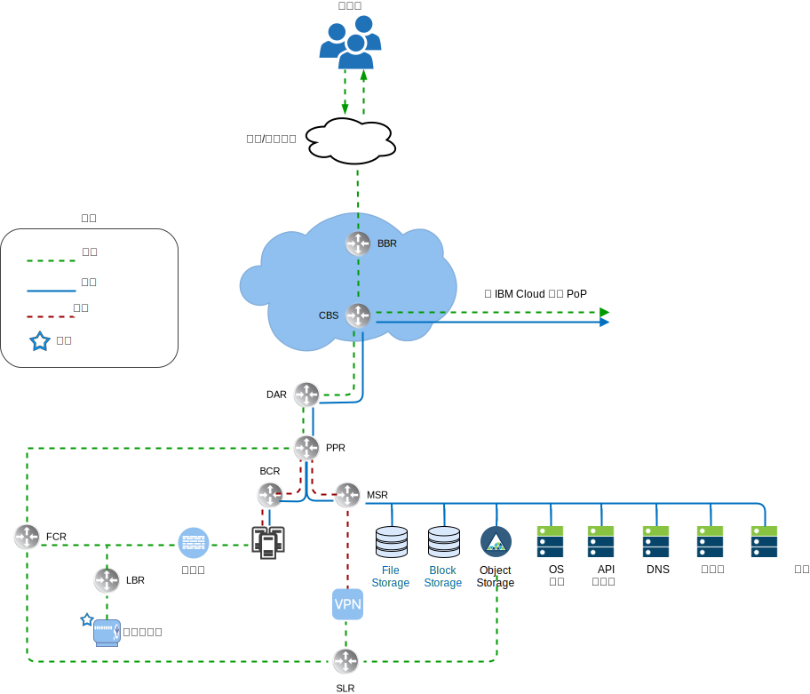
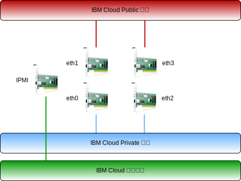

---

copyright:

  years:  2016, 2019

lastupdated: "2019-02-15"

---

# IBM Cloud 網路概觀
{: #vcsnsxt-overview-ic4vnetwork}

{{site.data.keyword.cloud}} 會處理實體網路。下列資訊說明 {{site.data.keyword.cloud_notm}} 所提供的實體網路，以及與先前所說明實體主機相關聯的實體主機連線（VLAN、MTU）。

{{site.data.keyword.cloud_notm}} 的實體網路分成三個不同的網路：公用、專用和管理。

圖 1. {{site.data.keyword.cloud_notm}} 高階網路視圖

## 公用網路
{: #vcsnsxt-overview-ic4vnetwork-public-net}

{{site.data.keyword.CloudDataCents_notm}} 及網路存在點 (PoP) 具有多個 1 Gbps 或 10 Gbps 最上層傳輸及對等網路營運商連線。世界各地的網路資料流量都會連接至最近的網路 PoP，並直接透過網路傳送到其資料中心，以讓提供者之間的網路中繼站數目及遞交次數減到最少。在資料中心內，透過一對對等聚集前端客戶交換器 (FCS) 提供個別伺服器的 1 Gbps 或 10 Gbps 網路頻寬。這些聚集交換器連接到一對個別路由器（亦即，前端客戶路由器 (FCR)），以執行 L3 網路功能。這種多層式的設計，容許網路在 {{site.data.keyword.CloudDataCent_notm}} 內的機架、列及 Pod 之間進行調整。

## 專用網路
{: #vcsnsxt-overview-ic4vnetwork-private-net}

所有 {{site.data.keyword.CloudDataCents_notm}} 及 PoP 都是藉由專用網路骨幹進行連接。此專用網路與公用網路分開，而且可以啟用全球各地之 {{site.data.keyword.CloudDataCents_notm}} 中服務的連線功能。使用多個 10 Gbps 或 40 Gbps 專用網路連線，可以在資料中心之間移動資料。與公用網路類似，專用網路在該伺服器中為多層式，而其他基礎架構則連接至聚集的後端客戶交換器 (BCS)。這些聚集交換器連接到一對個別路由器（亦即，後端客戶路由器 (BCR)），以執行 L3 網路功能。專用網路也支援使用巨大訊框 (MTU 9000) 來進行實體主機連線的功能。

## 管理網路
{: #vcsnsxt-overview-ic4vnetwork-mgmt-net}

除了公用及專用網路之外，每部 {{site.data.keyword.cloud_notm}} 伺服器還會連接至頻外管理網路。這個可透過 VPN 存取的管理網路，容許「智慧型平台管理介面 (IPMI)」存取伺服器以進行維護及管理，而不論其 CPU、韌體及作業系統為何。

## 主要及可攜式 IP 區塊
{: #vcsnsxt-overview-ic4vnetwork-ip-blocks}

{{site.data.keyword.cloud_notm}} 配置兩種類型的 IP 位址，以在 {{site.data.keyword.cloud_notm}} 基礎架構內使用：
* 主要 IP 位址會指派給 {{site.data.keyword.cloud_notm}} 所佈建的裝置、裸機及虛擬伺服器。使用者不應該指派這些區塊中的任何 IP 位址。
* 我們提供可攜式 IP 位址，供使用者視需要指派及管理。

如果在帳戶內啟用 VLAN Spanning，或將帳戶配置為虛擬遞送及轉遞 (VRF) 帳戶，則可以將「主要」或「可攜式」IP 位址變成可遞送給客戶帳戶內的任何 VLAN。

## VLAN Spanning
{: #vcsnsxt-overview-ic4vnetwork-vlan-spanning}

VLAN Spanning 是 {{site.data.keyword.cloud_notm}} 廣域帳戶設定，容許將帳戶內所有 VLAN 的每個主要及可攜式子網路 IP 區塊遞送給彼此。此設定無法使用時，IP 區塊仍然可以遞送至 {{site.data.keyword.cloud_notm}} 服務，但不能遞送給彼此。此架構需要在已部署 VMware vCenter Server on {site.data.keyword.cloud_notm}} 的帳戶內啟用 VLAN Spanning，以在解決方案元件所在的各種子網路中透通地進行連線。

## 虛擬遞送及轉遞
{: #vcsnsxt-overview-ic4vnetwork-vrf}

{{site.data.keyword.cloud_notm}} 帳戶也可以配置為「虛擬遞送及轉遞 (VRF)」帳戶。VRF 帳戶提供與 VLAN Spanning 類似的功能，以啟用子網路 IP 區塊之間的自動遞送。所有具有 Direct Link 連線的帳戶都必須轉換或建立為 VRF 帳戶。

## 實體主機連線
{: #vcsnsxt-overview-ic4vnetwork-host-connect}

此設計內的每部實體主機都會有兩對備用的 10 Gbps 乙太網路連線，以連接至每台 {{site.data.keyword.cloud_notm}} Top of Rack (ToR) 交換器（公用及專用）。配接卡會設定為總共 4 個 10 Gbps 連線的個別連線（未結合）。這樣可讓每個網路介面卡 (NIC) 連線彼此獨立地運作。

圖 2. 實體主機連線

## VLAN
{: #vcsnsxt-overview-ic4vnetwork-vlans}

VMware on {{site.data.keyword.cloud_notm}} 供應項目設計成在部署時指派三個 VLAN（一個公用及兩個專用）。公用 VLAN 會指派給 eth1 及 eth3，而專用連線會指派給 eth0 及 eth2。請務必注意，依預設，在此設計中，建立及指派的公用 VLAN 及第一個專用 VLAN 不會加上標籤。稍後，額外的專用 VLAN 會成為實體交換器埠的主幹，並在使用這些子網路的 VMware 埠群組內加上標籤。

如前所述，在此設計中，專用網路由兩個 VLAN 組成。會將三個子網路配置給這些 VLAN 中的第一個 VLAN（這裡指定為「專用 VLAN A」）。第一個是 {{site.data.keyword.cloud_notm}} 指派給實體主機的主要專用 IP 子網路範圍。第二個子網路用於管理虛擬機器（例如，vCenter Server Appliance、Platform Services Controller）。第三個用於使用 NSX Manager 指派給每部主機的「VXLAN 通道端點 (VTEP)」。

除了「專用 VLAN A」之外，還有第二個專用 VLAN（這裡指定為「專用 VLAN B」）存在，可以支援 VMware 特性（例如 vSAN 和 vMotion）以及網路連接儲存空間 (NAS) 的網路連線功能。因此，VLAN 分為兩個或三個可攜式子網路。第一個子網路會指派給 vMotion 資料流量用的核心埠群組。其餘的子網路用於儲存空間資料流量，而使用 vSAN 時，會將其中一個指派給用於 vSAN 資料流量的核心埠群組。使用 NAS 時，會將其中一個指派給 NFS 資料流量專用的埠群組。所有配置為 vCenter Server 自動化部署一部分的子網路都會使用 {{site.data.keyword.cloud_notm}} 管理的範圍。這是要確保，在您目前或未來需要時，可以將任何 IP 位址遞送至所使用之 {{site.data.keyword.cloud_notm}} 帳戶內的任何資料中心。

表 1. VLAN 及子網路摘要

VLAN 	|子網路類型 	|說明       
---|---|---
公用 |主要  | 指派給實體主機，以進行公用網路存取。在起始部署時不會使用。
公用 |可攜式  |指派給 customer-nsx-esg 上的上行鏈路及 NAT 使用情形。
公用 |可攜式  |指派給 mgmt-nsx-esg 上的上行鏈路 NAT 使用情形。
公用 |可攜式  |指派給 hcx-mgmt-esg 上的上行鏈路 NAT 使用情形（若選取 Hybridity Bundle）。
專用 A 	|主要    |指派給 {{site.data.keyword.cloud_notm}} 所指派的實體主機。由管理介面用於 vSphere 管理資料流量。
專用 A 	|可攜式  |指派給充當管理元件的虛擬機器。
專用 A 	|可攜式  |指派給 NSX VTEP。
專用 A 	|可攜式  |指派給 HCX 以供內部使用（若選取 Hybridity Bundle）。
專用 A 	|可攜式  |指派給 customer-nsx-esg 上的上行鏈路使用情形。
專用 A 	|可攜式  |指派給 HCX（若選取 Hybridity Bundle）。
專用 B	 |主要	  |在起始部署時不會使用。
專用 B 	|可攜式  |指派給 vSAN（若使用中）。
專用 B 	|可攜式  |指派給 NAS（若使用中）。
專用 B 	|可攜式  |指派給 vMotion。

此設計是使用 VLAN 上的實體主機及虛擬系統實例 (VSI) 所實作，並配置成指向 {{site.data.keyword.cloud_notm}} BCR（後端「專用網路」客戶路由器）以作為預設路徑。vCenter Server 實例啟用軟體定義網路的使用。{{site.data.keyword.cloud_notm}} 管理路由器無法辨識由 NSX 所建立並包括遞送至 VLAN 子網路的任何網路套版，而且您可能需要建立靜態路徑、防火牆規則及 NAT 規則，才能適當地管理網路流程。

專用網路連線配置成使用 MTU 大小為 9000 的巨大訊框，以改善大型資料傳送（例如儲存空間及 vMotion）的效能。這是 VMware 內及 {{site.data.keyword.cloud_notm}} 容許的最大 MTU。公用網路連線使用標準乙太網路 MTU 1500。必須維護此值，因為任何變更都可能導致透過網際網路傳送時發生封包片段化。

## 相關鏈結
{: #vcsnsxt-overview-ic4vnetwork-related}

* [vCenter Server on {{site.data.keyword.cloud_notm}} with Hybridity Bundle 概觀](/docs/services/vmwaresolutions/archiref/vcs?topic=vmware-solutions-vcs-hybridity-intro)
