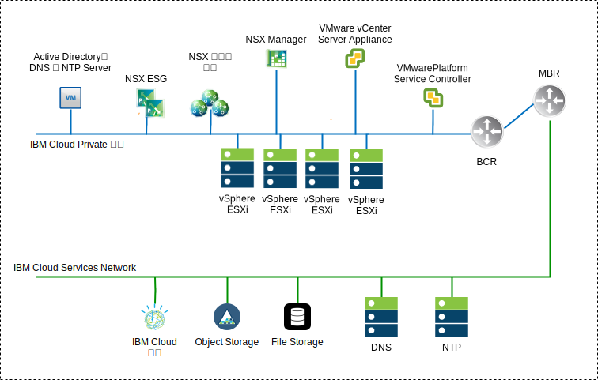

---

copyright:

  years:  2016, 2019

lastupdated: "2019-01-23"

---

# NSX-V 概觀

網路虛擬化提供存在於虛擬層內的網路層疊。NSX-V 提供具有快速佈建、部署、重新配置及毀損隨需應變虛擬網路這類特性的架構。此設計使用 vSphere Distributed Switch (vDS) 及 VMware NSX for vSphere 來實作虛擬網路。

在此設計中，NSX Manager 部署至起始叢集。NSX Manager 會獲指派指定給管理元件之專用可攜式位址區塊中的 VLAN 支援 IP 位址，也會配置先前記載的 DNS 及 NTP 伺服器。

表 1. NSX-V Manager 虛擬應用裝置規格

 屬性            | 規格                           
---|---
 NSX Manager     | 虛擬應用裝置 
 vCPU 數目       |4 
記憶體| 16 GB 
 磁碟            | 管理 NFS 共用上 60 GB 
 磁碟類型        | 精簡佈建                     
網路| 指定給管理元件的**專用 A** 可攜式 

下列 NSX-V Manager 網路概觀顯示與此架構中其他元件相對的 NSX Manager 位置。

圖 1. NSX-V Manager 網路概觀

在起始部署之後，{{site.data.keyword.cloud}} 自動化會在起始叢集內部署三個 NSX Controller。控制器會獲指派指定給管理元件之**專用 A** 可攜式子網路中的 IP 位址。會建立 VM-VM 反親緣性規則，以在叢集中的各主機間區隔控制器。起始叢集必須至少部署三個節點，以確保控制器具有高可用性。

除了控制器之外，{{site.data.keyword.cloud_notm}} 自動化還會準備具有 NSX VIBS 的已部署 vSphere 主機，以透過使用「VXLAN 通道端點 (VTEP)」來使用虛擬化網路 (VXLAN)。VTEP 會獲指派的 IP 位址來自指定給 VTEP 之**專用 A** 可攜式子網路的 IP 位址範圍。VXLAN 資料流量位於未加上標籤的 VLAN，並且會指派給專用虛擬分散式交換器 (vDS)。稍後，會指派區段 ID 儲存區，並將叢集中的主機新增至傳輸區域。傳輸區域中只會使用單點播送，因為 {{site.data.keyword.cloud_notm}} 內未配置 IGMP 探查。

接著會部署 NSX Edge Services Gateway (ESG) 配對。對於所有部署，都會將一個閘道配對用於來自位於專用網路之自動化元件的出埠資料流量。VMware vCenter Server on {{site.data.keyword.cloud_notm}} 實例包括第二個閘道（稱為客戶管理邊緣），其已部署並配置連往公用網路的上行鏈路，以及指派給專用網路的介面。管理者可以配置任何必要的 NSX 元件，例如「分散式邏輯路由器 (DLR)」、邏輯交換器和防火牆。

## 分散式交換器設計

此設計使用最少數目的虛擬分散式交換器 (vDS)。叢集中的主機已連接至公用及專用網路。它們已配置兩個虛擬分散式交換器。兩台交換器的使用遵循 {{site.data.keyword.cloud_notm}} 內所實作公用及專用網路的實體網路區隔。

共配置兩個分散式交換器。第一個適用於公用網路連線功能 (SDDC-Dswitch-Public)，而第二個適用於專用網路連線功能 (SDDC-Dswitch-Private)。
需要區隔不同類型的資料流量，以降低競用及延遲。基於存取安全，也需要區隔網路。VLAN 用來區隔實體網路功能。此設計使用三個 VLAN。兩個用於專用網路資料流量，一個用於公用網路資料流量。

表 2. VLAN 資料流量對映

VLAN      | 指定        | 資料流量類型 
---|---|---
VLAN1     | 公用        | 可用於網際網路存取 
VLAN2     | 專用 A    | ESXi 管理、管理、VXLAN (VTEP) 
VLAN3     | 專用 B    | vSAN、NFS、vMotion 

工作負載中的資料流量將會在 NSX 邏輯交換器上流動。vSphere 叢集會將兩個 vSphere Distributed Switch (vDS) 用於聚合叢集。

表 3. 聚合叢集分散式交換器

vSphere Distributed Switch 名稱 |功能                          |網路 I/O 控制 |負載平衡模式 |實體 NIC 埠 | MTU 
---|---|---|---|---|---
 SDDC-Dswitch-Private | ESXi 管理 虛擬 SAN vSphere vMotion VXLAN 通道端點 (VTEP) NFS| 啟用 | 根據明確失效接手（vSAN、vMotion）遞送。 原始虛擬埠（所有其他項目）|2 | 9,000（巨大訊框）
 SDDC-Dswitch-Public | 外部管理資料流量（南北向）| 啟用 | 根據原始虛擬埠遞送 |2 | 1,500（預設值）

表 4. 分散式交換器埠群組小組及失效接手設定

 參數               | 設定          
---|---
 負載平衡           |根據來源虛擬埠遞送 \*
 失效接手偵測       | 僅限鏈結狀態 
 通知交換器         | 啟用 
 失效回復           | 啟用 
 失效接手順序       | 作用中的上行鏈路：Uplink1、Uplink2 \* 

\* vSAN 埠群組會使用作用中或待命的明確失效接手，因為它不支援進行 vSAN 儲存空間資料流量的負載平衡。
{:note}

圖 2. 叢集 VM 核心介面埠群組對映

表 5. 叢集虛擬交換器埠群組、VLAN 及小組原則

 vSphere Distributed Switch | 埠群組名稱 |小組	|上行鏈路 | VLAN ID 
---|---|---|---|---
SDDC-Dswitch-Private	|SDDC-DPortGroup-Mgmt	|來源虛擬埠| 作用中：0、1 |VLAN1     
SDDC-Dswitch-Private	|SDDC-DPortGroup-vMotion	|來源虛擬埠| 作用中：0、1 |VLAN2     
SDDC-Dswitch-Private	|SDDC-DPortGroup-VSAN	| 明確失效接手 | 作用中：0 待命：1 |VLAN2     
SDDC-Dswitch-Private	|SDDC-DPortGroup-NFS	|來源虛擬埠| 作用中：0、1 |VLAN2     
SDDC-Dswitch-Private	| 由 NSX 自動產生 |來源虛擬埠| 作用中：0、1 |VLAN1     
SDDC-Dswitch-Public	  |SDDC-DPortGroup-External	|來源虛擬埠| 作用中：0、1 |VLAN3     

## NSX-V

此設計指定 NSX 元件的配置，但不會套用任何網路套版元件配置。客戶可根據需求自行決定設計網路套版。

已配置下列元件：
-	管理伺服器及控制器已安裝並整合至 vCenter Web 使用者介面。
-	已安裝 ESXi 代理程式，並配置每部 ESXi 主機的 VTEP IP 位址。
-	VTEP 配置、控制器配置、VXLAN 配置（傳輸區域）。
-	供管理元件使用的 NSX Edge Services Gateway (ESG) 應用裝置。
-	僅針對 vCenter Server，NSX Edge Services Gateway (ESG) 應用裝置供客戶使用。

「未」配置的項目：
-	虛擬分散式路由器。
-	微分段。
-	VXLAN。
-	將「NSX 管理」鏈結至其他 VMware 實例。

### NSX-V 安全

NSX for vSphere 可讓組織將資料中心劃分為不同的安全區段，並往下探查至個別工作負載的層次，但與工作負載執行所在無關。IT 團隊可以根據應用程式及使用者環境定義來定義每個工作負載的原則，這確保立即回應資料中心內的威脅，並向下強制執行到應用程式。

下列是一些主要 NSX 元件：
-	NSX 分散式有狀態防火牆內嵌在每個 Hypervisor 主機最多有 20 Gbps 防火牆容量的 Hypervisor 核心內。透過 NSX Edge 提供南北向防火牆功能。
-	NSX 會將動態安全群組及相關聯原則建立到不只是 IP 位址及 MAC。這些原則包括 vCenter 物件和標籤、作業系統類型以及「第 7 層」應用程式資訊，以根據應用程式的環境定義來啟用微分段。
-	使用來自 VM、Active Directory 及 Mobile Device Management 整合之登入資訊的身分型原則，可根據使用者來容許安全（包括遠端及虛擬桌面環境中的階段作業層次安全）。
- Application Rule Manager 及 Endpoint Monitoring 可啟用最多「第 7 層」的端對端網路資料流量視覺化，並容許應用程式團隊識別資料中心內及資料中心間端點，以及建立適當的安全規則予以回應。
- 支援與協力廠商供應商的管理、控制平面及資料平面整合（例如下一代防火牆、IDS/IPS、無代理程式防毒、切換、進階安全等等）。

下圖顯示如何建立安全群組來實作一些 NSX-V 微分段特性的高階圖。在此範例中，production 及 development 是安全群組，並根據這些群組來指派安全規則。

圖 3. NSX-V 安全

### 相關鏈結

* [vCenter Server on {{site.data.keyword.cloud_notm}} with Hybridity Bundle 概觀](/docs/services/vmwaresolutions/archiref/vcs/vcs-hybridity-intro.html)
