---

copyright:

  years:  2016, 2018

lastupdated: "2018-11-06"

---

# IBM Kubernetes Service

## IKS 概觀

IBM Kubernetes Service (IKS) 提供隔離的安全平台來管理容器。此平台在失效接手時具有可攜性、可延伸及自我修復功能。

此架構包含下列主要元件：
-	**{{site.data.keyword.cloud}} 帳戶** - 工作者節點部署至 {{site.data.keyword.cloud_notm}} 帳戶。主節點部署至 IBM 所管理的中央「雲端帳戶」。
-	**叢集** - Kubernetes 叢集包含一或多個工作者節點。
-	**工作者節點** - 工作者節點是裸機，或 IBM 帳戶中所管理的虛擬伺服器實例。當您佈建工作者節點時，要判斷該工作者節點上管理之容器可用的資源。工作者節點包括 IBM 管理的「Docker 引擎」、個別運算資源、網路及儲存空間磁區服務。
-	**主節點** - 工作者節點是由 Kubernetes 主節點所管理，Kubernetes 主節點會集中控制及監視叢集中的所有 Kubernetes 資源。此主節點由 IBM 所管理。

IKS 具有下列概念：
-	**服務** - 服務是一個 Kubernetes 資源，可將一組 Pod 分組，並提供與這些 Pod 的網路連線功能，而不會公開每個 Pod 的實際專用 IP 位址。您可以使用服務，在叢集內或公用網際網路中使用您的應用程式。
-	**部署** - 部署是 Kubernetes 資源，您可以在其中指定執行應用程式所需之其他資源或功能的相關資訊（例如服務、持續性儲存空間或註釋）。將部署記載在配置 YAML 檔案中，然後再將其套用至叢集。Kubernetes 主節點會配置資源，並將容器部署至具有可用容量之工作者節點上的 Pod。定義應用程式的更新策略，包括您要在漸進式更新期間新增的 Pod 數目，以及每次更新時可能無法使用的 Pod 數目。當您執行漸進式更新時，部署會檢查更新是否正常運作，並且在偵測到失敗時停止推出。
-	**Pod** - 由稱為 Pod 的 Kubernetes 資源部署、執行及管理叢集中的每個應用程式。Pod 代表 Kubernetes 叢集中的小型可部署單元，並且用來將必須視為單一單元的容器分組在一起。在大部分情況下，每一個容器都會部署至其專屬 Pod。應用程式可能需要將一個容器及其他 Helper 容器部署至一個 Pod，以使用相同的專用 IP 位址來定址那些容器。
-	**應用程式** - 應用程式可能指的是整個應用程式或應用程式的元件。您可以在個別 Pod 或個別工作者節點中部署應用程式的元件。

Kubernetes 不會規定特定網路解決方案。

Kubernetes 網路模型只需要陳述三個基礎需求：
* 容器可以在不使用 NAT 的情況下與所有其他容器通訊
* 節點可以在不使用 NAT 的情況下與所有容器通訊（反之亦然）
* 容器本身所看到的 IP 與其他人看到該容器的 IP 相同。

### 名稱空間

名稱空間是容器網路的基礎層面。名稱空間是用來分割核心資源的 Linux 核心特性，讓一組處理程序可以看到一組資源，而另一組處理程序則會看到一組不同的資源。資源包括裝載點、處理程序 ID、網路堆疊、IPC 及使用者 ID。每個名稱空間都有一組專用 IP 位址、其自己的遞送表、Socket 清單、連線追蹤表格、防火牆，以及其他網路相關資源。

### 容器網路介面

Kubernetes 會使用「容器網路介面 (CNI)」作為其外掛程式導向的網路解決方案。它包含用於撰寫外掛程式的一個規格及多個程式庫，以在 Linux 容器中配置網路介面。CNI 規格是僅處理容器網路連線功能的輕量型規格，以及刪除容器之後的資源記憶體回收。

Kubernetes 的 CNI 環境定義中有兩個核心定義：
- **Pod** - 與 Linux 網路名稱空間同義。Kubernetes 中的排定單元是一個 Pod，基本上，這是一律並置（當成一個單元排定至節點）的一組緊密連結的一個以上容器。Pod 不能分散到多個工作者節點。
- **網路** - 可以彼此通訊的唯一可定址實體群組。這些實體可能是個別容器、機器或一些其他網路裝置（例如路由器）。

若要讓 CNI 將容器新增至網路，容器運行環境必須先建立容器的新網路名稱空間，然後啟動一個以上已定義的外掛程式。網路配置採用 JSON 格式，且包含必要欄位，例如名稱和類型，以及外掛程式類型特定欄位。CNI 外掛程式預期會將 IP 位址指派給介面，並設定其相關的網路路徑。IKS 使用 Calico 作為 CNI 的網路外掛程式。Calico 會將 IP 位址指派給每個工作負載。在 IKS 中，Calico 使用 IP-in-IP 通道作業，以在「{{site.data.keyword.cloud_notm}} 網路」中隱藏容器網路 IP 位址。

從網路資料流量的角度來看，我們會區分 IKS 中的四種類型，如下圖所示。

圖 1. 容器網路資料流量類型

- **Pod 內網路** - 也稱為容器對容器通訊。Pod 內的所有容器都會共用網路名稱空間、相同的 IP 位址，並在本端主機上看到彼此。每個應用程式的資料流量都是使用不同的埠號來區分。開發人員必須確保 Pod 內的容器在所使用的埠中，彼此之間不會發生衝突。在 Pod 內，存在一個所謂的基礎架構容器。這是 kubelet 所啟動的第一個容器，並獲得 Pod 的 IP 以及設定網路名稱空間。然後，Pod 中的所有其他容器都結合基礎架構容器的網路及 IPC 名稱空間。容器已啟用網路橋接器模式，而且 Pod 中的所有其他容器都透過容器模式結合此名稱空間。如果基礎架構容器當掉，則 kubelet 會結束 Pod 中的所有容器，然後通常會使用新的 IP 位址來重新佈建。在本文件中，我們不會提供此資料流量的任何其他詳細資料。

- **Pod 間網路** - 也稱為「Pod 對 Pod」通訊。有三種類型的東西向資料流量：
  - Pod 可以直接與相同子網路上的其他 Pod 通訊。在 IKS 中，每個 Pod 都會有一個從 IKS 所提供範圍指派的 IP 位址。在佈建時，每個工作者節點都會獲指派一個子網路。相同子網路及主機中的 Pod 發生沒有 Proxy、通道作業或 NAT 的 Pod 對 Pod 通訊。
  - Pod 可以直接與不同子網路上的其他 Pod 通訊。在 IKS 中自動配置 IP-in-IP 封裝，只封裝跨子網路流動的封包。此封裝會在「{{site.data.keyword.cloud_notm}} 網路」中隱藏 Pod 網路位址空間。封裝會使用來自 {{site.data.keyword.cloud_notm}} 主要專用子網路的 IP 位址。
  - Pod 可以使用服務與其他 Pod 通訊（稱為 Pod 對服務通訊）。不過，Pod 可以直接與其他 Pod 通訊，因為 Pod 上方的兩個點會當掉。它們會產生，但在當掉時不會復活。抄本集會動態建立及破壞 Pod（例如擴增或縮減時）。雖然每個 Pod 都會取得其自己的 IP 位址，但即使是這些 IP 位址還是無法依賴，無法在一段時間內維持穩定。開發人員最好使用服務建構來進行通訊，其中，使用可透過 DNS 探索的穩定虛擬 IP 位址。

- **Ingress** - 指的是將資料流量從外部使用者或應用程式遞送至 Pod。服務提供一組 Pod 的穩定虛擬 IP (vIP) 位址。雖然 Pod 是暫時的，但是服務可讓用戶端使用 vIP 可靠地探索並連接至 Pod 中所執行的容器。此 vIP 不是連接至網路介面的實際 IP 位址。它的目的只是充當穩定端點，以將資料流量轉遞至一個以上的 Pod。從叢集外部存取 Pod 更具挑戰性。Kubernetes 旨在為服務提供高可用性、高效能的負載平衡。IKS 中有南北向資料流量的三個選項：

  - **NodePort** - NodePort 服務視為適合進行測試，或者是否只有短時間才需要公用或專用存取。NodePort 服務會透過工作者節點的專用及公用 IP 位址在工作者節點上開啟埠。如果您要封鎖公用或專用，則必須使用 Calico preDNAT 網路原則。工作者節點的公用及專用 IP 位址不是永久性的。
  - **LoadBalancer** - 指派給負載平衡器的可攜式公用及專用 IP 位址是永久性的，而且在叢集中重建工作者節點時不會變更。您可以公開應用程式所需的任何埠來自訂負載平衡器。具有可攜式專用 IP 位址的負載平衡器服務仍然會在每個工作者節點上開啟一個公用節點埠。您必須使用 Calico preDNAT 網路原則來封鎖其上的公用節點埠。
  - **Ingress 服務** - ALB 使用安全且唯一的公用或專用進入點，將送入的要求遞送至您的應用程式。ALB 會接聽送入的 HTTP 或 HTTPS、TCP 或 UDP 服務要求。它會根據您在 Ingress 資源中所定義的規則，跨應用程式 Pod 轉遞要求。當您建立叢集時，會自動建立一個公用及一個專用 Ingress 應用程式負載平衡器 (ALB)。因為啟用公用 ALB，而且依預設會停用專用 ALB，所以您必須停用公用 ALB，並啟用專用 ALB。

- **Egress** - 指的是在 Pod 外部呼叫外部資源（例如 API）或取用 VM 中的資源。Egress 選項：
    - 針對在叢集外執行的系統，定義服務資源。會建立一個「端點」資源，詳細說明外部系統：IP 位址及埠號。「端點」資源可以列出數個位址，而 Kubernetes 會在那些位址之間循環，就像在叢集內執行的 Pod 之間一樣。然後，使用「服務」資源為服務建立 kube-dns 中的「叢集 IP」及 DNS 名稱。
    - 使用 stongSwan IPSec VPN，您可以連接至叢集外部的應用程式。使用 Helm 圖表，會部署並配置 Kubernetes Pod 內的 strongSwan IPSec VPN 服務。建立 VPN 連線功能時，會在叢集中的所有工作者節點上自動配置路徑。這些路徑容許透過 VPN 通道在任何工作者節點與遠端系統上的 Pod 之間進行雙向連線。如果 Pod 失敗，則叢集會重新啟動 Pod，不過，在啟動新的 Pod 並重新建立 VPN 連線時，您可能會遇到短暫的關閉時間。可攜式公用或專用 IP 位址用於 strongSwan VPN 服務。local.subnet 設定可以使用叢集 Pod 子網路、叢集服務子網路或是公用或專用可攜式子網路。使用 localSubnetNAT 設定可以重新對映叢集子網路。或者，可以在單一 IP 位址後面隱藏叢集 IP 位址，方法是將 enableSingleSourceIP 設為 true。若要重新對映遠端網路子網路，請使用 remoteSubnetNAT 設定。
    - {{site.data.keyword.cloud_notm}} Virtual Router Appliance 可以部署為 VPN 閘道，以安全地連接至外部網路。公用或專用網路資料流量可以透過 VRA 進行遞送。VRA 會建立遠端 VPN 閘道的已加密 IPSec 通道。

## IKS 元件

工作者節點是由 Kubernetes 主節點所管理，Kubernetes 主節點會集中控制及監視叢集中的所有 Kubernetes 資源。開發人員部署容器的資源時，主節點可決定要在其上部署這些資源的工作者節點，並考慮叢集中的部署需求及可用容量。主節點及工作者節點透過安全的 TLS 憑證以及透過 {{site.data.keyword.cloud_notm}} 公用網路的 openVPN 連線彼此通訊。開發人員可以存取透過網際網路在「主節點」上管理的 kube-apiserver。

工作者節點中的 kubelet 會監看主節點中 kube-apiserver 的更新，並報告狀態。kubelet 是在每個工作者節點上執行的 Pod，負責監視在工作者節點上執行之 Pod 的性能，以及監看 Kubernetes API 伺服器傳送的事件。根據這些事件，kubelet 會建立或移除 Pod、發出存活性及就緒探測，以及將 Pod 的狀態回報給 Kubernetes API 伺服器。

從網路視景，下列元件會部署至工作者節點：

-	**openvpn-client** - OpenVPN 用戶端與 OpenVPN 伺服器搭配運作，以將主節點安全地連接至工作者節點。此元件在 kube-system 名稱空間中運作。
-	**Calico 節點** - Calico 節點是一個容器，可以使用 Calico 將網路容器所需的各種元件組合在一起。此元件在 kube-system 名稱空間中運作。
-	**Calico 原則控制器** - Calico 原則控制器監看入埠及出埠網路資料流量，以符合設定的網路原則。如果叢集裡不容許資料流量，則對叢集的存取會遭到封鎖。Calico 原則控制器也用來建立及設定叢集的網路原則。此元件在 kube-system 名稱空間中運作。
-	**Calico CNI** - Calico 容器網路介面 (CNI) 管理容器的網路連線功能，並在刪除容器時移除已配置的資源。
-	**Calico IPAM** - Calico IPAM 管理容器的 IP 位址指派。
-	**kube Proxy** - Kubernetes 網路 Proxy 是一個常駐程式，可在每個工作者節點上執行，以及針對叢集中執行的服務轉遞或負載平衡 TCP 及 UDP 網路資料流量。此元件在 kube-system 名稱空間中運作。
-	**kube DNS** - Kubernetes DNS 會在叢集上排定 DNS Pod 及服務。容器在搜尋其他 Pod 及服務時，會自動使用 DNS 服務的 IP 來解析 DNS 名稱。此元件在 kube-system 名稱空間中運作。
-	**Ingress ALB** - Ingress 是一種 Kubernetes 服務，您可以使用此服務，將公用或專用要求轉遞至叢集中的多個應用程式，以平衡叢集中的網路資料流量工作負載。若要透過公用及專用網路來公開您的應用程式，您必須建立 Ingress 資源，向 Ingress 應用程式負載平衡器 (ALB) 登錄您的應用程式。然後，便可以使用單一 URL 或 IP 位址來存取多個應用程式。此元件在 ibm-system 名稱空間中運作。
-	**負載平衡器** - 負載平衡器是一種 Kubernetes 服務，可用來將公用或專用要求轉遞至應用程式，以平衡叢集中的網路資料流量工作負載。此元件在 ibm-system 名稱空間中運作。

### Calico

IKS 使用 Calico 作為其網路提供者。Calico 正在使用「第 3 層」方法，而非層疊網路。透過 CNI 外掛程式，Calico 會與 Kubernetes 整合，以提供網路，讓使用者利用搭配使用純正 IP 網路與「邊界閘道通訊協定」的方法來進行路徑分佈。

Calico 提供一種 L3 Fabric 網路架構解決方案，而非 vSwitch，而 Calico 會在每個運算節點中使用 vRouter 函數。這會利用 Linux Kernel 的現有 L3 轉遞功能。Calico 透過 vRouter 直接將每個工作負載連接至基礎架構網路。vRouter 函數利用 BGP 來通告每個工作者節點中所管理 Pod 的路徑。每個 vRouter 都會使用 BGP 將其所連接的所有端點發表到所有其他 vRouter。

在 Calico 中，由工作者節點上的 Linux 遞送表及 iptables 基礎架構遞送往返 Pod 的 IP 封包，並設定其防火牆。

-	對於傳送封包的工作負載，Calico 確保工作者節點一律傳回為下一個躍點 MAC 位址，而不管工作負載本身可能配置的遞送為何。
-	對於定址至工作負載的封包，最後一個 IP 躍點是從目的地工作負載的工作者節點到工作負載本身的 IP 躍點。

圖 2. Calico CNI

上方的圖表顯示下列 Calico 元件：
-	**calicoctl** - 指令行介面。
-	**CNI 外掛程式**
-	**鍵值儲存庫** - 保留 Calico 的原則及網路配置狀態。Calico 使用 etcd 以提供元件之間的通訊，以及作為一致的資料儲存庫，這確保 Calico 一律可以建置精確的網路。etcd 元件會分佈至整個部署。它分成兩組機器：核心叢集及 Proxy。
-	**calico/node** - 一個 "helper" 容器，可將網路所需的各種元件組合在一起：
 -	**Felix** - 在端點管理所在之每部機器上執行的主要 Calico 代理程式。它負責使用程式設計路徑及 ACL，以及主機上所需的其他任何項目，以針對該主機上的端點提供想要的連線功能。
 - **BIRD** - BIRD 是一個開放程式碼 BGP 用戶端，用來在主機之間交換遞送資訊。Felix 將路徑插入至 Linux Kernel FIB 時，BGP 用戶端會挑選它們，並將它們分佈至部署中的其他節點。這確保在部署周圍有效率地遞送資料流量。
 - **Confd** - confd 範本引擎會監視 etcd 資料儲存庫是否有下列項目的任何變更：BGP 配置以及某個最上層廣域預設配置（例如「AS 號碼」、記載層次及 IPAM 資訊）。然後，它會根據 etcd 中的資料來動態產生 BIRD 配置檔，而 etcd 中的資料是從資料更新自動觸發。配置檔變更時，confd 會觸發 BIRD，以載入新的檔案。

因為 {{site.data.keyword.cloud_notm}} Private 網路只會轉遞 {{site.data.keyword.cloud_notm}} IP 定址綱目，所以需要有 Calico，才能使用 IKS 中工作負載間資料流量的 IP-in-IP 封裝來隱藏 Pod 網路 IP 位址。IKS 使用 IP-in-IP 跨子網路模式。

### IKS 中的 Calico

Calico 會自動安裝並配置在 IKS 中。會使用建立您自己的原則來保護特定服務的選項，建立預設原則以保護 Kubernetes 叢集。自動配置 IP-in-IP 封裝，只封裝跨子網路流動的封包，以及使用 NAT 進行來自容器的送出連線。也會在「{{site.data.keyword.cloud_notm}} Kubernetes 服務」中自動啟用「工作負載到 WAN 資料流量」，因此不需要額外配置 Calico。

#### Calico 的網路可調整性

Calico 的建置根據為分散式橫向擴充架構，可讓您順利從單一開發人員記事本擴充至大型企業部署，並使用標準 Linux 資料平面來提供虛擬工作負載的裸機效能。

#### Calico 的安全

Calico 使用一組原則來控制系統的每個元件，而這些原則可以配置為容許服務及容器實例只在需要時才彼此交談。它使用 IP 位址來識別容器實例，並根據這些位址來建立原則。與 Calico 的 Kubernetes 整合是基礎架構察覺的，而且可以根據基礎架構變更來擴充安全原則。

#### 與 Calico 整合

Calico 提供一種高度可擴充網路及網路原則解決方案，以根據與網際網路相同的 IP 網路原則來連接 Kubernetes Pod。部署時，不需要封裝或層疊即可提供高效能且大規模的資料中心網路。Calico 透過其分散式防火牆，為 Kubernetes Pod 提供精細的意圖型網路安全原則。Calico 的執行也可以透過原則強制執行模式以及其他網路解決方案（例如 Flannel，也稱為 canal）或原生 GCE 網路。

## IKS 網路

依預設，IKS 會搭配使用公用 VLAN 及專用 VLAN 的存取權與下列項目來設定叢集。
- 每一個工作者節點的公用 IP 位址，其為工作者節點提供公用網路介面。依預設：
  -	所有工作者節點都容許所有出埠網路資料流量。
  -	除了少數埠之外，入埠網路資料流量會遭到封鎖。會開啟這些埠讓 IBM 可以監視網路資料流量，並自動安裝 Kubernetes 主節點的安全更新項目。
-	每個工作者節點的專用 IP 位址，其為工作者節點提供專用網路介面。
-	所有工作者節點與主節點之間的自動安全 OpenVPN 連線。

第一次在區域中建立叢集時，會在 {{site.data.keyword.cloud_notm}} 基礎架構帳戶中自動為您佈建該區域中的公用 VLAN 及專用 VLAN。對於在該區域中建立的每個後續叢集，您可以重複使用相同的公用及專用 VLAN，因為多個叢集可以共用 VLAN。

工作者節點可以連接至公用 VLAN 及專用 VLAN，或只能連接至專用 VLAN。如果您只要將工作者節點連接至專用 VLAN，則可以使用現有專用 VLAN 的 ID，或建立專用 VLAN，並在建立叢集期間使用 ID。

工作者節點及 Pod 的 IP 子網路也會自動佈建至 VLAN。子網路透過將 IP 位址指派給叢集元件，來提供與叢集元件的網路連線功能。下列子網路會自動佈建在預設公用及專用 VLAN 上：
-	**公用 VLAN 子網路：**
    - 主要公用子網路會決定在建立叢集期間指派給工作者節點的公用 IP 位址。相同 VLAN 上的多個叢集可以共用一個主要公用子網路。
    - 可攜式公用子網路只會連結至一個叢集，並提供該叢集 8 個公用 IP 位址。3 個 IP 保留給網路功能使用。1 個 IP 由預設公用 Ingress ALB 使用，而 4 個 IP 可以用來建立公用負載平衡器網路服務。可攜式公用 IP 為永久性的固定 IP 位址，可用來透過網際網路存取負載平衡器服務。
-	**專用 VLAN 子網路：**
    - 主要專用子網路會決定在建立叢集期間指派給工作者節點的專用 IP 位址。相同 VLAN 上的多個叢集可以共用一個主要專用子網路。
    - 可攜式專用子網路只會連結至一個叢集，並提供該叢集 8 個專用 IP 位址。3 個 IP 保留給網路功能使用。1 個 IP 由預設專用 Ingress ALB 使用，而 4 個 IP 可以用來建立專用負載平衡器網路服務。可攜式專用 IP 為永久性的固定 IP 位址，可用來透過網際網路存取負載平衡器服務。

### 相關鏈結

* [VCS Hybridity Bundle 概觀](../vcs/vcs-hybridity-intro.html)
