---

copyright:

  years:  2016, 2018

lastupdated: "2018-11-01"

---

# 系統環境定義
系統環境定義圖會定義系統的主要元素、系統界限，以及與其互動的實體和互動。它是高階圖，提供讀者系統起始視圖。

圖 1. 系統環境定義

網路視景中的四個核心元件如下：
- **內部部署虛擬化** - 此 VMware 環境裝載於用戶端內部部署或協力廠商，並且目前管理正在執行要現代化之應用程式的虛擬機器 (VM)。它是 VM 移轉的來源環境，並且透過 VMware HCX 與 {{site.data.keyword.cloud}} 鬆散耦合。
- **vCenter Server** - 此 {{site.data.keyword.vmwaresolutions_short}} 實例是從內部部署環境移轉 VM 的目標。它會與內部部署虛擬化一起形成混合式環境，讓 VM 可以無縫地從某個環境移至另一個環境。
- **IBM Cloud Kubernetes Service** - 它使用 Kubernetes 作為容器編排解決方案。IBM 會操作並管理 Kubernetes 主節點，而工作者節點會部署至客戶管理的基礎架構。IBM 提供用於作業系統修補程式部署、Docker 引擎升級和新 Kubernetes 版本的管理工具。IBM Kubernetes Service 提供隔離的安全平台，在失效接手時，用來管理具有可攜性、可延伸及自我修復的容器。
- **IBM Cloud Private** - 用來開發及管理容器化應用程式的應用程式平台。這是整合的環境，其中包括容器編排程式 Kubernetes、專用映像檔儲存庫、管理主控台、監視架構和圖形使用者介面，您可以集中在此介面中部署、管理、監視及調整應用程式。
-	**IBM Cloud Services** - 可從 {{site.data.keyword.cloud_notm}} 使用的各種服務。服務選項包括分析、AI 及 IoT 作為範例。

## 動作者

系統環境定義圖識別下列動作者。

表 1. 動作者

動作者  |說明       
---|---
系統管理者 | 系統管理者是使用 vCenter 及 HCX 外掛程式的企業 VMware 資源。它們會識別移轉的候選項目、延伸網路、移轉 VM，以及管理 NSX-V。它們使用 {{site.data.keyword.cloud_notm}} 主控台來佈建 VCS 實例以及調整容量。
開發人員 | 開發人員是具有企業技術熟練的容器資源，可使用 IKS/ICP/CAM 主控台及 API 來建立與管理容器。他們會在應用程式現代化的過程中建立新的服務。
企業使用者 | 此企業資源需要有應用程式的網路存取權，才能執行更新內容這類的商業程序。
客戶 | 客戶是想要使用企業服務的外部動作者。如果是 Acme Skateboards，則它是想要購買滑板運動產品的滑板玩家。「客戶」需要安全的網際網路來存取型錄。
IBM IKS | 這是管理服務之「IKS 主節點」的 IBM 人力資源。

## 系統

系統環境定義圖識別下列系統。

表 2. 系統

動作者  |說明       
---|---
vCenter| vCenter 是系統管理者的主要介面，用於管理內部部署 VM，以及存取 HCX 外掛程式來延伸網路與移轉 VM。使用 vCenter Server with Hybridity Bundle，系統管理者可以無縫地將內部部署 vSphere 網路整合至在 {{site.data.keyword.cloud_notm}} 上執行的 VCS 實例。混合式網路會將內部部署網路延伸至 {{site.data.keyword.cloud_notm}}，讓客戶可以將其應用程式移轉至在 {{site.data.keyword.cloud_notm}} 上執行的 VCS 實例，並在必要時移轉回內部部署。如需 vCenter Server with Hybridity Bundle 的詳細資料，請參閱 [VMware HCX on {{site.data.keyword.cloud_notm}} 解決方案架構](https://www.ibm.com/cloud/garage/files/HCX_Architecture_Design.pdf)文件。
內部部署 VM| 內部部署 VM 會管理移轉至雲端的應用程式。一開始，它們會移轉為 VM，然後透過應用程式現代化旅程從 VM 移轉至容器。
雲端上 VM | 從內部部署移轉的雲端上 VM 主機應用程式。它們透過延伸的 L2 網路與內部部署應用程式進行通訊。就此參照架構和此 Acme Skateboards 範例而言，其中一個雲端上 VM 是資料庫伺服器，它是線上呈現工作負載的一部分。
NSX-V| VCS 上的 NSX-V 提供由系統管理者管理的軟體定義層疊網路。層疊網路是 HCX 延伸網路的目標，它會處理來自 ICP 之 VM 的資料流量。NSX-V 使用 vSphere Distributed Switch (vDS) 提供部署、重新配置及毀損 VMware 內隨需應變虛擬網路及微分段服務這類特性的參照架構。如需相關資訊，請參閱 [NSX-V 概觀](vcsnsxt-overview-ic4vnsxv.html)。
CAM| {{site.data.keyword.cloud_notm}} Automation Manager (CAM) 在 ICP 上執行，並提供單一窗格，可以直接使用範本，同時佈建 VM 型工作負載及 Kubernetes 型工作負載。CAM 容許開發人員執行下列動作：  - 在 VCS、ICP 或 IKS 上佈建工作負載。  - 組合及編排可理解 VM 和容器的服務。  - 整合其 DevOps 工具鏈及 Day 2 ITSM 解決方案。
容器化應用程式 | 這些應用程式完成應用程式現代化旅程，且目前作為容器執行。就此參照架構和此 Acme Skateboards 範例而言，其中一個容器化應用程式是 Web 伺服器，它是線上呈現工作負載的一部分。
Watson | 就此參照架構和此 Acme Skateboards 範例而言，Watson 代表「概念車」架構中使用的 AI 服務。

### 相關鏈結

* [VCS Hybridity Bundle 概觀](../vcs/vcs-hybridity-intro.html)
