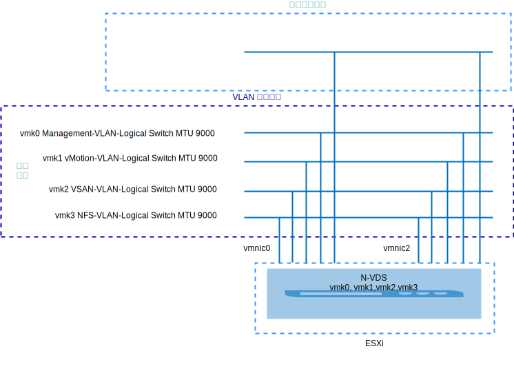
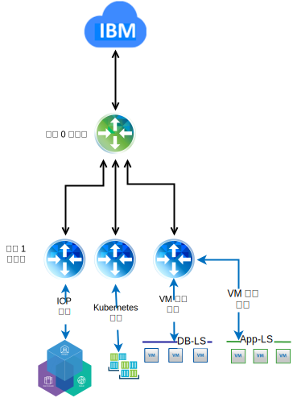

---

copyright:

  years:  2016, 2019

lastupdated: "2019-02-15"

---

# VMware vCenter Server on IBM Cloud 上的 VMware NSX-T 技術預覽
{: #vcsnsxt-techpreview}

## NSX-T 概觀
{: #vcsnsxt-techpreview-nsx-t-ovw}

VMware NSX-T 設計成處理具有異質端點及技術堆疊的應用程式架構。除了 vSphere 之外，這些環境還可以包括其他 Hypervisor、KVM、容器及裸機。NSX-T 可讓 IT 及開發團隊選擇最適合其應用程式的技術。NSX-T 也設計為供開發組織及 IT 組織進行管理、作業及使用。

在此設計中，NSX-T 管理基礎架構部署在起始 vCenter Server 叢集，或部署至現有叢集。

NSX-T Manager 會獲指派專用可攜式位址區塊中的 IP 位址，而此區塊指定給管理元件並配置成使用一般 DNS 及 NTP 伺服器。

部署額外的叢集，並將其當成「Hypervisor 傳輸」節點使用，以及當成工作負載資料儲存庫使用的 vSAN 或 NFS 儲存空間。表 1 彙總中型環境的需求。

表 1. NSX-T 元件規格

資源	|NSX-T Manager	|控制器 x 3	|邊緣 x 2	|裸機邊緣*
---|---|---|---|---
中型 | 虛擬應用裝置 | 虛擬應用裝置 | 虛擬應用裝置 |實體伺服器*
 vCPU 數目       |4	|4	|4	| 8                                   
記憶體	| 16 GB | 16 GB |8 GB	|32 GB
磁碟 |140-GB vSAN 或管理 NFS 共用。|120-GB vSAN 或管理 NFS 共用。|120-GB vSAN 或管理 NFS 共用。|200 GB
 磁碟類型        | 精簡佈建                            | 精簡佈建                            | 精簡佈建                            |實體
網路 |指定給管理元件的專用 A 可攜式。|指定給管理元件的專用 A 可攜式。|指定給管理元件的專用 A 可攜式。|指定給管理元件的專用 A 可攜式。

\* **附註**：檢查硬體相容性清單中的特定需求。

圖 1. NSX-V 及 T 管理元件佈置

### 起始配置
{: #vcsnsxt-techpreview-init-config}

部署 NSX-T Manager，此控制器叢集包含起始 vCenter Server 叢集內的三個控制器及一個 Edge 叢集。將 IP 位址指派給**專用 A** 可攜式子網路中的所有元件。

透過區隔控制器與叢集中主機的方式，建立 VM-VM 反親緣性規則。起始叢集至少要部署三個節點，以確保控制器具有高可用性。

針對 NSX-T Manager 部署另外兩個 vSphere 主機，並在其上安裝 NSX-T 軟體 (VIB)。建立主機及邊緣上行鏈路設定檔、NIOC 設定檔，以及定義用於「通道端點」通訊的 IP 儲存區。如需相關資訊，請參閱上行鏈路設定檔定義表格及 NIOC 設定檔定義表格。

儲存區中所定義的 IP 位址來自**專用 A** 可攜式 IP 位址範圍。建立 VLAN 及層疊傳輸區域，而兩個額外的 ESXi 主機配置為這兩個區域的傳輸節點。目前，會指派對等的上行鏈路設定檔。在 ESXi 主機上建立 N-VDS 轉動，並指派給 uplink1 及 uplink2。

目前，需要有兩個額外的 VLAN，才能容納從 vDS 埠群組到 NSX-T 邏輯 VLAN 交換器之 vmkernel 埠移轉的小組、失效接手及上行鏈路原則。使用適當的 VLAN ID 來建立邏輯 VLAN 交換器，並移轉 vmkernel 埠。

NSX-T 會建立 vmk10（用於封裝介面），及 vmk50（用於 ESXi 主機上的內部 Tier0 傳輸及內部 Tier0-Tier1 傳輸子網路）。依預設，169.254.0.0/28 子網路用於內部 Tier0 傳輸，而 100.64.0.0/16 子網路用於 Tier0-Tier1 傳輸。

表 2. 上行鏈路設定檔定義

上行鏈路設定檔 | 規格                           
---|---
LAG	|目前未定義。
小組	|失效接手：作用中 = Uplink1 = vmnic0、待命= Uplink2 = vmnic2
傳輸 VLAN	| 0 
MTU	|9000

表 3. NIOC 設定檔定義

資料流量類型/資料流量名稱	|限制 (%)	|共用	|保留 (%)
---|---|---|---
 管理資料流量 |無限制	|20	| 0 
虛擬機器資料流量 |無限制	|30	| 0 
容錯資料流量 |無限制	|50	| 0 
vSphere 抄寫資料流量 |無限制	|50	| 0 
iSCSI 資料流量 |無限制	|50	| 0 
「vSphere 資料保護」備份資料流量 |無限制	|50	| 0 
 vMotion 資料流量 |無限制	|50	| 0 
NFS 資料流量 |無限制	|100	| 0 
vSAN 資料流量 |無限制	|100	| 0 

圖 2. 邏輯 VLAN 交換器到 vmkernel 介面

## NSX-T
{: #vcsnsxt-techpreview-nsx-t}

此設計指定 NSX-T 元件的配置、VLAN 及層疊傳輸區域，但不會套用任何層疊網路元件配置。您可以根據需求自行決定設計網路層疊。

已配置下列項目：
-	已安裝管理伺服器及控制器。
-	已安裝 ESXi 代理程式，並配置用於傳輸節點的「通道端點」IP 位址儲存區。
-	已配置 VLAN 及層疊傳輸區域的傳輸節點。
-	在 ESXi 傳輸節點上建立 N-VDS。
-	VMkernel 埠會從 VSS/VDS 移轉至 N-VDS。
-	供管理元件使用的層級 0 路由器。

「未」配置的項目：
-	層疊邏輯交換器。
-	微分段。
-	將 NSX 管理鏈結至其他 VMware 實例。

### 具有 NSX-V 及 NSX-T 的 vCenter Server
{: #vcsnsxt-techpreview-vcs-nsx-v-nsx-t}

原始 vCenter Server 叢集包含適用於 NSX-V 及 NSX-T 的所有管理元件以及 vCenter Server 應用裝置。此叢集中的主機是針對 NSX-V 而準備，如 [NSX-V 概觀](/docs/services/vmwaresolutions/archiref/vcsnsxt?topic=vmware-solutions-vcsnsxt-overview-ic4vnsxv)所述。第二個叢集中的主機是針對 NSX-T 而準備，並配置為傳輸節點。如果客戶選擇從 NSX-V 移轉至 NSX-T，則此配置可讓客戶這麼做。

### NSX-T 與 NSX-V
{: #vcsnsxt-techpreview-nsx-t-vs-nsx-v}

下列資訊強調顯示 VMware SDN 產品（NSX-V 及 NSX-T）之間的主要差異。這兩個解決方案都提供 VMware 環境內的微分段，不過，NSX-T 可進行更多作業，如下列各節所述。

如需詳細的架構差異，請參閱 [VMware NSX-T Reference Design Guide](https://communities.vmware.com/servlet/JiveServlet/download/37591-3-195840/VMware%20NSX-T%20Reference%20Design%20Guide.pdf)（PDF 下載）。

#### NSX for vSphere                          
{: #vcsnsxt-techpreview-nsx-vsphere}

NSX-V 僅針對 vSphere 部署所設計並進行設計，因此單一 NSX-V Manager 會關聯至單一 VMware vCenter Server 實例。基本上，如果您在 VMware 環境內需要網路虛擬化，NSX-V 是適當的解決方案。

NSX-V 重點：
-	以 VMware 為中心。
-	針對 vSphere 內的 SDN 所設計（vSphere 使用者介面中網路虛擬化的單一窗格）。
-	使用 VXLAN 封裝通訊協定（大部分協力廠商供應商所支援）。
-	實體 NIC 不是由 NSX-V 所擁有，而是指派給虛擬分散式交換器 (vDS) SDDC-Dswitch-Private 及 SDDC-Dswitch-Public。
-	用於東西向資料流量之「分散式邏輯路由器 (DLR)」與用於南北向資料流量之 Edge Service Gateway (ESG) 的術語差異。

#### NSX 變形金剛
{: #vcsnsxt-techpreview-nsx-transformers}

NSX-T 是 vCenter 及 vSphere 環境的獨立式解決方案，但它也支援 KVM、公用雲端、容器，並且可以整合至 {{site.data.keyword.containerlong_notm}} 和 {{site.data.keyword.icpfull_notm}}、Redhat OpenShift、Pivotal 及其他這類架構。NSX-T 可讓您跨多個 Hypervisor、容器及雲端來管理 SDN。

NSX-T 重點
-	獨立式產品。不需要 vCenter。
-	多 Hypervisor 支援
    - 控制器可以部署至 KVM 或 ESXi。
    - 邊緣可以部署為虛擬或裸機。
-	容器整合（NSX-T CNI 外掛程式）。
-	OpenSwitch (OvS) 支援。
- 多層最佳化遞送：
    - 「層級 1」路由器的「路徑公告」。
    - 「層級 0」路由器的「路徑重新配送」。
-	使用 Geneve 封裝通訊協定。
-	「實體 NIC」由「NSX-T 傳輸」節點所擁有，並指派給 N-VDS。
-	用於東西向資料流量之「層級 1 邏輯路由器」與用於南北向資料流量之「層級 0 邏輯路由器」的術語差異。

## Calico
{: #vcsnsxt-techpreview-calico}

Calico 的建置根據為分散式橫向擴充架構，可讓您順利從單一「開發人員」記事本擴充至大型企業部署，並使用標準 Linux 資料平面來提供虛擬工作負載的裸機效能。Calico 由數個互相依賴的元件構成：
-	Felix，此常駐程式是在管理端點、容器或 VM 的每個節點上執行。Felix 負責介面管理、路徑和 acl 程式設計、遞送至端點、端點之間的資料流量驗證以及狀態報告，基本上是它所管理主機的網路性能。
- 將編排程式外掛程式連結至 Calico 的編排程式外掛程式（在此情況下為 Kubernetes 外掛程式）提供從 Kubernetes 到 Calico 的 API 轉換，以及在端點網路設定失敗時從 Calico 回到 Kubernetes 的回饋意見。
-	etcd 提供元件之間的通訊，並儲存至一致的資料儲存庫，這確保 Calico 一律可以建置精確的網路。
-	BIRD 在每個同時管理 Felix 的節點上提供 BGP 用戶端功能。Felix 將路徑插入至 Linux Kernel 時，BGP 用戶端會挑選路徑，並將它們分佈至部署中的其他節點。在大型環境中，也會部署 BGP 路徑反射程式，用來作為 BGP 用戶端連接的中心點。這可讓每個用戶端不需要與每個其他用戶端交談，並將路徑分佈至部署中的其他節點。

圖 3. Calico 概觀

### NSX-T 及 Calico
{: #vcsnsxt-techpreview-nsx-t-calico}

#### NSX-T 元件詳細資料
{: #vcsnsxt-techpreview-nsx-t-comp-details}

NSX-T 架構具有資料平面、控制平面及管理平面的內建分隔。這種分隔提供多個優點，包括可調整性、效能、備援及異質。主要架構重點如下：
-	管理平面：NSX-T 管理平面透過進階叢集技術從基礎設計，這可讓平台處理大規模的並行 API 要求。
-	控制平面：NSX-T 控制平面會追蹤系統的即時虛擬網路及安全狀態。NSX-T 控制平面會將控制平面分隔為一個中央叢集控制平面 (CCP) 及一個本端控制平面 (LCP)。這可大幅簡化 CCP 的工作，並讓平台延伸並擴充異質端點。
-	資料平面：NSX-T 資料平面會引進主機交換器（而不是根據 vSwitch），以將它與運算管理程式取消連結，並正規化網路連線功能。透過 NSX-T Manager 執行所有建立、讀取、更新及刪除 (CRUD) 作業。

#### Calico 與 NSX 的差異
{: #vcsnsxt-techpreview-diff-calico-nsx}

Calico 是一個 Tigera 開放程式碼專案，並且主要由 Tigera 團隊維護。它是以 CNI 提供，可讓 {{site.data.keyword.icpfull_notm}} 及 {{site.data.keyword.containerlong_notm}} 兩者所使用的編排系統（例如 Kubernetes）啟用網路及安全。

Calico 會建立及管理平面「第 3 層」網路，並為每個工作負載指派可完整遞送的 IP 位址。工作負載可以在沒有 IP 封裝或網址轉換的情況下通訊，以取得裸機效能、更輕鬆的疑難排解及更佳的交互作業能力。在需要層疊的環境中，Calico 使用 IP-in-IP 通道作業，或與其他層疊網路（例如 Flannel）搭配使用。有一個開放程式碼專案稱為 Canel，可同時提供 Calico 及 Flannel 安裝，並提供現成 VXLAN 網路，同時可讓您利用與 Calico 原則的原則隔離。

Calico 由數個互相依賴的元件構成，可提供端點通訊、安全、遞送及外掛程式與 Kubernetes 的整合。這全部都是透過指令行及配置檔來完成，因此，很難跨混合式環境提供一致的網路及安全原則。如需 Calico 元件的詳細資料，請參閱 [Project Calico](https://www.projectcalico.org/) 文件。

NSX-T 是 vCenter 及 vSphere 環境的獨立式解決方案，同時支援 KVM、公用雲端、容器，並且可以整合至 {{site.data.keyword.containerlong_notm}} 和 {{site.data.keyword.icpfull_notm}}、Redhat OpenShift、Pivotal 及其他這類架構。這可讓您跨多個 Hypervisor、容器及雲端管理 SDN。NSX-T 在第 2 層、第 3 層及第 4 層運作，並提供每層的功能。

NSX-T 容許跨 VM 及容器環境在易於瞭解的 Web 介面中進行網路及安全原則管理。

圖 4. NSX-T 與 Calico 元件之間的高階比較

## NSX-T 及 Kubernetes
{: #vcsnsxt-techpreview-nsx-t-kube}

提供 Kubernetes 與 NSX Manager 之間整合的核心元件是「NSX 容器外掛程式 (NCP)」。NCP 會當成 Kubernetes Pod 內的容器執行，以及監視和監看 Kubernetes API 伺服器上相關物件（如名稱空間及 Pod）的變更。開發人員會在 Kubernetes 端執行作業，而 NCP 使用向 NSX Manager 發出的 API 呼叫集合來建立相關「NSX 物件」（例如邏輯交換器、邏輯路由器及防火牆物件），即可看到那些變更並進行反應。

在下列情況下，提供兩個 Kubernetes 名稱空間：Acme 及 Skateboards，而每個名稱空間都有一個專用邏輯交換器（「第 1 層路由器」），以及一個將它連接至 T0 邏輯路由器的 IP 區段。

圖 5. Kubernetes NCP

### NSX 安全原則管理程式
{: #vcsnsxt-techpreview-nsx-sec-policy-manager}

除了提供網路虛擬化之外，NSX-T 也作為進階安全平台，並提供一組豐富的特性來簡化安全解決方案的部署。下列資訊概述可在多個平台上套用的微分段功能。

主要檢查概念包括：
-	NSX-T 分散式防火牆，提供 vNIC 層次工作負載的有狀態保護。DFW 在 Hypervisor 核心中執行，以協助提供微分段。
-	用於內部部署及雲端部署的統一安全原則模型，支援多 Hypervisor（即 ESXi 及 KVM）和多工作負載，而精度層次會往下到 VM 及容器屬性。
-	無關的運算管理 (Agnostic compute management)，支援由不同運算管理程式所管理的 Hypervisor，同時容許跨多個 vCenter 環境在 Hypervisor 中套用任何已定義的微分段原則。
-	NSX-T Edge 防火牆作為 N-S 資料流量的集中化有狀態防火牆服務。Edge 防火牆是根據每個邏輯路由器所實作，而且在「第 0 層」及「第 1 層」予以支援。從原則配置及強制執行視景，Edge 防火牆與 NSX-T DFW 無關。
-	根據包括標籤、虛擬機器名稱、子網路及邏輯交換器的各種準則，將物件動態分組為邏輯建構（稱為 NSGroup）。
-	原則強制執行的範圍是選擇性的，並具有應用程式或工作負載層次精度。
-	「分散式網路加密 (DNE)」提供流過網路之資料的機密性和完整性。
-	IP 探索機制可動態識別工作負載定址。
-	SpoofGuard 封鎖 vNIC 層次的 IP 盜用。
-	交換器安全會對未獲授權的資料流量提供暴風控制及安全。

圖 6. NSX-T 微分段

### NSX-T 與 NSX-V 之間的差異
{: #vcsnsxt-techpreview-diff-nsx-t-nsx-v}

NSX for vSphere (NSX-V) 僅針對 vSphere 部署所設計並進行設計，因此單一 NSX-V Manager 平台會關聯至單一 VMware vCenter Server 實例。基本上，如果您在 VMware 環境內需要網路虛擬化，則 NSX-V 很可能是適當的解決方案。

NSX Transformers (NSX-T) 是可支援多個 vCenter 及 vSphere 環境的獨立式解決方案，同時支援 KVM、公用雲端、容器，並且可以整合至 {{site.data.keyword.containerlong_notm}} 和 {{site.data.keyword.icpfull_notm}}、Redhat OpenShift、Pivotal 及其他這類架構。這可讓您使用一組共用工具跨多個 Hypervisor、容器及雲端來管理 SDN。

#### NSX-V 的網路可調整性
{: #vcsnsxt-techpreview-net-scalability-nsx-v}

VMware NSX-V 設計成處理具有數千個端點及技術堆疊的應用程式架構，可讓它橫跨具有三個主機的單一 vSphere 叢集到超過數千個主機及數千個虛擬機器的跨 vCenter 部署。

#### NSX-T 的網路可調整性
{: #vcsnsxt-techpreview-net-scalability-nsx-t}

VMware NSX-T 設計成處理具有異質端點及技術堆疊的應用程式架構，可讓它橫跨任何站台、任何雲端或任何端點裝置。這可讓它從小型資料中心擴充至多重雲端環境。

#### NSX-V 的安全
{: #vcsnsxt-techpreview-sec-nsx-v}

VMware NSX-V 可讓您定義在整個環境中一致定義的安全原則，不論應用程式類型或其在 VMware 基礎架構內部署之處為何。新的工作負載在部署時會自動繼承安全原則，並在整個生命週期保持這些工作負載，無論其佈建或移至何處。NSX 會取消安全原則與靜態網路屬性（例如 IP 位址、埠及通訊協定）的連結，並容許根據應用程式及基礎架構的環境定義瞭解來定義原則。NSX 也容許將進階協力廠商安全服務插入至特定微分段，而非透過實體裝置或虛擬應用裝置來遞送所有網路資料流量。藉由這麼做，可在正確的時間於正確的位置插入進階安全服務，以達到最大的網路資料流量效率，同時提高安全服務本身的效率。

#### NSX-T 的安全
{: #vcsnsxt-techpreview-sec-nsx-t}

VMware NSX-T 在 VMware vSphere 環境中提供與 NSX-V 相同的功能。NSX-T 針對在專用及公用雲端環境（例如 {{site.data.keyword.cloud}} Private 及 {{site.data.keyword.containerlong_notm}}）以及其他雲端供應項目中執行的應用程式，提供一致及可擴充的微分段安全。

#### 與 NSX-V 整合
{: #vcsnsxt-techpreview-integration-nsx-v}

對於與 Kubernetes {{site.data.keyword.cloud_notm}} 自動化的 NSX-V 整合，在 vCenter Server 實例上安裝 {{site.data.keyword.icpfull_notm}}。專用交換器/VXLAN、DLR 及 ESG 特別針對 Kubernetes 網路所建立。{{site.data.keyword.icpfull_notm}} 的 Day 1 層疊網路是 192.168.20.0/24 子網路，透過 ESG 進行遞送設定，以存取基礎網路。

圖 7. NSX-V 及 Kubernetes

#### 與 NSX-T 整合
{: #vcsnsxt-techpreview-integration-nsx-t}

與 Kubernetes 的 NSX-T 整合是透過 NSX-T 容器外掛程式 (NCP)。NCP 會在每個 Kubernetes 節點上執行，並與 NSX Manager 及 Kubernetes 控制平面通訊。NSX-T 外掛程式會自動建立 Kubernetes 叢集的邏輯拓蹼、為每個名稱空間建立個別邏輯網路、將 Kubernetes Pod 連接至邏輯網路，以及配置 IP 及 MAC 位址。

NSX-T 分散式防火牆容許建立網路原則，而這些原則是針對 Kubernetes 叢集所實作。它支援 Ingress 和 Egress 原則、標籤及表示式比對原則，並且具有負載平衡器功能（可全部套用至 Kubernetes 基礎架構）。

圖 8. NSX-T 及 Kubernetes

## 相關鏈結
{: #vcsnsxt-techpreview-related}

* [VMware NSX-T Reference Design Guide](https://communities.vmware.com/servlet/JiveServlet/download/37591-3-195840/VMware%20NSX-T%20Reference%20Design%20Guide.pdf)（PDF 下載）
* [遞送至雲端 NSX-T](https://www.routetocloud.com/category/nsx-t/)
* [網路工程師的 VMware 容器及容器網路](https://www.vmware.com/content/dam/digitalmarketing/vmware/en/pdf/products/nsx/vmware-containers-and-container-networking-whitepaper.pdf)
