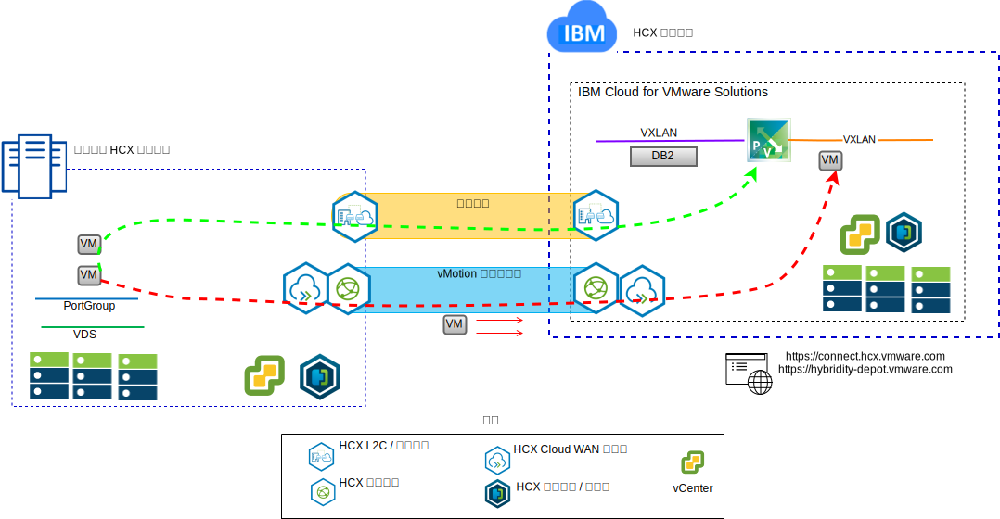

---

copyright:

  years:  2016, 2019

lastupdated: "2019-02-15"

---

# 使用案例
{: #vcsnsxt-usecases}

## VMware 工作負載移轉至 IBM Cloud
{: #vcsnsxt-usecases-wkld-mig}

Acme Skateboards 想要將其內部部署 VMware SDDC 實例無縫延伸到 VMware vCenter Server on {{site.data.keyword.cloud}} 實例。他們必須讓業務持續運作，並使關閉時間降到最低。重新配置其應用程式以便在雲端執行並不是最佳解決方案。

VMware vCenter Server on {{site.data.keyword.cloud_notm}} with Hybridity Bundle 能夠在 vCenter Server 實例與內部部署 VMware 虛擬化資料中心之間建立無縫連線。

VMware HCX 元件部署為 vCenter Server 目標站台中的虛擬機器 (VM)，能夠建立與安裝在對等節點內部部署來源站台之 VMware HCX 元件的連線。

圖 1. VMware Hybrid Cloud Extension 服務

內部部署與 {{site.data.keyword.cloud_notm}} 之間的鬆散耦合交互連線可啟用下列這類功能：
- **簡單交互連線** - 可透過任何實體連線（包括公用網際網路、專用 VPN 或 Direct Link），輕鬆建立邏輯網路連線。
- **第 2 層延伸** - 內部部署網路延伸至雲端，包括內部部署子網路和 IP 位址。
- **加密** - 在兩端之間安全地加密網路資料流量。
- **最佳化網路** - 選取最佳連線，並有效率地溢滿連線，讓網路資料流量儘可能地快速移動。
- **刪除重複資料** - 可讓網路資料流量減少達 50%。
- **智慧型遞送** - 當工作負載移動時，鄰近遞送可以變更網路路徑（即閘道），讓網路資料流量使用目標站台閘道，而不會「回流」到起始站台。
- **零關閉時間移轉** - 可以使用 vMotion 將執行中系統移至雲端（或從雲端移回）。
- **排定的移轉** - 可以將任意數目的 VM 抄寫至目的地站台，然後在該站台上依指定時間啟動，以取代起始站台上所執行的系統。
- **安全原則的移轉** - 如果在內部部署使用 NSX，則任何安全原則、防火牆等等，都會隨著工作負載一起移動。

## 混合式架構部署
{: #vcsnsxt-usecases-hybrid-archi-deployment}

Acme Skateboards 想要在由 vCenter Server with Hybridity Bundle 與 {{site.data.keyword.icpfull_notm}} 組成的 {{site.data.keyword.cloud_notm}} 上部署混合式架構，以進行應用程式現代化。他們的需求是在 VN 上執行其資料庫、在容器中執行應用程式和 Web 介面，而且想要使用一組共用的工具來進行網路和安全管理。

{{site.data.keyword.vmwaresolutions_short}} 提供自動化，以在全球的 {{site.data.keyword.CloudDataCents_notm}} 中部署 VMware 技術元件。架構由單一雲端地區組成，可支援延伸至位於另一個地理位置的其他雲端地區，或延伸至相同資料中心內的另一個 {{site.data.keyword.cloud_notm}} Pod。

{{site.data.keyword.icpfull_notm}} 及 Cloud Automation Manager (CAM) 產品可以手動部署至內部部署的虛擬化平台，因而能夠從內部部署位置進行雲端管理。或者，{{site.data.keyword.icpfull_notm}} 及 CAM 也可以當作服務延伸提供給現有或新的 vCenter Server 部署，因而能夠從 {{site.data.keyword.cloud_notm}} 進行雲端管理。

下圖代表 vCenter Server 實例上執行的 {{site.data.keyword.icpfull_notm}}。NSX-V 已配置專用交換器/VXLAN、「分散式邏輯路由器 (DLR)」以及專用於 {{site.data.keyword.icpfull_notm}} 層疊網路的 Edge Services Gateway (ESG)。透過 ESG 設定遞送，以存取基礎網路。

使用 {{site.data.keyword.cloud_notm}} 自動化，Acme Skateboards 可以佈建封裝 vCenter Server 的混合式解決方案，以在 vCenter Server 上執行其資料庫 VM 和 {{site.data.keyword.icpfull_notm}}，並在容器中執行其應用程式和前端系統 Web 服務。NSX 為其提供一組共用的管理工具，用來管理層疊網路中的網路和安全。

如需 NSX-V 的相關資訊，請參閱 [NSX-V 概觀](/docs/services/vmwaresolutions/archiref/vcsnsxt?topic=vmware-solutions-vcsnsxt-overview-ic4vnsxv)。如需 vCenter Server 及 {{site.data.keyword.icpfull_notm}} 供應項目的相關資訊，請參閱 [vCenter Server 及 {{site.data.keyword.cloud_notm}} Private](/docs/services/vmwaresolutions/archiref/vcsicp?topic=vmware-solutions-vcsicp-intro)。

圖 2. 具有 {{site.data.keyword.icpfull_notm}} 的 vCenter Server

這會在內部部署與 {{site.data.keyword.cloud_notm}} 之間建立鬆散耦合的交互連線，並且啟用下列這類功能：
-	**簡單交互連線** - 可透過任何實體連線（包括公用網際網路、專用 VPN 或 Direct Link），輕鬆建立邏輯網路連線。
-	**第 2 層延伸** - 內部部署網路延伸至雲端，包括內部部署子網路和 IP 位址。
-	**加密** - 在兩端之間安全地加密網路資料流量。
-	**最佳化網路** - 選取最佳連線，並有效率地溢滿連線，讓網路資料流量儘可能地快速移動。
-	**刪除重複資料** - 可讓網路資料流量減少達 50%。
-	**智慧型遞送** - 當工作負載移動時，鄰近遞送可以變更網路路徑（即閘道），讓網路資料流量使用目標站台閘道，而不會「回流」到起始站台。
-	**零關閉時間移轉** - 可以使用 vMotion 將執行中系統移至雲端（或從雲端移回）。
-	**排定的移轉** - 可以將任意數目的 VM 抄寫至目的地站台，然後在該站台上依指定時間啟動，並取代起始站台上所執行的系統。
-	**安全原則的移轉** - 如果在內部部署使用 NSX，則任何安全原則、防火牆等等，都會隨著工作負載一起移動。

使用這個解決方案，Acme Skateboards 已順利將其內部部署 VMware 工作負載移轉至 {{site.data.keyword.cloud_notm}}，以滿足極短或沒有任何關閉時間且不需重新配置應用程式的需求。如需 vCenter Server with Hybridity Bundle 的相關資訊，請參閱 [VMware HCX on {{site.data.keyword.cloud_notm}} 解決方案架構](https://www.ibm.com/cloud/garage/files/HCX_Architecture_Design.pdf)。

## 相關鏈結
{: #vcsnsxt-usecases-related}

* [vCenter Server on {{site.data.keyword.cloud_notm}} with Hybridity Bundle 概觀](/docs/services/vmwaresolutions/archiref/vcs?topic=vmware-solutions-vcs-hybridity-intro)
