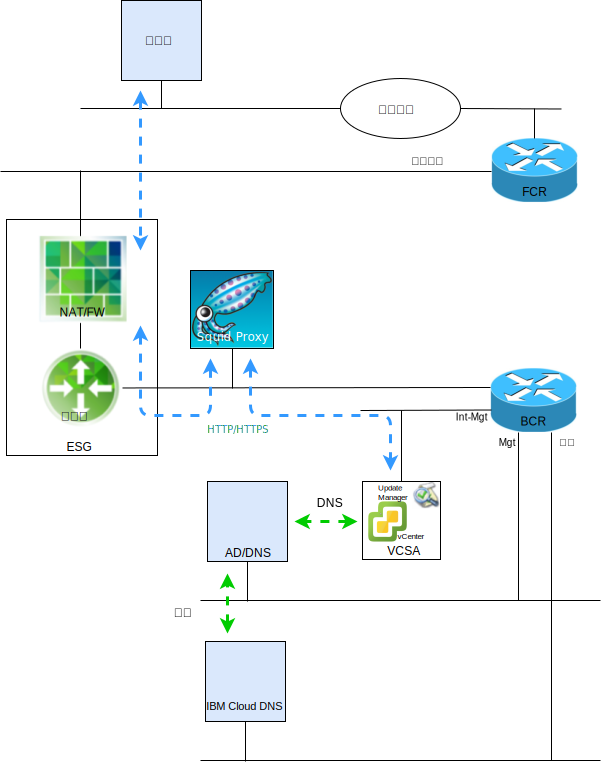

---

copyright:

  years:  2016, 2018

lastupdated: "2018-10-29"

---

# VMware Update Manager 簡介

本文件的目的是為您（IBM Cloud for VMware Solutions vCenter Server 實例的系統管理者）提供如何配置 VMware Update Manager (VUM) 以維護 vCenter Server 環境最新層次的指示。

VUM 會啟用 VMware vSphere 的集中式自動化修補程式及版本管理，容許您在 VCS 環境中執行下列作業：
* 升級及修補 vSphere ESXi 主機。
* 在主機上安裝及更新協力廠商軟體。
* 升級虛擬機器硬體、VMware Tools 及虛擬應用裝置。

本文件還說明用來維護 VCS 實例之下列元件的處理程序：
* vCenter Server Appliance        
* NSX            
* vSAN

本文件說明如何使用基於 CentOS 及 Squid 的 Proxy 伺服器實作，以讓 VUM 存取 VMware 儲存庫。VUM 從 VMware 的更新伺服器要求資源時，會先將要求傳送至 Proxy 伺服器，而 Proxy 伺服器接著會透過 External Services Gateway (ESG) 將要求傳送至更新伺服器。在 Proxy 伺服器取得資源之後，會將資源傳送至 VUM。

圖 1. 總覽圖

VCS 目前會部署 vSphere 6.5（表示現在已在 vCenter Server Appliance (VCSA) 內整合 VUM），而且因為 VUM 用戶端元件是在 vSphere Web Client 上執行的外掛程式，所以會在部署 VCSA 之後自動予以啟用。不過，VUM 將無法存取網際網路來存取 VMware 儲存庫。

這個記載的配置使用「全功能」且連接網際網路的 VUM 部署模型，而此 VUM 部署模型使用 IBM Cloud 公用網路來存取網際網路，以下載升級及修補程式。

需要使用替代網際網路連線的用戶端應該調查「VMware vSphere Update Manager 下載服務 (UMDS)」，而這超出本出版品的範圍。

雖然可以將 VUM 配置成從共用儲存庫匯入更新，或是手動從 .zip 檔案匯入修補程式及延伸規格，但本文件不討論這些主題。

因此，請注意，在 vSphere 6.5 中，不再支援於安裝 VUM 伺服器期間向 VCSA 登錄 VUM，而 VUM 伺服器位在您無法於 VCS 環境之 VM 中部署 VUM 的個別 Windows 機器上。

這份文件的章節組織如下：
* [VMware Update Manager 概觀](vum-overview.html) - 本節說明 VUM 的處理程序，並介紹瞭解工具作業和使用者介面所需的重要術語
* **安裝、配置及用法** - 本節說明 VCS 實例中讓 VUM 運作所需的步驟：
  - [起始配置](vum-init-config.html) - 一次性作業，用來：
      - 配置 NSX 網路，以容許 Proxy 伺服器存取網際網路
      - 安裝並配置 Proxy 伺服器，以提供 VUM 的網際網路存取
      - 起始設定 VUM，以使用 Proxy 伺服器
  - [收集 meta 資料](vum-metadata.html) - VUM 會透過您可以修改的預先定義自動處理程序，下載有關升級、修補程式或延伸規格的 meta 資料。VUM 會依一般可配置的間隔聯絡 VMware 或協力廠商來源，以收集有關可用升級、修補程式或延伸規格的最新 meta 資料
  - [建立基準線](vum-baselines.html) - 使用預先定義的基準線及基準線群組，或建立自訂基準線及基準線群組。然後，將基準線及基準線群組連接至庫存物件
  - [掃描並檢閱](vum-scanning.html) - 掃描庫存物件，並檢閱結果來判斷它們符合基準線及基準線群組的程度。可以依文字搜尋、群組選項、基準線選項及法規遵循狀態選項來過濾掃描結果
  - [編譯打包及補救](vum-staging.html) - 在補救之前可以選擇編譯打包修補程式及延伸規格，以確保將它們下載至主機。在補救期間，VUM 會將修補程式、延伸規格及升級套用至庫存物件

本文件假設您已部署一個「主要 VCS」實例，或多個不同的「主要 VCS」實例。如果您已部署「主要 VCS」及「次要 VCS」實例，因而使用 Single Sign On (SSO)，則請參閱 [SSO 鏈結的 vCenter](vum-updating-vcsa.html)。

如果您已使用 vSAN 部署 VCS，則請先參閱[更新 vSAN 叢集](vum-updating-vsan.html)。

如果您要更新 IBM Cloud 基礎架構管理自動化，請使用「IBM Cloud for VMware Solutions 主控台」。

[IBM Cloud for VMware Solutions 主控台](https://console.bluemix.net/infrastructure/vmware-solutions/console)可讓您執行下列動作：
*	升級授權，例如，將 NSX Base 升級至另一個版本
*	起始 VCS 平台的更新，例如，移至 2.5 版
*	檢視更新的狀態
*	檢視已安裝的更新

此機能只會自動更新 VCS 實例的管理元件。必須使用本文件中詳述的程序來套用 VMware 產品更新。

### 相關鏈結

* [VMware HCX on IBM Cloud 解決方案架構](https://www.ibm.com/cloud/garage/files/HCX_Architecture_Design.pdf)
* [VMware Solutions on IBM Cloud Digital Technical Engagement](https://ibm-dte.mybluemix.net/ibm-vmware)（展示）
