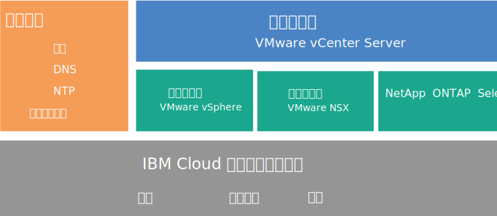
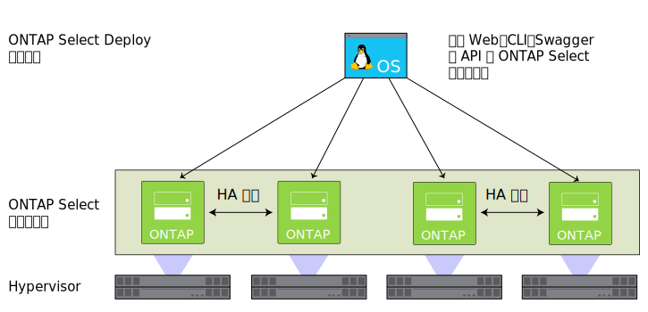

---

copyright:

  years:  2016, 2019

lastupdated: "2019-03-04"

subcollection: vmware-solutions

---

{:tip: .tip}
{:note: .note}
{:important: .important}

# NetApp ONTAP Select 概觀
{: #np_netappoverview}

檢閱 NetApp ONTAP Select on {{site.data.keyword.cloud}} 部署的架構及元件。

## NetApp ONTAP Select 架構
{: #np_netappoverview-archi}

NetApp ONTAP Select on {{site.data.keyword.cloud_notm}} 供應項目能提供儲存空間虛擬化服務，進而補足 vCenter Server 部署。

下圖說明 NetApp ONTAP Select on vCenter Server 部署的整體架構。

圖 1. NetApp ONTAP Select on {{site.data.keyword.cloud_notm}} 的高階架構

### 實體基礎架構
{: #np_netappoverview-physical-infras}

這層提供要供虛擬基礎架構使用的實體基礎架構（運算、網路及儲存空間資源）。

### 虛擬化基礎架構（運算、網路及 NetApp ONTAP Select）
{: #np_netappoverview-virtual-infras}

這層透過下列 VMware 產品及 NetApp ONTAP Select 產品來將實體基礎架構虛擬化：
* VMware vSphere 將實體運算資源虛擬化
* VMware NSX 是提供邏輯網路元件及虛擬網路的網路虛擬化平台。
* NetApp ONTAP Select on {{site.data.keyword.cloud_notm}} 會部署包含四部主機之四部 VM 的 ONTAP Select 叢集。

下圖說明 NetApp ONTAP Select 部署的元件。

圖 2. NetApp ONTAP Select 元件

### 虛擬化管理
{: #np_netappoverview-virtualization-mgmt}

虛擬化管理層包含下列元件：

* 具有內嵌 Platform Services Controller (PSC) 的 vCenter Server Appliance (vCSA)
* NSX Manager
* 兩個 NSX Edge Services Gateway (ESG)
* 三個 NSX Controller
* IBM CloudDriver 虛擬伺服器實例 (VSI)

NetApp ONTAP Select 是在 VMware 叢集裡執行，並將主機上的本端儲存空間虛擬化。NetApp ONTAP Select 部署在專用模型中，其中其他工作負載預期不會與其共用叢集。因此，NetApp ONTAP Select on {{site.data.keyword.cloud_notm}} 供應項目的硬體配置僅根據 NetApp ONTAP Select 的需求調整大小。

## NetApp ONTAP Select 實例的技術規格
{: #np_netappoverview-specs}

NetApp ONTAP Select 實例中包含下列元件。

標準化配置的可用性及定價可能會根據選取以用於部署的 {{site.data.keyword.CloudDataCent_notm}} 而有所不同。
{:note}

### Storage
{: #np_netappoverview-storage}

* 在**高效能（中型）**、**高效能（大型）**及**高容量**之間進行選擇
* 具有緊急備用的 RAID 5
* 兩個 1 TB 的 SATA 磁碟機 ESXi OS - RAID 1
* 管理資料儲存庫 - 500 GB 用於管理 VM

### 預設配置
{: #np_netappoverview-preset-config}

已提供四部具有下列配置選項的 {{site.data.keyword.cloud_notm}} {{site.data.keyword.baremetal_short}}：
* **高效能（中型）**- 超值授權 / 雙重 Intel Xeon E5-2650 v4（總計 24 核心，2.2 GHz）/ 128 GB RAM / 每個節點有 22 個 1.9 TB SSD 磁碟機容量 / 4 節點叢集的有效容量 - 59 TB
* **高效能（大型）**- 超值授權 / 雙重 Intel Xeon E5-2650 v4（總計 24 核心，2.2 GHz）/ 128 GB RAM / 每個節點有 22 個 3.8 TB SSD 磁碟機容量 / 4 節點叢集的有效容量 - 118 TB
* **高容量** - 標準授權 / 雙重 Intel Xeon E5-2650 v4（總計 24 核心，2.2 GHz）/ 64 GB RAM / 每個節點有 34 個 4 TB SATA 磁碟機容量 / 4 節點叢集的有效容量 - 190 TB

當 3.8 TB SSD（固態硬碟）磁碟機在正式發行至資料中心時，就會予以支援。
{:note}

### 硬體
{: #np_netappoverview-hardware}

* 三個 RAM 及磁碟選項：**高效能（中型）**、**高效能（大型）**及**高容量**
* 兩個 1 TB SATA 磁碟機 ESXi OS
* 一個 RAID 磁碟控制器
* VMware Server Virtualization 6.5

### 網路
{: #np_netappoverview-network}

* 10 Gbps 雙重公用及專用網路上行鏈路
* 三個 VLAN（虛擬 LAN）：一個公用 VLAN 和兩個專用 VLAN
* 一個安全的 VMware NSX Edge Services Gateway

### 虛擬伺服器實例
{: #np_netappoverview-vsi}

兩個 VSI（虛擬伺服器實例）：
* Microsoft Active Directory (AD) 及「網域名稱系統 (DNS)」服務的 VSI。
* IBM CloudBuilder 的 VSI，在完成實例部署之後會關閉它。

### 授權及費用
{: #np_netappoverview-license-and-fee}

*  四個超值或標準版 NetApp ONTAP Select 授權（由使用者提供）
*  VMware vSphere 6.5 Enterprise Plus 版本
*  VMware vCenter Server 6.5
*  VMware NSX Service Providers Edition（Base、Advanced 或 Enterprise）6.4
*  支援與服務費用（一個節點一份授權）

您只能從 {{site.data.keyword.vmwaresolutions_short}} 主控台，而不能從 {{site.data.keyword.slportal}} 或透過主控台以外的任何其他方法，來管理在 {{site.data.keyword.cloud_notm}} 帳戶中建立的 {{site.data.keyword.vmwaresolutions_short}} 元件。如果您在 {{site.data.keyword.vmwaresolutions_short}} 主控台以外變更這些元件，則變更不會與主控台同步。
{:important}

**警告：**從 {{site.data.keyword.vmwaresolutions_short}} 主控台以外來管理您在訂購實例時安裝至 {{site.data.keyword.cloud_notm}} 帳戶的任何 {{site.data.keyword.vmwaresolutions_short}} 元件，會使您的環境變得不穩定。這些管理活動包括：
*  新增、修改、退回、移除元件，或關閉元件電源
*  透過新增或移除 ESXi 伺服器來擴充或縮減實例容量
*  重新啟動服務

   這些活動的例外包括從 {{site.data.keyword.slportal}} 管理共用儲存空間檔案共用。這類活動包括：訂購、刪除（這可能會影響已裝載的資料儲存庫）、授權及裝載共用儲存空間檔案共用。

## 防火牆考量
{: #np_netappoverview-firewall-considerations}

如果您使用防火牆，則必須針對來自 {{site.data.keyword.IBM}} CloudDriver 虛擬伺服器實例 (VSI) 及 SDDC Manager 虛擬機器 (VM) 的所有通訊配置規則。這些規則必須容許所有通訊協定在 IP 位址 `10.0.0.0/8` 及 `161.26.0.0/16` 上進行通訊。這類防火牆的範例包含 NSX Distributed Firewall (DFW) 或 Vyatta 防火牆。

## 相關鏈結
{: #np_netappoverview-related}

* [規劃 NetApp ONTAP Select 實例](/docs/services/vmwaresolutions/netapp?topic=vmware-solutions-np_planning#requirements-and-planning-for-netapp-ontap-select-instances)
* [訂購 NetApp ONTAP Select 實例](/docs/services/vmwaresolutions/netapp?topic=vmware-solutions-np_orderinginstances)
* [vCenter Server 概觀](/docs/services/vmwaresolutions/vcenter?topic=vmware-solutions-vc_vcenterserveroverview)
* [NetApp ONTAP 文件中心](http://docs.netapp.com/ontap-9/index.jsp?topic=%2Fcom.netapp.doc.exp-clus-peer%2Fhome.html){:new_window}
