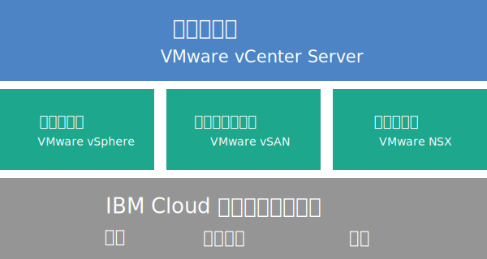

---

copyright:

  years:  2016, 2018

lastupdated: "2018-06-22"

---

# Cloud Foundation 概觀

當您訂購 VMware Cloud Foundation on {{site.data.keyword.cloud}} 時，會自動部署整個 VMware 環境。基本部署包含四部 {{site.data.keyword.cloud_notm}} {{site.data.keyword.baremetal_short}}，其中已預先安裝 VMware Cloud Foundation 堆疊且配置成提供統一軟體定義資料中心 (SDDC) 平台。Cloud Foundation 原本便整合了 VMware vSphere、VMware NSX、VMware Virtual SAN，並且是根據 VMware 驗證的設計進行架構。

## Cloud Foundation 架構

下圖說明 Cloud Foundation 部署的整體架構及元件。

圖 1. Cloud Foundation 架構

### 實體基礎架構

這層提供要供虛擬基礎架構使用的實體基礎架構（運算、儲存空間及網路資源）。

### 虛擬化基礎架構（運算、儲存空間及網路）

這層透過不同的 VMware 產品來將實體基礎架構虛擬化：
* VMware vSphere 將實體運算資源虛擬化。
* VMware Virtual SAN (vSAN) 會根據實體伺服器中的儲存空間來提供軟體定義的共用儲存空間。
* VMware NSX 是提供邏輯網路元件及虛擬網路的網路虛擬化平台。

### 虛擬化管理

這層包含 vCenter Server，它代表虛擬化環境的管理層。您可以使用相同的熟悉 vSphere API 相容工具及 Script，來管理 IBM 管理的 VMware 環境。

在 {{site.data.keyword.vmwaresolutions_short}} 主控台上，您可以使用新增及移除 ESXi 伺服器功能，來擴充及縮減實例的容量。此外，還可以使用在受管理環境中套用更新及升級 VMware 元件這類的生命週期管理功能。

如需有關架構的詳細資料，請參閱[解決方案概觀](../archiref/solution/solution_overview.html)。

## Cloud Foundation 實例元件

Cloud Foundation 實例中包括下列元件。

**附註**：硬體、網路、虛擬機器及儲存空間所產生的費用可能會根據選取進行部署的 {{site.data.keyword.CloudDataCent_notm}} 而不同。

### Bare Metal Server

您可以使用下列其中一個配置來訂購 {{site.data.keyword.cloud_notm}} {{site.data.keyword.baremetal_short}}：
*  **自訂**：具有所選取 CPU 型號及 RAM 大小的 {{site.data.keyword.baremetal_short}}。   
   * 2-CPU Intel Broadwell Generation（Intel Xeon E5-2600 v4 系列）
   * 2-CPU Intel Skylake Generation（Intel Xeon 4100/5100/6100 系列）
**附註：**如果您計劃使用 vSAN 儲存空間，則配置需要四部 {{site.data.keyword.baremetal_short}}。
* **預先配置**：2-CPU Intel Broadwell Generation（Intel Xeon E5-2600 v4 系列）
  * **小型**（雙重 Intel Xeon E5-2650 v4 /總計 24 核心，2.2 GHz / 128 GB RAM / 12 個磁碟）
  * **大型**（雙重 Intel Xeon E5-2690 v4 /總計 28 核心，2.6 GHz / 512 GB RAM / 12 個磁碟）

### 網路

訂購了下列網路元件：
* 10 Gbps 雙重公用及專用網路上行鏈路
* 三個 VLAN（虛擬 LAN）：一個公用 VLAN 和兩個專用 VLAN
* 用於出埠 HTTPS 管理資料流量的安全管理服務「VMware NSX Edge Services 閘道 (ESG)」，其由 IBM 部署為管理網路拓撲的一部分。IBM 管理虛擬機器利用此 ESG，來和與自動化相關的特定外部 IBM 管理元件進行通訊。如需相關資訊，請參閱[管理服務 NSX Edge 是否有安全風險？](../vmonic/faq.html#does-the-management-services-nsx-edge-pose-a-security-risk-)

  **重要事項**：您無法存取此 ESG，因此無法使用它。如果您修改它，則可能無法從 {{site.data.keyword.vmwaresolutions_short}} 主控台管理 Cloud Foundation 實例。此外，請注意，使用防火牆或停用外部 IBM 管理元件的 ESG 通訊，將導致 {{site.data.keyword.vmwaresolutions_short}} 變成無法使用。

* 如果您有現有叢集，並且其中具有現行 VMware vSphere 版本所支援的 ESXi 伺服器，則會自動啟用 EVC（加強型 vMotion 相容性）特性。EVC 提供叢集中所有 ESXi 伺服器的 vMotion 相容性，方法是確保叢集中的所有 ESXi 伺服器都向虛擬機器公開一組相同的 CPU 特性。透過使用 EVC，即使 ESXi 伺服器上的實際 CPU 可能不同，虛擬機器還是可以在叢集的任何 ESXi 伺服器之間移轉。

### 虛擬伺服器實例

已訂購下列 VSI（虛擬伺服器實例）：
* 多站台配置支援所需之 Microsoft Active Directory (AD) 及「網域名稱系統 (DNS)」服務的 VSI。此 VSI 規格為：Windows 2012 R2（8 GB RAM/2 個 CPU 核心/100 GB 磁碟/雙重 1 Gbps 專用上行鏈路）。
* IBM CloudBuilder 的 VSI，在完成實例部署之後會關閉它。
* （如果已訂購 Veeam on {{site.data.keyword.cloud_notm}}）已訂購 Veeam 備份服務的 VSI。

### 儲存空間

下列是已訂購的儲存空間（視您選取的 {{site.data.keyword.baremetal_short}} 配置而定）：
* 兩個 1-TB SATA 開機磁碟
* 兩個 960-GB SSD（固態磁碟）快取磁碟
* 一個 RAID 磁碟控制器
* 僅針對**自訂**配置，您可以根據需求來設定磁碟機數目以及磁碟類型和容量。
* 僅針對**預先配置**、**小型**配置：兩個 1.9 TB SSD 容量磁碟
* 僅針對**預先配置**、**大型**配置：四個 3.8 TB SSD 容量磁碟

### 用於備份的儲存空間

訂購一個 2-TB 共用檔案層次儲存空間，最多可擴充到 12 TB。

**附註**：用於備份的儲存空間不是 Cloud Foundation 實例的標準元件。當您訂購實例時，可以選取或取消選取備份服務來選擇是否要用於備份的儲存空間。

### 授權（IBM 提供或 BOYL）與費用

* 四個 VMware vSphere Enterprise Plus 6.5u1
* 四個 VMware vCenter Server 6.5
* 四個 VMware NSX Enterprise 6.3
* 四個 VMware vSAN Advanced 或 Enterprise 6.6
* 四個 SDDC Manager 授權（僅限 IBM 所提供）
* 四筆支援與服務費用

## Cloud Foundation 擴充節點元件

針對 {{site.data.keyword.cloud_notm}} 帳戶中的下列元件，每一個 Cloud Foundation 擴充節點都會部署及產生費用。

### 擴充節點的硬體

一部 {{site.data.keyword.cloud_notm}} Bare Metal Server，其中具有 [Cloud Foundation 實例元件](../sddc/sd_cloudfoundationoverview.html#cloud-foundation-instance-components)中所呈現的配置。

### 擴充節點的授權與費用

* 一個 VMware vSphere Enterprise Plus 6.5u1
* 一個 VMware vCenter Server 6.5
* 一個 VMware NSX Enterprise 6.3
* 一個 VMware vSAN Advanced 或 Enterprise 6.6
* 一個 SDDC Manager 授權
* 一筆支援與服務費用

**重要事項**：您必須從 {{site.data.keyword.vmwaresolutions_short}} 主控台管理 {{site.data.keyword.cloud_notm}} 帳戶中所建立的 {{site.data.keyword.vmwaresolutions_short}} 元件，而不是在主控台以外的 {{site.data.keyword.slportal}} 或透過任何其他方法進行管理。如果您在 {{site.data.keyword.vmwaresolutions_short}} 主控台以外變更這些元件，則變更不會與主控台同步。

**警告**：從 {{site.data.keyword.vmwaresolutions_short}} 主控台以外管理已在訂購實例時安裝至 {{site.data.keyword.cloud_notm}} 帳戶的任何 {{site.data.keyword.vmwaresolutions_short}} 元件，可能會讓您的環境不穩定。這些管理活動包括：
*  新增、修改、退回或移除元件
*  透過新增或移除 ESXi 伺服器來擴充或縮減實例容量
*  關閉元件電源
*  重新啟動服務

   這些活動的例外包括從 {{site.data.keyword.slportal}} 管理共用儲存空間檔案共用。這類活動包括：訂購、刪除（這可能會影響已裝載的資料儲存庫）、授權及裝載共用儲存空間檔案共用。

## 相關鏈結

* [Cloud Foundation 軟體資料清單](sd_bom.html)
* [規劃 Cloud Foundation 實例](sd_planning.html)
* [訂購 Cloud Foundation 實例](sd_orderinginstance.html)
* [VMware vSphere 文件中心](https://pubs.vmware.com/vsphere-60/index.jsp){:new_window}
* [VMware NSX 6 文件中心](https://pubs.vmware.com/NSX-6/index.jsp){:new_window}
* [EVC 及 CPU 相容性常見問題](https://kb.vmware.com/s/article/1005764)
