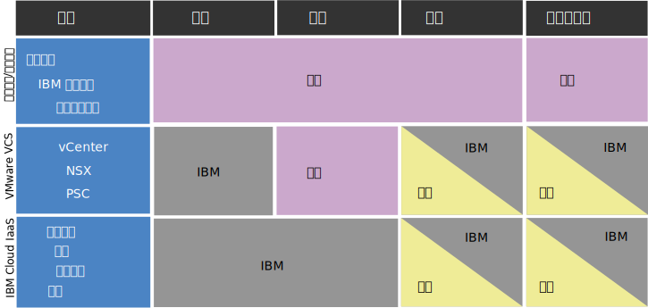

---

copyright:

  years:  2016, 2019

lastupdated: "2019-05-02"

subcollection: vmware-solutions

---

# vCenter Server with Hybridity Bundle 實例的法規遵循資訊
{: #vc_hybrid_compl_info}

請檢閱下列資訊，以取得 VMware vCenter Server with Hybridity Bundle 實例的法規遵循相關詳細資料。

## 客戶與 IBM 對於 vCenter Server IBM Cloud with Hybridity Bundle 的責任
{: #vc_hybrid_compl_info-responsibility}

下圖提供關於客戶（您）與 IBM 對於法規遵循活動之責任的詳細資料。

## 健康資料限制
{: #vc_hybrid_compl_info-health-data-restrictions}

此章節中的條款適用於整個 {{site.data.keyword.vmwaresolutions_full}} 組合。

### HIPAA
{: #vc_hybrid_compl_info-hipaa}

本「雲端服務」之資料表中，縱有載明 1996 年「健康資訊可攜性與責任歸屬法案」(Health Information Portability and Accountability Act of 1996, HIPAA) 相關資訊，且允許搭配本「雲端服務」一併使用列屬個人資料類型及/或「特種個人資料」之「健康資訊」及「健康資料」（統稱「健康資料」），於搭配本「雲端服務」一併使用「健康資料」時，仍應遵循下列限制與條件之規定：

{{site.data.keyword.vmwaresolutions_short}}

上列供應項目僅限於為實作「HIPAA 隱私權與安全規則」(HIPAA Privacy and Security Rule) 就「健康資料」之使用所規定之控管措施而提供之，惟「客戶」應事先通知 IBM，表明「客戶」將搭配本「雲端服務」一併使用「健康資料」，IBM 則應以書面確認，將針對「健康資料」之使用而提供本「雲端服務」。據以，本「雲端服務」不得使用於受 HIPAA 保護之任何「健康資料」的傳輸、儲存或其他用途，但有下列情形者不在此限：(i)「客戶」對 IBM 為前述用途之通知者；(ii) IBM 與「客戶」已簽訂適用「事業夥伴合約」(Business Associate Agreement) 者；及 (iii) IBM 以書面向「客戶」確認本「雲端服務」得與「健康資料」一併使用者。在任何情形下，均不得將「雲端服務」作為 HIPAA 所定義之健康照護資料交換中心，而用以處理 PHI。

在系統失效的情況下，協力廠商服務提供者可能會向客戶要求除錯構件（日誌、核心記憶體傾出等等）。收集這些構件並傳輸至協力廠商提供者，需完全由客戶負責。IBM 支援中心團隊可提供文件的鏈結，或透過畫面共用階段作業提供指示，而予以協助。不過，客戶需負責清理任何 PHI 的資料，並確保在傳輸之前適當地加密。在傳送資料之前，評估是否需要協力廠商提供者執行 BAA 亦為客戶的責任。

## 個人資訊及規範資料
{: #vc_hybrid_compl_info-personal-info-and-regulated-data}

本「雲端服務」並非專為受管理內容之特定安全需求而設計，例如：個人資料或機密個人資料。本「雲端服務」是否符合「客戶」與本「雲端服務」連線時所使用之內容類型的「客戶」需求，需由「客戶」決定。

## 存取客戶實例的原則
{: #vc_hybrid_compl_info-policy-for-access-client-inst}

作為 {{site.data.keyword.vmwaresolutions_short}} 提供的 VMware vCenter Server 環境提供 VMWare 管理平台層，讓我們的客戶能夠管理虛擬化功能。在 IBM Cloud for VMware 產品與服務的生命週期內，可能需要「IBM 支援中心」以協助保證其能夠順利完成。「IBM 支援中心」的人為介入多半是客戶要求（亦即支援問題單）的結果。不過，在少數情況下，沒有客戶撰寫支援問題單，「IBM 支援中心」也會提供預防性協助，以防止未來的問題發生。此存取是透過 IBM Cloud 內部支援網路進行，並透過「IBM 支援中心」開立的支援問題單加以記載，再由 IBM Cloud SOC 持續監視。未經客戶事先同意，「IBM 支援中心」不會修改實例配置。存取是針對 VMware 管理元件及/或 IBM Cloud 管理元件，決不會存取用戶端虛擬機器或應用程式。

## 預防支援
{: #vc_hybrid_compl_info-proactive-support}

### 起始佈建的預防支援
{: #vc_hybrid_compl_info-proactive-support-for-initial-provision}

* 在實例或服務的起始訂購及佈建期間，「IBM 支援中心」可能會在未事先通知客戶的情況下存取客戶實例及資訊，以確保適當履行訂單。
* 除了訂購、佈建及安裝程序之外，「IBM 支援中心」還會主動監視新增主機這類的實例生命週期作業。
* 為了解決已發生或未來可能發生的問題，「IBM 支援中心」可能會採取一些動作，包括但不限於：檢閱客戶訂單詳細資料、重新啟動自動化工作、執行「作業系統」重新載入作業，或使用所提供的客戶 IBM Cloud 使用者名稱及 API 金鑰來開啟 IBM Cloud 問題單。

### 穩定狀態作業的預防支援
{: #vc_hybrid_compl_info-proactive-support-for-steady-state-operations}

* 在少數情況下，「IBM 支援中心」可能需要在穩定狀態作業期間存取用戶端實例，以對實例問題進行預防性疑難排解，或驗證所佈建服務或元件的功能。
* 此存取是透過 IBM Cloud 內部支援網路進行。未經客戶事先同意，「IBM 支援中心」不會修改實例配置。
* 存取是針對 VMware 管理元件及/或 IBM Cloud 管理元件，決不會存取用戶端虛擬機器或應用程式。

### 支援問題單
{: #vc_hybrid_compl_info-support-tickets}

* IBM 不主動監視 vCenter Server 環境，而且在正常作業情況下，如果沒有客戶撰寫的支援問題單，「IBM 支援中心」不會進入 VMWare 管理層。
* 當客戶開立實例、服務或佈建問題的支援問題單時，該問題單會很快被指派給適當的「IBM 支援中心」團隊，該團隊將成為負責解決該問題的主要關係方。
* 由於在團隊層次維護卓越技術專門知識需要有專業等級，因此在解決特定軟體問題時，有時需要涉及多個支援團隊。這很容易處理，因為我們的支援團隊都是透過網路連結，來共同解決發生的任何問題。
* 為了調查問題，IBM 可能需要存取您系統上關於失敗的資訊，或需要重建失敗以取得其他資訊。
* 客戶產生的支援問題單可作為確認通知：「IBM 支援中心」可以存取 VMware 管理層，以進行調查、除錯及分類。如果需要對環境進行中斷維護或變更，「IBM 支援中心」會在變更管理處理程序中，透過問題單要求客戶提供其他記載確認。
* 如需支援問題單的相關資訊，請參閱 [IBM 支援中心手冊](https://www-01.ibm.com/support/docview.wss?uid=ibm10733923)以及[與 IBM 支援中心聯絡](/docs/services/vmwaresolutions/vmonic?topic=vmware-solutions-trbl_support)。

## 客戶責任
{: #vc_hybrid_compl_info-client-responsibilities}

* 雖然我們建議客戶採取一些步驟讓其環境更加安全，但應該注意，有些作法可能會對 IBM Cloud for VMware 的效益產生負面影響。
* 客戶需對其建立的防火牆負責，也要負責對 IBM Cloud for VMware 元件之間進行通訊所加諸的結果限制。這些防火牆也可能妨礙「IBM 支援中心」存取客戶實例及解決問題的能力。
* 客戶需完全負責對其系統中的資料進行加密。
* 在起始部署時，供應項目的自動化及客戶的帳戶是分開的。我們容許並鼓勵客戶變更入口網站中 IBM 提供的所有密碼。
* vCenter 存取和認證是在起始部署期間建立並提供給客戶。「IBM 支援中心」必須保留對管理層的完整存取權，以提供生命週期管理及支援我們的客戶，這是我們供應項目需求的一部分。
* 如果任何時候變更了認證（例如密碼），「IBM 支援中心」可能無法再協助客戶回復遺失或忘記的認證，甚至是對客戶環境進行疑難排解。
* 如需此問題及相關問題之重要性的相關資訊，請參閱[變更 NSX 元件密碼時的考量](/docs/services/vmwaresolutions/vcenter?topic=vmware-solutions-vc_networkingonvcenterserver#vc_networkingonvcenterserver-change-nsx-component-password-considerations)及[有關變更 vCenter Server 構件的考量](/docs/services/vmwaresolutions/vcenter?topic=vmware-solutions-vcenter_chg_impact)。

### 通訊與疑難排解
{: #vc_hybrid_compl_info-communication-troubleshooting}

* IBM 不保證我們的產品沒有瑕疵，不過我們會努力予以修正，讓它能夠依設計運作。客戶在這項工作中扮演重大角色。
* 雖然「IBM 支援中心」可以在產品的整個生命週期提供協助，但客戶提供的資訊和存取可能會限制此支援。
* 客戶需負責在失敗時提供深入文件，並在需要進一步釐清時能夠即時回應「IBM 支援中心」。
* 客戶亦應負責遵循本文件所規定之準則，以授權同意進行預防支援。
* 倘若拒絕同意或未能遵守所提供的準則，客戶需承擔因客戶與支援團隊之間的延遲通訊而導致問題解決可能延宕的責任。
* 客戶應該做好準備，以執行其他技術疑難排解（否則可能改由「IBM 支援中心」執行）。必要時，IBM 會提供適當的文件及協助。

### 安全措施
{: #vc_hybrid_compl_info-security-measures}

* 「雲端服務」的管理：客戶應負責應用程式之管理、作業、維護及安全，包括基礎中介軟體。
* 服務完整性與可用性：IBM 會將針對本「雲端服務」所偵測到之所有網路侵入通知轉遞給客戶。由客戶負責確定所報告之各項通知的影響。如有硬體故障，將通知客戶。OS 或軟體故障之監視及回應由客戶負責，客戶得於必要時尋求 IBM 支援。
* 活動記載：客戶需視需要負責「OS/系統」及「資料庫/應用程式」的活動記載。
* 加密：客戶需視需要負責配置及管理所有加密（包括靜態資料及傳輸中資料）。
* 企業永續性與災難回復：客戶需視需要負責配置及管理所有企業永續及災難回復程序。

### 協力廠商服務
{: #vc_hybrid_compl_info-third-party-services}

* 協力廠商軟體或程式碼隨附於一些 IBM 產品與服務中。此程式碼是為了方便起見而包括，但它不是 IBM 程式的一部分。
* 這些非 IBM 程式係由其提供者直接授權。客戶同意在提供者條款的約束下使用非 IBM 程式。這些在購買 IBM 產品與服務時所附的 IBM 授權合約中均有提供。
* IBM 會進行測試，以確保協力廠商產品可與 IBM 程式搭配使用且適當地運作。
* IBM 軟體支援中心透過瞭解 IBM 產品與服務如何與協力廠商軟體一起使用，來診斷相關的客戶問題。如果結論是 IBM 程式正確運作，但問題仍然存在，則 IBM 必須將客戶轉介到協力廠商供應商，以進一步診斷。
* 如需關於協力廠商軟體或程式碼之客戶責任的進一步資訊，請參閱 [IBM 支援中心手冊](https://www-01.ibm.com/support/docview.wss?uid=ibm10733923)。

## 同意存取客戶環境
{: #vc_hybrid_compl_info-consent-to-access-client-environment}

* 「IBM 支援中心」需要存取客戶實例，以確保其適當的佈建及維護。客戶需負責控制及提供所需的存取。
* 將客戶撰寫的支援問題單作為確認通知，並同意「IBM 支援中心」存取客戶實例，以解決該支援問題單所述的問題。
* 客戶應負責遵循本文件所規定之準則，以授權同意進行預防性支援。倘若拒絕同意或未能遵守所提供的準則，客戶需承擔因客戶與支援團隊之間的延遲通訊而導致問題判斷和解決延宕的責任，還有其他可能的技術疑難排解。

## 起始佈建
{: #vc_hybrid_compl_info-initial-provision}

* 在起始佈建及訂購時，會提供本文件給客戶。
* 客戶提交訂單之後，即表示同意這些條款，因而授權同意「IBM 支援中心」在沒有事先通知的情況下隨時存取其實例，以快速解決環境相關問題或防止未來的失敗。
* 此同意適用於目前在整個生命週期中訂購的所有實例。未來佈建之實例及實例元件，可能需要其他同意。

## 穩定狀態作業
{: #vc_hybrid_compl_info-steady-state-operations}

如果客戶未獲授權同意在起始佈建及訂購中進行實例的預防支援，則必要時，客戶必須在任何未來服務問題單中包括明確同意。同意的聲明必須遵循已設定的準則，否則被視為無效。

## 相關鏈結
{: #vc_hybrid_compl_info-related}

* [vCenter Server with Hybridity Bundle 概觀](/docs/services/vmwaresolutions/vcenter?topic=vmware-solutions-vc_hybrid_overview)
* [與 IBM 支援中心聯絡](/docs/services/vmwaresolutions/vmonic?topic=vmware-solutions-trbl_support)
