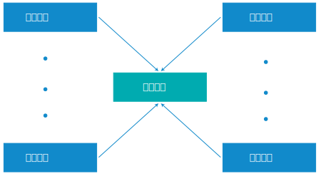

---

copyright:

  years:  2016, 2018

lastupdated: "2018-07-20"

---

# vCenter Server with Hybridity Bundle 實例的多站台配置

{{site.data.keyword.vmwaresolutions_full}} 容許在不同的位置部署實例，並在短時間內啟動並執行它們。

## 多站台部署元件

多站台部署包含下列元件。

* **主要實例**：主要 vCenter Server with Hybridity Bundle 實例具有下列配置：
  *  Microsoft Active Directory (AD) 及 DNS（網域名稱系統）根網域
  *  vCenter Server 子網域
  *  SSO（單一登入）網域
  *  SSO 站台名稱
* **次要實例**：一個以上鏈結至主要實例的次要 vCenter Server with Hybridity Bundle 實例，其具有下列配置：
   *  SSO 站台名稱
   *  鏈結至主要實例上之根網域的 DNS 子網域
   *  主要實例及次要實例上的 AD 虛擬機器之間的 DNS 及 AD 抄寫設定。
   *  已部署並配置為向主要實例上的 PSC (Platform Services Controller) 抄寫的 PSC。
   *  使用「加強型鏈結模式」將次要實例上的 VMware vCenter 設定為主要實例上的 vCenter。

## vCenter Server with Hybridity Bundle 多站台部署

多站台配置特性會搭配使用中心及分支拓蹼與主要站台及最多七個次要站台。支援單層站台，亦即，您無法配置鏈結至其他次要站台的後續站台。在所有實例中，您在多站台配置中共有 128 部 ESXi 伺服器。

**附註**：如果您的配置需要超過 128 部 ESXi 伺服器的多站台部署，則請與「IBM 支援中心」聯絡以取得協助。如需相關資訊，請參閱[與 IBM 支援中心聯絡](../vmonic/trbl_support.html)。

下圖說明 vCenter Server with Hybridity Bundle 多站台部署的整體視圖。

圖 1. vCenter Server with Hybridity Bundle 多站台部署

此模型包含下列各層：

* **主要實例**：在多站台配置中，若要部署第一個實例，請在實例訂購處理程序期間將該實例定義為主要實例。
* **次要實例**：在多站台配置中，您會在訂購處理程序期間將連接至主要實例的實例定義為次要實例。

一次只能將一個次要實例指派給主要實例。您無法同時將多個次要實例指派給主要實例。若要這麼做，您必須重新進行訂購處理程序，並選取先前定義的主要實例作為次要實例的主要實例。您必須對您要建立的所有次要實例重複此程序。

您最多可以在多站台配置中部署 8 個（1 個主要及 7 個次要）實例。

**附註**：刪除屬於多站台配置的 vCenter Server with Hybridity Bundle 實例需要特殊規劃。如需相關資訊，請參閱[刪除多站台配置中的 vCenter Server with Hybridity Bundle 實例](vc_hybrid_deletinginstance_multi.html)。

### 相關鏈結

* [Assign Primary Role to NSX Manager](https://pubs.vmware.com/NSX-62/topic/com.vmware.nsx-cross-vcenter-install.doc/GUID-44E8AE16-BA3F-4DD9-B582-FC1E137E6CFC.html){:new_window}
* [Configuring Secondary NSX Managers](https://pubs.vmware.com/NSX-62/topic/com.vmware.nsx-cross-vcenter-install.doc/GUID-9E48BC57-15E3-49C7-8BC5-F94ED8918BBE.html){:new_window}
* [AD trusts supported with vCenter Single Sign-On](https://kb.vmware.com/kb/2064250){:new_window}
* [Securely connect your private VMware workloads in the {{site.data.keyword.cloud_notm}}](https://www.ibm.com/developerworks/library/se-securely-connect-private-vmware-workloads-ibm-cloud/index.html){:new_window}
