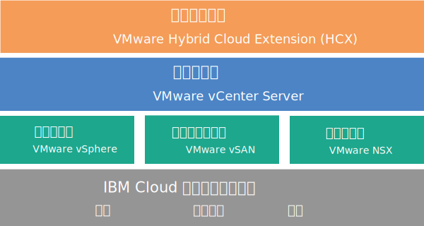

---

copyright:

  years:  2016, 2018

lastupdated: "2018-07-18"

---

# vCenter Server with Hybridity Bundle 概觀

vCenter Server with Hybridity Bundle 是可在 2.3 版及更新版本中取得的實例。

VMware vCenter Server on {{site.data.keyword.cloud}} with Hybridity Bundle 是一個提供 VMware vSphere 堆疊作為服務的受管理專用雲端。VMware 環境建置在四部 {{site.data.keyword.cloud_notm}} {{site.data.keyword.baremetal_short}} 上、包括 VMware vSAN 作為專用儲存空間、自動部署及配置容易管理的邏輯邊緣防火牆（其採用 VMware NSX 技術），以及包括 VMware HCX on {{site.data.keyword.cloud_notm}} 服務。

在許多情況下，整個環境可以在一天內佈建完成，且裸機基礎架構可以快速而彈性地擴充運算容量，並依需要擴增及縮減。

若要增加 vSAN 叢集的 vSAN 型儲存空間容量，您可以在部署後新增更多 ESXi 伺服器。

您可以將 VMware NSX Advanced 版本升級至 Enterprise 版本，並可購買其他 VMware 元件（例如 VMware vRealize Operations）。

如果您要卸載虛擬化、來賓作業系統或應用程式層的日常作業及維護，則可以新增 IBM Managed Services。{{site.data.keyword.cloud_notm}} Professional Services 團隊也可協助您透過移轉、實作、規劃及上線服務來加速移到雲端。

## vCenter Server with Hybridity Bundle 架構

下圖說明三節點 vCenter Server with Hybridity Bundle 部署的高階架構及元件。

圖 1. vCenter Server with Hybridity Bundle 高階架構

### 實體基礎架構

這層提供要供虛擬基礎架構使用的實體基礎架構（運算、儲存空間及網路資源）。

### 虛擬化基礎架構（運算、儲存空間及網路）

這層透過不同的 VMware 產品來將實體基礎架構虛擬化：
* VMware vSphere 將實體運算資源虛擬化。
* VMware Virtual SAN (vSAN) 會根據實體伺服器中的儲存空間來提供軟體定義的共用儲存空間。
* VMware NSX 是提供邏輯網路元件及虛擬網路的網路虛擬化平台。

### 虛擬化管理

此層由 vCenter Server Appliance (vCSA)、NSX Manager、兩個 NSX ESG、三個 NSX Controller、Platform Services Controller (PSC) 虛擬應用裝置及 IBM CloudDriver 虛擬伺服器實例 (VSI) 所組成。針對將主機新增至環境這類特定作業，視需要依需求部署 CloudDriver VSI。

基本供應項目與 vCenter Server Appliance 一起部署，其大小調整後可支援最多 400 部主機及最多 4000 部 VM 的環境。相同的 vSphere API 相容工具及 Script 可用來管理 IBM 管理的 VMware 環境。

總計，基本供應項目需要 38 個 vCPU 及 67 GB vRAM 保留給虛擬化管理層。VM 的其餘主機容量視數個因素而定，例如超訂閱率、VM 大小調整及工作負載效能需求。

如需部署 HCX on {{site.data.keyword.cloud_notm}} 服務時的其他管理資源需求，請參閱 [VMware HCX on {{site.data.keyword.cloud_notm}} 概觀](../services/hcx_considerations.html)。

### 基礎架構混合

本層會抽象化內部部署站台與 {{site.data.keyword.cloud_notm}} 站台之間的資源，讓您可以安全並輕鬆地來回移動工作量，而不需要變更 VM 特徵（例如其 IP 位址）。

根據 VMware Hybrid Cloud Extension (HCX)，您可以在內部部署與 {{site.data.keyword.cloud_notm}} 站台之間建立鬆散耦合交互連接，以在不需要關閉的情況下啟用 VM 的大量移轉或 VM 的即時 vMotion。

## vCenter Server with Hybridity Bundle 實例的技術規格

下列元件已包含在 vCenter Server with Hybridity Bundle 實例中：

**附註：**標準化硬體配置的可用性及定價可能會根據選取以用於部署的 {{site.data.keyword.CloudDataCent_notm}} 而有所不同。

### Bare Metal Server

您的 vCenter Server with Hybridity Bundle 實例訂單隨附四個自訂 {{site.data.keyword.baremetal_short}}。下列是可用的 CPU 型號：
  * 2-CPU Intel Broadwell Generation（Intel Xeon E5-2600 v4 系列）
  * 2-CPU Intel Skylake Generation（Intel Xeon 4100/5100/6100 系列）

### 網路

訂購了下列網路元件：
*  10 Gbps 雙重公用及專用網路上行鏈路
*  三個 VLAN（虛擬 LAN）：一個公用 VLAN 和兩個專用 VLAN
*  在連接至第 2 層 (L2) 網路的本端工作負載之間，用於潛在東西向通訊（水平通訊）的一個具有 DLR（分散式邏輯路由器）的 VXLAN (Virtual eXtensible LAN)。VXLAN 是部署成一個遞送拓蹼範例，您可以在其中修改、建置或移除它。您也可以將其他 VXLAN 連接到 DLR 上的新邏輯介面，來新增安全區域。
*  兩個 VMware NSX Edge Services Gateway：
  * 用於出埠 HTTPS 管理資料流量的安全管理服務 VMware NSX Edge Services Gateway (ESG)，IBM 將它部署為管理網路拓蹼的一部分。IBM 管理 VM 使用此 ESG，以與跟自動化相關的特定外部 IBM 管理元件進行通訊。如需相關資訊，請參閱[將您的網路配置成使用客戶管理的 ESG](../vcenter/vc_esg_config.html#configuring-your-network-to-use-the-customer-managed-nsx-esg-with-your-vms)。

    **重要事項**：您無法存取此 ESG，因此無法使用它。如果您修改它，則可能無法從 {{site.data.keyword.vmwaresolutions_short}} 主控台管理 vCenter Server with Hybridity Bundle 實例。此外，請注意，使用防火牆或停用外部 IBM 管理元件的 ESG 通訊，將導致 {{site.data.keyword.vmwaresolutions_short}} 變成無法使用。
  * 用於出埠和入埠 HTTPS 工作負載資料流量的安全客戶管理 VMware NSX Edge Services Gateway，IBM 將它部署為範本，您可以修改它來提供 VPN 存取或公用存取。如需相關資訊，請參閱[客戶管理的 NSX Edge 是否造成安全風險？](../vmonic/faq.html#does-the-customer-managed-nsx-edge-pose-a-security-risk-)。

如需部署 HCX on {{site.data.keyword.cloud_notm}} 服務時所訂購之網路元件的其他資訊，請參閱 [HCX on {{site.data.keyword.cloud_notm}} 概觀](../services/hcx_considerations.html)。

### 虛擬伺服器實例

已訂購下列虛擬伺服器實例 (VSI)：
* IBM CloudBuilder 的 VSI，在完成實例部署之後會關閉它。
* 您可以選擇在管理叢集中部署單一 Microsoft Windows Server VSI for Microsoft Active Directory (AD) 或兩部高可用性 Microsoft Windows VM，以協助加強安全及穩健性。

### 儲存空間

vSAN 儲存空間提供自訂的配置，以及磁碟類型和數量的各種選項：
* 磁碟數量：2、4、6 或 8。
* 儲存磁碟：960 GB SSD SED、1.9 TB SSD SED 或 3.8 TB SSD SED。

  此外，還訂購了每部主機 2 個快取磁碟 (960 GB)。

### IBM 提供的授權及費用

vCenter Server with Hybridity Bundle 實例訂單隨附下列授權。

* VMware vSphere Enterprise Plus 6.5u1
* VMware vCenter Server 6.5
* VMware NSX Service Providers Edition（Advanced 或 Enterprise）6.4
* VMware vSAN（Advanced 或 Enterprise）6.6

可以提供其他支援及服務費用。

## vCenter Server with Hybridity Bundle 擴充節點的技術規格

每一個 vCenter Server with Hybridity Bundle 擴充節點都會部署下列元件，並在您的 {{site.data.keyword.cloud_notm}} 帳戶中收取其費用。

### 擴充節點的硬體

一個具有自訂配置的 Bare Metal Server。

### 擴充節點的授權與費用

* 一個 VMware vSphere Enterprise Plus 6.5u1
* 一個 VMware NSX Service Providers Edition（Advanced 或 Enterprise）6.4
* 一筆支援與服務費用
* VMware vSAN（Advanced 或 Enterprise）6.6

**重要事項**：您必須從 {{site.data.keyword.vmwaresolutions_short}} 主控台管理 {{site.data.keyword.cloud_notm}} 帳戶中所建立的 {{site.data.keyword.vmwaresolutions_short}} 元件，而不是在主控台以外的 {{site.data.keyword.slportal}} 或透過任何其他方法進行管理。如果您在 {{site.data.keyword.vmwaresolutions_short}} 主控台以外變更這些元件，則變更不會與主控台同步。

**警告**：從 {{site.data.keyword.vmwaresolutions_short}} 主控台以外管理已在訂購實例時安裝至 {{site.data.keyword.cloud_notm}} 帳戶的任何 {{site.data.keyword.vmwaresolutions_short}} 元件，可能會讓您的環境不穩定。這些管理活動包括：
*  新增、修改、退回或移除元件
*  透過新增或移除 ESXi 伺服器來擴充或縮減實例容量
*  關閉元件電源
*  重新啟動服務

   這些活動的例外包括從 {{site.data.keyword.slportal}} 管理共用儲存空間檔案共用。這類活動包括：訂購、刪除（這可能會影響已裝載的資料儲存庫）、授權及裝載共用儲存空間檔案共用。

### 相關鏈結

* [vCenter Server 軟體資料清單](vc_bom.html)
* [vCenter Server with Hybridity Bundle 實例的需求及規劃](vc_hybrid_planning.html)
* [訂購 vCenter Server with Hybridity Bundle 實例](vc_hybrid_orderinginstance.html)
* [HCX on {{site.data.keyword.cloud_notm}} 概觀](../services/hcx_considerations.html)
* [與 IBM 支援中心聯絡](../vmonic/trbl_support.html)
