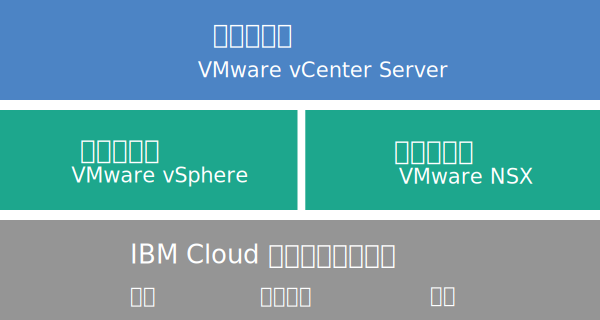

---

copyright:

  years:  2016, 2019

lastupdated: "2019-03-11"

subcollection: vmwaresolutions

---

{:tip: .tip}
{:note: .note}
{:important: .important}

# vCenter Server 概觀
{: #vc_vcenterserveroverview}

VMware vCenter Server on {{site.data.keyword.cloud}} 是一個提供 VMware vSphere 堆疊作為服務的受管理專用雲。VMware 環境建置在至少兩部（建議三部）{{site.data.keyword.cloud_notm}} {{site.data.keyword.baremetal_short}} 上，提供共用網路連接儲存空間及專用軟體定義儲存空間選項，而且它能自動部署及配置容易管理的邏輯 Edge 防火牆（其採用 VMware NSX 技術）。

在許多情況下，整個環境可以在一天內佈建完成，且裸機基礎架構可以快速而彈性地擴充運算容量，並依需要擴增及縮減。

部署後，您可以藉由從 {{site.data.keyword.slportal}} 訂購其他 NFS（網路檔案系統）檔案共用，以及將它們手動連接至叢集裡的所有 ESXi 伺服器，來增加共用儲存空間。如果您需要專用儲存空間，我們以高效能（所有 SSD）及高容量（所有 SATA）兩種配置提供 [NetApp ONTAP Select on {{site.data.keyword.cloud_notm}}](/docs/services/vmwaresolutions/netapp?topic=vmware-solutions-np_netappoverview)。

VMware vSAN 也以專用儲存空間選項提供。若要增加 vSAN 叢集的 vSAN 型儲存空間容量，您可以在部署後新增更多 ESXi 伺服器。

如果您已購買 IBM 提供的 VMware 授權，則可以將 VMware NSX Base 版本升級為 Advanced 或 Enterprise 版本，並可購買其他 VMware 元件（例如 VMware vRealize Operations）。

如果您要卸載虛擬化、來賓作業系統或應用程式層的日常作業及維護，則可以新增 IBM 管理的服務。{{site.data.keyword.cloud_notm}} Professional Services 團隊也可協助您透過移轉、實作、規劃及上線服務來加速移到雲端。

## vCenter Server 架構
{: #vc_vcenterserveroverview-archi}

下圖說明三節點 vCenter Server 部署的高階架構及元件。

圖 1. 三節點叢集的 vCenter Server 高階架構

### 實體基礎架構
{: #vc_vcenterserveroverview-physical-infras}

這層提供要供虛擬基礎架構使用的實體基礎架構（運算、儲存空間及網路資源）。

### 虛擬化基礎架構（運算及網路）
{: #vc_vcenterserveroverview-virtualization-infras}

這層透過不同的 VMware 產品來將實體基礎架構虛擬化：
* VMware vSphere 將實體運算資源虛擬化。
* VMware NSX 是提供邏輯網路元件及虛擬網路的網路虛擬化平台。

### 虛擬化管理
{: #vc_vcenterserveroverview-virtualization-mgmt}

這層包含具有內嵌 Platform Services Controller (PSC) 的 vCenter Server Appliance (vCSA)、NSX Manager、兩個 NSX ESG、三個 NSX Controller 及 IBM CloudDriver 虛擬伺服器實例 (VSI)。針對將主機新增至環境這類特定作業，視需要依需求部署 CloudDriver VSI。

基礎供應項目與 vCenter Server Appliance 一起部署，其大小調整後可支援最多 400 部主機及最多 4000 部 VM 的環境。相同的 vSphere API 相容工具及 Script 可用來管理 IBM 管理的 VMware 環境。

總計，基礎供應項目需要 38 個 vCPU 及 67 GB vRAM 保留給虛擬化管理層。VM 的其餘主機容量視數個因素而定，例如超訂閱率、VM 大小調整及工作負載效能需求。

如需架構的相關資訊，請參閱 [{{site.data.keyword.vmwaresolutions_short}} 架構參考資料](/docs/services/vmwaresolutions/archiref/solution?topic=vmware-solutions-solution_overview)。

## vCenter Server 實例的技術規格
{: #vc_vcenterserveroverview-specs}

下列元件已包含在 vCenter Server 實例中。

標準化硬體配置的可用性及定價可能會根據選取以用於部署的 {{site.data.keyword.CloudDataCent_notm}} 而有所不同。
{:note}

### Bare Metal Server
{: #vc_vcenterserveroverview-bare-metal}

您可以使用下列其中一項配置，訂購三部以上的 {{site.data.keyword.baremetal_short}}：
* **Skylake**：2-CPU Intel Skylake 產生伺服器（Intel Xeon 4100/5100/6100 系列），搭配您選取的 CPU 型號及 RAM 大小。
* **SAP 認證**：Intel Skylake 或 Intel Broadwell 產生伺服器（Intel Xeon 6140/E5-2690/E7-8890 系列），搭配您選取的 CPU 型號。
* **Broadwell**：2-CPU Intel Broadwell 產生伺服器（Intel Xeon E5-2600/E7-4800 系列），搭配您選取的 CPU 型號及 RAM 大小。

如果您計劃使用 vSAN 儲存空間，則配置需要四個 {{site.data.keyword.baremetal_short}}。
{:note}

### 網路
{: #vc_vcenterserveroverview-networking}

訂購了下列網路元件：
*  10 Gbps 雙重公用及專用網路上行鏈路
*  三個 VLAN（虛擬 LAN）：一個公用 VLAN 和兩個專用 VLAN
*  一個具有 DLR（分散式邏輯路由器）的 VXLAN (Virtual eXtensible LAN)，以便在連接至第 2 層 (L2) 網路的本端工作負載之間，進行潛在的東西向通訊。VXLAN 是部署成一個遞送拓蹼範例，您可以加以修改、在其上進行建置，或是移除它。您也可以藉由將額外 VXLAN 連接到 DLR 上的新邏輯介面，來新增安全區域。
*  兩個 VMware NSX Edge Services Gateway：
  * 用於出埠 HTTPS 管理資料流量的安全管理服務 VMware NSX Edge Services Gateway (ESG)，IBM 將它部署為管理網路拓蹼的一部分。IBM 管理虛擬機器會利用此 ESG，來和與自動化相關的特定外部 IBM 管理元件進行通訊。如需相關資訊，請參閱[將您的網路配置成使用客戶管理的 ESG](/docs/services/vmwaresolutions/vcenter?topic=vmware-solutions-vc_esg_config#configuring-your-network-to-use-the-customer-managed-nsx-esg-with-your-vms)。

    此 ESG 名為 **mgmt-nsx-edge**，您無法存取此 ESG，因此無法使用它。如果您修改它，則可能無法從 {{site.data.keyword.vmwaresolutions_short}} 主控台管理 vCenter Server 實例。此外，使用防火牆或停用與外部 IBM 管理元件的 ESG 通訊，可能會導致 {{site.data.keyword.vmwaresolutions_short}} 變成無法使用。
    {:important}
  * 用於出埠和入埠 HTTPS 工作負載資料流量的安全客戶管理 VMware NSX Edge Services Gateway。IBM 將此閘道部署為範本，您可以修改它來提供 VPN 存取或公用存取。如需相關資訊，請參閱[客戶管理的 NSX Edge 是否造成安全風險？](/docs/services/vmwaresolutions/vmonic?topic=vmware-solutions-faq#does-the-customer-managed-nsx-edge-pose-a-security-risk-)。

### 虛擬伺服器實例
{: #vc_vcenterserveroverview-vsi}

已訂購下列虛擬伺服器實例 (VSI)：
* IBM CloudBuilder 的 VSI，在完成實例部署之後會關閉它。
* （適用於實例 2.2 版及更新版本）您可以選擇在管理叢集裡部署單一 Microsoft Windows Server VSI for Microsoft Active Directory (AD) 或兩部高可用性 Microsoft Windows VM，以協助加強安全及穩健性。
* （適用於實例 1.9 版到 2.1 版）已部署並可查閱 Microsoft Windows Server VSI for Microsoft Active Directory (AD)。VSI 充當登錄主機及虛擬機器之實例的 DNS。
* （適用於實例 1.8 版及更早版本）用於管理元件 Snapshot 型備份的 VSI，其在實例部署完成之後會保持運作。

### Storage
{: #vc_vcenterserveroverview-storage}

在起始部署期間，您可以選擇 vSAN 和 NFS 儲存空間選項。

若為實例 2.8 版及更新版本，您可以將 NFS 儲存空間共用新增至現有 NFS 或 vSAN 叢集。如需相關資訊，請參閱[擴充及縮減 vCenter Server 實例的容量](/docs/services/vmwaresolutions/vcenter?topic=vmware-solutions-vc_addingremovingservers#adding-nfs-storage-to-vcenter-server-instances)中的*將 NFS 儲存空間新增至 vCenter Server 實例* 小節。
{:note}

#### vSAN 儲存空間
{: #vc_vcenterserveroverview-vsan-storage}

vSAN 選項提供自訂的配置，以及磁碟類型、大小和數量的各種選項：
* 磁碟數量：2、4、6 或 8
* 儲存空間磁碟：960 GB SSD SED、1.9 TB SSD SED 或 3.8 TB SSD SED。

  此外，還為每部主機訂購 2 個 960 GB 的快取磁碟。

  當 3.8 TB SSD（固態硬碟）磁碟機在正式發行至資料中心時，就會予以支援。
  {:note}
* 「高效能 Intel Optane」選項，提供 2 個額外容量磁碟機槽來放置共 10 個容量磁碟。這個選項取決於 CPU 型號。

#### NFS 儲存空間
{: #vc_vcenterserveroverview-nfs-storage}

NFS 選項為工作負載提供自訂的共用檔案層次儲存空間，以及大小和效能的各種選項：
* 大小：20 GB 到 24 TB
* 效能：0.25、2、4 或 10 IOPS/GB。
* 檔案共用的個別配置。

  10 IOPS/GB 效能層次限制為每個檔案共用的容量上限為 4 TB。
  {:note}

如果您選擇 NFS 選項，則會訂購用於管理元件的一個 2 TB 及 4 IOPS/GB 檔案共用。

#### 本端磁碟儲存空間
{: #vc_vcenterserveroverview-local-disk-storage}

本端磁碟選項（僅可用於 **SAP 認證**四重 Intel Xeon E7-8890 v4 處理器 Bare Metal 配置）提供具有磁碟計數及磁碟類型的各種選項的自訂配置。

### 授權（IBM 提供或 BOYL）與費用
{: #vc_vcenterserveroverview-license-and-fee}

* VMware vSphere Enterprise Plus 6.5u2 或 6.7u1
* VMware vCenter Server 6.5
* VMware NSX Service Providers Edition（Base、Advanced 或 Enterprise）6.4
* （針對 vSAN 叢集）VMware vSAN Advanced 或 Enterprise 6.6
* 支援與服務費用（一個節點一份授權）

## vCenter Server 擴充節點的技術規格
{: #vc_vcenterserveroverview-expansion-node-specs}

每個 vCenter Server 擴充節點會部署下列節點，並在您的 {{site.data.keyword.cloud_notm}} 帳戶中產生費用。

### 擴充節點的硬體
{: #vc_vcenterserveroverview-expansion-node-hardware}

一部具有 [vCenter Server 實例的技術規格](/docs/services/vmwaresolutions/vcenter?topic=vmware-solutions-vc_vcenterserveroverview#specs)中所呈現之配置的 Bare Metal Server。

### 擴充節點的授權與費用
{: #vc_vcenterserveroverview-expansion-node-license-and-fee}

* 一個 VMware vSphere Enterprise Plus 6.5u2 或 6.7u1
* 一個 VMware NSX Service Providers Edition（Base、Advanced 或 Enterprise）6.4
* 一筆支援與服務費用
* （針對 vSAN 叢集）VMware vSAN Advanced 或 Enterprise 6.6

您只能從 {{site.data.keyword.vmwaresolutions_short}} 主控台，而不能從 {{site.data.keyword.slportal}} 或透過主控台以外的任何其他方法，來管理在 {{site.data.keyword.cloud_notm}} 帳戶中建立的 {{site.data.keyword.vmwaresolutions_short}} 元件。如果您在 {{site.data.keyword.vmwaresolutions_short}} 主控台以外變更這些元件，則變更不會與主控台同步。從 {{site.data.keyword.vmwaresolutions_short}} 主控台以外管理在訂購實例時已安裝至 {{site.data.keyword.cloud_notm}} 帳戶的任何 {{site.data.keyword.vmwaresolutions_short}} 元件，可能會讓您的環境不穩定。這些管理活動包括：
*  新增、修改、退回或移除元件
*  透過新增或移除 ESXi 伺服器來擴充或縮減實例容量
*  關閉元件電源
*  重新啟動服務
   這些活動的例外包括從 {{site.data.keyword.slportal}} 管理共用儲存空間檔案共用。這類活動包括：訂購、刪除（這可能會影響已裝載的資料儲存庫）、授權及裝載共用儲存空間檔案共用。
   {:important}

## 相關鏈結
{: #vc_vcenterserveroverview-related}

* [vCenter Server 軟體資料清單](/docs/services/vmwaresolutions/vcenter?topic=vmware-solutions-vc_bom)
* [規劃 vCenter Server 實例](/docs/services/vmwaresolutions/vcenter?topic=vmware-solutions-vc_planning)
* [訂購 vCenter Server 實例](/docs/services/vmwaresolutions/vcenter?topic=vmware-solutions-vc_orderinginstance)
* [{{site.data.keyword.cloud_notm}} file and block storage](https://www.ibm.com/cloud/garage/content/architecture/virtualizationArchitecture/shared-storage){:new_window}
* [擴充檔案共用容量](/docs/infrastructure/FileStorage?topic=FileStorage-expandCapacity#expandCapacity)
