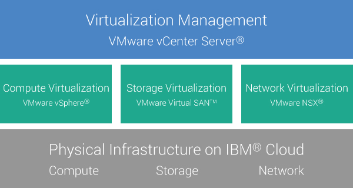

---

copyright:

  years:  2016, 2017

lastupdated: "2017-10-12"

---

# Cloud Foundation overview

When you order VMware Cloud Foundation on IBM® Cloud, an entire VMware environment is deployed automatically. The base deployment consists of four IBM® Cloud bare metal servers with the VMware Cloud Foundation stack preinstalled and configured to provide a unified software-defined data center (SDDC) platform. Cloud Foundation natively integrates VMware vSphere, VMware NSX, VMware Virtual SAN, and is architected based on VMware Validated Designs.

## Cloud Foundation architecture

The following graphic depicts the overall architecture and components of the Cloud Foundation deployment.

Figure 1. Cloud Foundation architecture

### Physical infrastructure

This layer provides the physical compute, storage, and network resources to be used by the virtual infrastructure.

### Virtualization infrastructure (Compute, Storage, and Network)

This layer virtualizes the physical infrastructure through different VMware products:
* VMware vSphere virtualizes the physical compute resources.
* VMware Virtual SAN provides software-defined shared storage based on the storage in the physical servers.
* VMware NSX is the network virtualization platform that provides logical networking components and virtual networks.

### Virtualization management

This layer consists of vCenter Server, which represents the management layer for the virtualized environment. The same familiar vSphere API-compatible tools and scripts can be used to manage the IBM®-hosted VMware environment.

On the {{site.data.keyword.vmwaresolutions_full}} console, you can expand and contract the capacity of your instances using the add and remove ESXi server capability. In addition, lifecycle management functions like patching and upgrading the VMware components in the hosted environment are also available.

For details about the architecture, see the _Reference architecture_ document in the [Architecture Center](https://www.ibm.com/devops/method/content/architecture/virtCloudFoundationPlatform){:new_window}.

## Cloud Foundation instance components

The following components are included in your Cloud Foundation instance.

**Note**: Charges that are incurred for the hardware, networking, VMs, and storage might vary based on the data center that is selected for deployment.

### Hardware

IBM Cloud bare metal servers with the following hardware options to choose from:
* Standard (Dual Intel Xeon E5-2690 v4 / 28 cores total, 2.60 GHz / 256 GB RAM / 12 disks)
* Small (Dual Intel Xeon E5-2650 v4 / 24 cores total, 2.20 GHz / 128 GB RAM / 12 disks)
* User customized (the user selects the CPU and RAM options)

In addition, the following disk and networking specifications:
* Two 1-TB SATA drives
* Eight 2-TB SATA drives
* Two 1.2-TB SSD drives
* One RAID disk controller
* 10 Gbps dual public and private network uplinks
* VMware Server Virtualization 6.0 (VMware vSphere Enterprise Plus)

### Networking

* Three VLANs (Virtual LANs): one public VLAN and two private VLANs
* A secure management services VMware NSX Edge Services Gateway (ESG) for outbound HTTPS management traffic, which is deployed by IBM as part of the management networking typology. This ESG is used by the IBM management virtual machines to communicate with specific external IBM management components that are related to automation. For more information, see [Does the management services NSX Edge pose a security risk?](../vmonic/faq.html#does-the-management-services-nsx-edge-pose-a-security-risk-)

  **Important**: This ESG is not accessible to you and you cannot use it. If you modify it, you might not be able to manage the Cloud Foundation instance from the {{site.data.keyword.vmwaresolutions_short}} console. In addition, note that using a firewall or disabling the ESG communications to the external IBM management components will cause {{site.data.keyword.vmwaresolutions_short}} to become unusable.

* The EVC (Enhanced vMotion Compatibility) feature is automatically enabled if you also have an existing cluster with ESXi servers that are supported by the current VMware vSphere version. EVC ensures vMotion compatibility for all hosts in a cluster and that all hosts in a cluster present the same CPU feature set to virtual machines, even if the actual CPUs on the hosts differ. Using EVC prevents migrations with vMotion from failing because of incompatible CPUs.

### Virtual Server Instances

Three VSIs (Virtual Server Instances):
* A VSI for CloudBuilder, which is shut down after the instance deployment is completed.
* A VSI for the Veeam backup, which keeps running after the instance deployment is completed.
* A VSI for Microsoft Active Directory (AD) and Domain Name System (DNS) services, which is required for multi-site configuration support. This VSI specification is: Windows 2012 R2 (8 GB RAM / 2 CPU cores / 100 GB disk / Dual 1 Gbps private uplinks).

### Storage for backups

One 2 TB shared file-level storage that can be scaled up to 12 TB.

**Note**: With the introduction of the Veeam on IBM Cloud service, the storage for backups is no longer a standard component of Cloud Foundation instances. When you order an instance, you can choose whether you want storage for backups by selecting or deselecting the Veeam on IBM Cloud service.

### Licenses and fees

* Four VMware vSAN Standard Tier I 0 - 20 TB 6.x
* Four VMware NSX Enterprise 6.2
* Four SDDC Manager licenses
* Four Support and Services fees

## Cloud Foundation expansion node components

Each Cloud Foundation expansion node will deploy and incur charges for the following components in your IBM Bluemix Infrastructure (SoftLayer) account.

### Hardware for expansion nodes

One IBM Cloud bare metal server with the configuration presented in [Cloud Foundation instance components](../sddc/sd_cloudfoundationoverview.html#cloud-foundation-components).

### Licenses and fees for expansion nodes

* One VMware vSAN Standard Tier I 0 - 20 TB 6.x
* One VMware NSX Enterprise 6.2
* One SDDC Manager license
* One Support and Services fee

For details about the components, see the _Bill of Materials_ document in the [Architecture Center](https://www.ibm.com/devops/method/content/architecture/virtCloudFoundationPlatform){:new_window}.

**Important**: You must manage the {{site.data.keyword.vmwaresolutions_short}} components that are created in your Bluemix Infrastructure (SoftLayer) account only from the {{site.data.keyword.vmwaresolutions_short}} console, not the Bluemix Infrastructure (SoftLayer) portal or any other means outside of the console. If you change these components outside of the {{site.data.keyword.vmwaresolutions_short}} console, the changes are not synchronized with the console.

**CAUTION**: Managing any {{site.data.keyword.vmwaresolutions_short}} components (which were installed into your Bluemix Infrastructure (SoftLayer) account when you ordered the instance) from outside the {{site.data.keyword.vmwaresolutions_short}} console can make your environment unstable. These management activities include:

*  Adding, modifying, returning, or removing components
*  Expanding or contracting instance capacity through adding or removing ESXi servers
*  Powering off components
*  Restarting services

   Exceptions to these activities include managing the shared storage file shares from the Bluemix Infrastructure (SoftLayer) portal. Such activities include: ordering, deleting (which might impact data stores if mounted), authorizing, and mounting shared storage file shares.

## Related links

* [Planning Cloud Foundation instances](sd_planning.html)
* [Ordering Cloud Foundation instances](sd_orderinginstance.html)
* [VMware vSphere Documentation Center](https://pubs.vmware.com/vsphere-60/index.jsp){:new_window}
* [VMware NSX 6 Documentation Center](https://pubs.vmware.com/NSX-6/index.jsp){:new_window}
