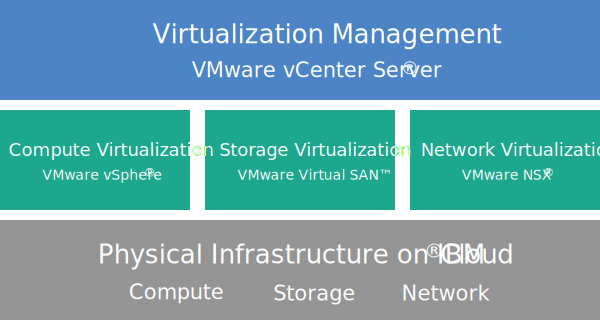

---

copyright:

  years:  2016, 2019

lastupdated: "2019-02-14"

---

{:tip: .tip}
{:note: .note}
{:important: .important}

# Cloud Foundation overview
{: #sd_cloudfoundationoverview}

When you order VMware Cloud Foundation on {{site.data.keyword.cloud}}, an entire VMware environment is deployed automatically. The base deployment consists of four {{site.data.keyword.cloud_notm}} {{site.data.keyword.baremetal_short}} with the VMware Cloud Foundation stack preinstalled and configured to provide a unified software-defined data center (SDDC) platform. Cloud Foundation natively integrates VMware vSphere, VMware NSX, VMware Virtual SAN, and is architected based on VMware-validated designs.

## Cloud Foundation architecture
{: #sd_cloudfoundationoverview-archi}

The following graphic depicts the overall architecture and components of the Cloud Foundation deployment.

Figure 1. Cloud Foundation architecture

### Physical infrastructure
{: #sd_cloudfoundationoverview-physical-infras}

This layer provides the physical infrastructure (compute, storage, and network resources) to be used by the virtual infrastructure.

### Virtualization infrastructure (Compute, Storage, and Network)
{: #sd_cloudfoundationoverview-virtualization-infras}

This layer virtualizes the physical infrastructure through different VMware products:
* VMware vSphere virtualizes the physical compute resources.
* VMware Virtual SAN (vSAN) provides software-defined shared storage based on the storage in the physical servers.
* VMware NSX is the network virtualization platform that provides logical networking components and virtual networks.

### Virtualization management
{: #sd_cloudfoundationoverview-virtualization-mgmt}

This layer consists of vCenter Server, which represents the management layer for the virtualized environment. The same familiar vSphere API-compatible tools and scripts can be used to manage the IBM-hosted VMware environment.

On the {{site.data.keyword.vmwaresolutions_short}} console, you can expand and contract the capacity of your instances by using the add and remove ESXi server capability. In addition, lifecycle management functions like applying updates and upgrading the VMware components in the hosted environment are also available.

For more information about the architecture, see [Solution overview](/docs/services/vmwaresolutions/archiref/solution/solution_overview.html).

## Technical specifications for Cloud Foundation instances
{: #technical-specifications-for-cloud-foundation-instances}

The following components are included in your Cloud Foundation instance.

Charges that are incurred for the hardware, networking, virtual machines, and storage might vary based on the {{site.data.keyword.CloudDataCent_notm}} that is selected for deployment.
{:note}

### Bare Metal Server
{: #sd_cloudfoundationoverview-bare-metal}

You can order {{site.data.keyword.cloud_notm}} {{site.data.keyword.baremetal_short}} with one of the following configurations:
*  **Skylake**: 2-CPU Intel Skylake generation servers (Intel Xeon 4100/5100/6100 series) with your selected CPU model and RAM size.   
*  **Broadwell**: 2-CPU Intel Broadwell generation servers (Intel Xeon E5-2600/E7-4800 series) with your selected CPU model and RAM size.

If you plan to use vSAN storage, the configuration requires four {{site.data.keyword.baremetal_short}}.
{:note}

### Networking
{: #sd_cloudfoundationoverview-networking}

The following networking components are ordered:
* 10 Gbps dual public and private network uplinks
* Three VLANs (Virtual LANs): one public VLAN and two private VLANs
* Secure management services VMware NSX Edge Services Gateway (ESG) for outbound HTTPS management traffic, which is deployed by IBM as part of the management networking typology. This ESG is used by the IBM management virtual machines to communicate with specific external IBM management components that are related to automation. For more information, see [Does the management services NSX Edge pose a security risk?](/docs/services/vmwaresolutions/vmonic/faq.html#does-the-management-services-nsx-edge-pose-a-security-risk-)

  This ESG is not accessible to you and you cannot use it. If you modify it, you might not be able to manage the Cloud Foundation instance from the {{site.data.keyword.vmwaresolutions_short}} console. In addition, using a firewall or disabling the ESG communications to the external IBM management components will cause {{site.data.keyword.vmwaresolutions_short}} to become unusable.
  {:important}

* The EVC (Enhanced vMotion Compatibility) feature is automatically enabled if you have an existing cluster with ESXi servers that are supported by the current VMware vSphere version. EVC provides vMotion compatibility for all ESXi servers in a cluster by ensuring that all ESXi servers in a cluster expose the same set of CPU features to virtual machines. By using EVC, the virtual machines can migrate between any ESXi servers in the cluster, even if the actual CPUs on the ESXi servers might be different.

### Virtual Server Instances
{: #sd_cloudfoundationoverview-vsi}

The following VSIs (Virtual Server Instances) are ordered:
* A VSI for Microsoft Active Directory (AD) and Domain Name System (DNS) services. The VSI is required for multi-site configuration support. This VSI specification is: Windows 2012 R2 (8 GB RAM / 2 CPU cores / 100 GB disk / Dual 1 Gbps private uplinks).
* A VSI for IBM CloudBuilder, which is shut down after the instance deployment is completed.
* (If Veeam on {{site.data.keyword.cloud_notm}} is ordered) A VSI for the Veeam backup service is ordered.

### Storage
{: #sd_cloudfoundationoverview-storage}

The following storage is ordered, depending on the {{site.data.keyword.baremetal_short}} configuration that you select:
* Two 1-TB SATA boot disks
* Two 960-GB SSD (Solid-State Disk) cache disks
* One RAID disk controller
* For the **Skylake** and **Broadwell** configuration only, you can set the number of disk drives and the disk type and capacity according to your requirements. Also, you have the High-Performance Intel Optane option, which provides two extra capacity disk bays for a total of 10 capacity disks. The High-Performance Intel Optane option is dependent on the CPU model.

### Licenses (IBM-provided or BYOL) and fees
{: #sd_cloudfoundationoverview-license-and-fee}

* Four VMware vSphere Enterprise Plus 6.5u1
* Four VMware vCenter Server 6.5
* Four VMware NSX Enterprise 6.3
* Four VMware vSAN Advanced or Enterprise 6.6
* Four SDDC Manager licenses (IBM-provided only)
* Four Support and Services fees

## Technical specifications for Cloud Foundation expansion nodes
{: #sd_cloudfoundationoverview-expansion-node-specs}

Each Cloud Foundation expansion node deploys and incurs charges for the following components in your {{site.data.keyword.cloud_notm}} account.

### Hardware for expansion nodes
{: #sd_cloudfoundationoverview-expansion-node-hardware}

One {{site.data.keyword.cloud_notm}} Bare Metal Server with the configuration presented in [Technical specifications for Cloud Foundation instances](/docs/services/vmwaresolutions/sddc/sd_cloudfoundationoverview.html#technical-specifications-for-cloud-foundation-instances).

### Licenses and fees for expansion nodes
{: #sd_cloudfoundationoverview-expansion-node-license-and-fee}

* One VMware vSphere Enterprise Plus 6.5u1
* One VMware vCenter Server 6.5
* One VMware NSX Enterprise 6.3
* One VMware vSAN Advanced or Enterprise 6.6
* One SDDC Manager license
* One Support and Services fee

You must manage the {{site.data.keyword.vmwaresolutions_short}} components that are created in your {{site.data.keyword.cloud_notm}} account only from the {{site.data.keyword.vmwaresolutions_short}} console, not the {{site.data.keyword.slportal}} or any other means outside of the console. If you change these components outside of the {{site.data.keyword.vmwaresolutions_short}} console, the changes are not synchronized with the console.
{:important}

**CAUTION:** Managing any {{site.data.keyword.vmwaresolutions_short}} components, which were installed into your {{site.data.keyword.cloud_notm}} account when you ordered the instance, from outside the {{site.data.keyword.vmwaresolutions_short}} console can make your environment unstable. These management activities include:
*  Adding, modifying, returning, or removing components
*  Expanding or contracting instance capacity through adding or removing ESXi servers
*  Powering off components
*  Restarting services

   Exceptions to these activities include managing the shared storage file shares from the {{site.data.keyword.slportal}}. Such activities include: ordering, deleting (which might impact data stores if mounted), authorizing, and mounting shared storage file shares.

## Related links
{: #sd_cloudfoundationoverview-related}

* [Cloud Foundation Software Bill of Materials](/docs/services/vmwaresolutions/sddc/sd_bom.html)
* [Planning Cloud Foundation instances](/docs/services/vmwaresolutions/sddc/sd_planning.html)
* [Ordering Cloud Foundation instances](/docs/services/vmwaresolutions/sddc/sd_orderinginstance.html)
* [VMware vSphere Documentation Center](https://pubs.vmware.com/vsphere-60/index.jsp){:new_window}
* [VMware NSX 6 Documentation Center](https://pubs.vmware.com/NSX-6/index.jsp){:new_window}
* [EVC and CPU Compatibility FAQ](https://kb.vmware.com/s/article/1005764)
