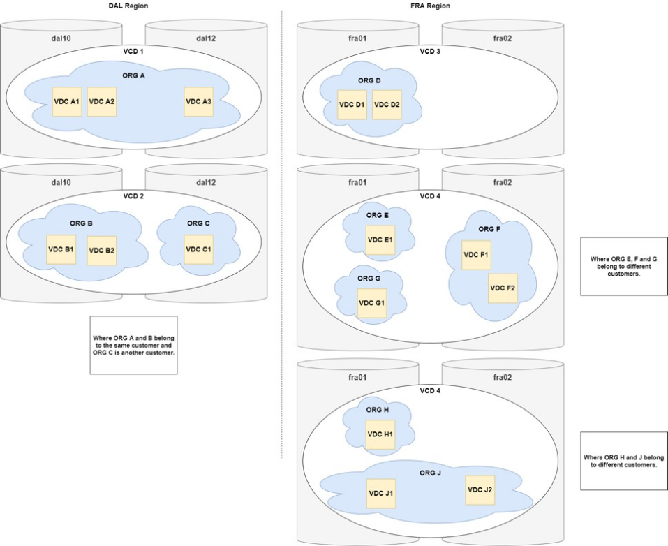

---

copyright:

  years:  2020, 2024

lastupdated: "2024-04-02"

keywords: vmware solutions shared, get started shared, tech specs shared

subcollection: vmwaresolutions

---

{{site.data.keyword.attribute-definition-list}}

# VMware Shared overview
{: #shared_overview}

{{site.data.content.shared-deprecated-note}}

The {{site.data.keyword.vmwaresolutions_full}} Shared offering provides standardized and customizable deployment choices of VMware® virtual data center environments. With VMware Shared virtual data centers, you can quickly and seamlessly migrate or deploy VMware workloads to the cloud, on IBM-hosted VMware infrastructure. {{site.data.keyword.IBM_notm}} provides a self-service on-demand VMware cloud computing platform with VMware Cloud Director running on {{site.data.keyword.cloud_notm}}. This Infrastructure as a Service (IaaS) on-demand offering provides the option to use specific virtual CPU (vCPU), storage, vRAM, Network, and IP, as needed.

VMware Shared has the following IaaS subscription service types:

* Multitenant on-demand virtual data centers
* Multitenant reserved virtual data centers

You can manage the lifecycle of virtual data centers by using VMware Shared. The following functions are supported when you use the VMware Cloud Director Management console or public API:

* Virtual data center creation
* Virtual data center elasticity
* Virtual data center deletion

VMware Shared comes standard with five public IP addresses on an NSX Edge Service Gateway with unlimited ingress over the public network.

Virtual data centers incur charges for the following components:

* Storage allocations with tiered pricing based on storage performance
* vCPU usage
* Virtual memory usage
* Egress on public networking
* Commercial operating system licenses used
* Optional VMware services

## VMware Shared architecture
{: #shared_overview-archi}

The following graphic depicts the high-level architecture and components of VMware Shared deployment.

{: caption="Figure 1. VMware Shared architecture" caption-side="bottom"}

### VMware Cloud Director
{: #shared_overview-vcloud-dir}

This layer represents the management interface. VMware Cloud Director provides role-based access to a web-based tenant portal. The portal allows the members of an organization to interact with the organization's resources to create and work with vApps and virtual machines (VMs).

The supported version of VMware Cloud Director is v10.4.1 and it supports up to virtual hardware version 19.

### Organization
{: #shared_overview-org}

An organization is a unit of administration for a collection of users, groups, and computing resources. Users authenticate at the organization level, supplying credentials established by an organization administrator when the user was created or imported. Organization administrators manage organization users, groups, and catalogs.

#### Users and policies
{: #shared_overview-users-policies}

An organization can contain an arbitrary number of users and groups. Users can be created locally by the organization administrator or imported from a directory service such as LDAP. Permissions within an organization are controlled through the assignment of privileges and roles to users and groups.

#### Catalogs
{: #shared_overview-cat}

Organizations use catalogs to store vApp templates and media files. The members of an organization that have access to a catalog can use the catalog's vApp templates and media files to create their own vApps. Organizations administrators can copy items from public catalogs to their organization catalog.

#### Virtual data centers
{: #shared_overview-vc}

An Organization virtual data center provides resources to an organization. Virtual data centers provide an environment where virtual systems can be stored, deployed, and operated. They also provide storage for virtual CD and DVD media. An organization can have multiple virtual data centers.

{: caption="Figure 2. VMware Shared virtual data center architecture" caption-side="bottom"}

### Sites
{: #shared_overview-sites}

A site is a Cloud Director instance that is set up over a set of zones in a multizone region. An account can have only one organization in one Cloud Director instance that provides a one-to-one relationship between a site and a Cloud Director organization.

For example, the following graphic depicts two Cloud Director instances, *VCD1* and *VCD2*. The clusters span across the dal10 and dal12 locations. Two organizations, *Org A* and *Org B* belong to the same customer and one organization, *Org C* belongs to a different customer.

{: caption="Figure 3. VMware Shared site architecture" caption-side="bottom"}

## Role-based access policies (VMware Shared V4.8 and later)
{: #shared_overview-access-policies}

Role-based access control is achieved by using a site and organization IAM policy for VMware Shared resources.

| Access policy level | Access |
|:------------------- |:------ |
| Site/Org IAM Policy | Exposed and active |
| VDC IAM Policy | View and delete only |
| Global Resource List | Organizations only |
| VMware Console Resource List | Organizations and associated virtual data centers only|
{: caption="Table 1. Site and Organization IAM policy control for VMware Shared" caption-side="bottom"}

For VMware Shared versions earlier than V4.8, role-based access control is achieved by using a virtual data center IAM policy for VMware Shared resources.

| Access policy level | Access |
|:------------------- |:------ |
| Site/Org IAM Policy | Hidden |
| VDC IAM Policy | Exposed and active |
| Global Resource List | Virtual data center only |
| VMware Console Resource List | Virtual data center only|
{: caption="Table 2. Virtual data center IAM policy control for VMware Shared" caption-side="bottom"}

### Access policy updates
{: #shared_overview-access-policies-reqs}

You have access to your sites only to assign access policies. The access policy at the site level applies to every resource within it. You don't assign access control directly to a virtual data center.

For more information about assigning resource access and roles, see:
* [Managing IAM access for VMware Solutions](/docs/vmwaresolutions?topic=vmwaresolutions-iam)
* [Roles and permissions for Cloud Director](/docs/vmwaresolutions?topic=vmwaresolutions-iam_vcd&interface=ui)

#### Resource Group based access policy updates
{: #shared_overview-access-policies-reqs-rg}

If you have multiple resource groups with different virtual data centers from one specific location, only the resource group that contains the first virtual data center of that location (based on creation date) applies to all of the virtual data centers in that location. Policies apply to the resource group that contains the first virtual data center or you can set a policy at the VMware Solutions service level.

If all of your virtual data centers are in a single location and belong to only one resource group access policy, your site automatically belongs to the same resource group as the virtual data center.

Your existing group membership has sites that are listed instead of virtual data centers. The site for a virtual data center belongs to a resource group only if the virtual data center was the first virtual data center of the site.
{: note}

#### Virtual data center based access policy updates
{: #shared_overview-access-policies-reqs-vdc}

A new access policy is required at the VMware Solutions service level for all your resources.

Virtual data center based access policies are named after the site. If you did not make the required policy updates before the V4.8 release, your virtual data center based policy is ineffective.
{: attention}

## Technical specifications for VMware Shared
{: #shared_overview-specs}

The following components are included in your virtual data center:

### Compute
{: #shared_overview-specs-comp}

Compute processing is allocated to virtual data centers in vCPU increments. Each vCPU increment represents a single 2.0 GHz core. Compute memory is allocated in GB increments.

### Networking
{: #shared_overview-specs-net}

By default, every virtual data center comes configured with one advanced edge gateway with five public IP addresses and one private service IP address. The advanced edge gateway is customer configurable and can be customized.

The public IP addresses can be used for public facing vApps for inbound or outbound public internet traffic.

The service address can be used for access to {{site.data.keyword.cloud_notm}} infrastructure services on the {{site.data.keyword.cloud_notm}} internal private network, including the following services:

* NTP
* Windows® operating system licensing and updates
* Red Hat Enterprise Linux® operating system licensing and updates
* Cloud Object Storage

### Storage
{: #shared_overview-specs-storage}

When you create or deploy vApps or VMs, you can select either an unencrypted or encrypted storage policy. Each option has six different tiers of storage available, depending on the storage performance required.

Storage policy availability can vary by region and deployment topology.
{: note}

#### Unencrypted storage policy options
{: #shared_overview-specs-storage-unencrypted}

* Standard - The storage tier with no maximum throughput. The number of IOPS/GB is not guaranteed.
* 10 IOPS/GB - The storage tier with a maximum throughput of 10 IOPS/GB, the highest guaranteed performance.
* 4 IOPS/GB - Storage tier with a maximum throughput of 4 IOPS/GB.
* 2 IOPS/GB - Storage tier with a maximum throughput of 2 IOPS/GB.
* 0.25 IOPS/GB - Storage tier with a maximum throughput of 0.25 IOPS/GB.
* vSAN™ - No IOPS limitation.

Standard is the default policy for virtual data centers.
{: note}

#### Encrypted storage policy options
{: #shared_overview-specs-storage-encrypted}

Encryption-enabled storage policies are available to all Organization virtual data centers. Encryption protects not only the VMs but also VM disks and other files. Administrators can encrypt VMs and disks by associating the VM or disk with a storage policy that has the VM encryption capability.

* Standard - Encrypted. The storage tier with no maximum throughput. The number of IOPS/GB is not guaranteed.
* 10 IOPS/GB - Encrypted. The storage tier with a maximum throughput of 10 IOPS/GB, the highest guaranteed performance.
* 4 IOPS/GB - Encrypted. Storage tier with a maximum throughput of 4 IOPS/GB.
* 2 IOPS/GB - Encrypted. Storage tier with a maximum throughput of 2 IOPS/GB.
* 0.25 IOPS/GB - Encrypted. Storage tier with a maximum throughput of 0.25 IOPS/GB.
* vSAN - Encrypted. No IOPS limitation.

For more information about the VM encryption limitations for VMware Cloud Director 10.4, see [Enabling VM encryption on storage policies of an Organization virtual data center](https://docs.vmware.com/en/VMware-Cloud-Director/10.4/VMware-Cloud-Director-Service-Provider-Admin-Portal-Guide/GUID-80F58C1D-A97E-43FE-8E41-E9242A1D2332.html){: external}.

The encryption storage policies do not currently work with VM customizations. To resolve this issue, you can use encryption storage policies after a VM is deployed and customized by using the unencrypted storage policies. For more information, see [Changing the general properties of a virtual machine](/docs/vmwaresolutions?topic=vmwaresolutions-shared_vcd-ops-guide#shared_vcd-ops-guide-change-properties).
{: important}

#### Standard-Catalog storage policy
{: #shared_overview-specs-storage-standard-catalog}

Select the Standard-Catalog storage policy to upload vApp templates and any media to your catalog. The Standard-Catalog storage policy does not deploy vApps and VMs, is unencrypted, and has no IOPS restrictions.

The Standard-Catalog storage policy always spans all virtual data centers in the region so you can access media files from any virtual data center regardless of the data center zone.

### Maximum disk size
{: #shared_overview-specs-disk-size}

* The maximum disk size is 16 TBs per disk for the 0.25 IOPS / GB, 2 IOPS/GB, 4 IOPS/GB, 10 IOPs / GB, and Standard storage policies.
* The maximum disk size is 62 TBs per disk for the vSAN storage policy.

### Maximum host capacity
{: #shared_overview-specs-capacity}

The maximum host capacity for a single VM has the following specifications:
* 80 vCPU
* 1.5 TB RAM
* Storage is not limited
* Open virtualization appliance (OVA) size is limited to 300 GB. You can use the Open Virtualization Format (OVF) Tool for uploading larger OVAs.

## Managing user access with Identity and Access Management
{: #shared_overview-manage_user_access}

The {{site.data.keyword.cloud_notm}} Identity and Access Management (IAM) offering controls user access
to {{site.data.keyword.vmwaresolutions_short}} service instances. For more information about IAM, see [Managing user access with Identity and Access Management](/docs/vmwaresolutions?topic=vmwaresolutions-iam).

## Related links
{: #shared_overview-related}

* [Requirements for VMware Shared](/docs/vmwaresolutions?topic=vmwaresolutions-shared_planning)
* [Ordering virtual data centers](/docs/vmwaresolutions?topic=vmwaresolutions-shared_ordering)
* [Operating VMware Shared](/docs/vmwaresolutions?topic=vmwaresolutions-shared_vcd-ops-guide)
* [VMware Cloud Director](https://docs.vmware.com/en/VMware-Cloud-Director/10.4/VMware-Cloud-Director-Tenant-Portal-Guide/GUID-74C9E10D-9197-43B0-B469-126FFBCB5121.html){: external}
* [Troubleshooting NSX Edge](https://docs.vmware.com/en/VMware-NSX-Data-Center-for-vSphere/6.4/com.vmware.nsx.troubleshooting.doc/GUID-E6CD6FAA-3DA7-4AD7-9577-EE121AA7E1E6.html){: external}
