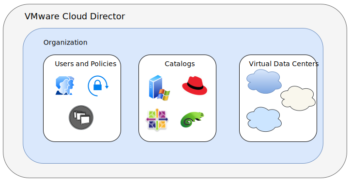
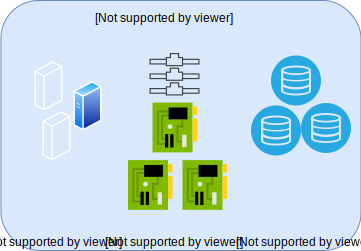

---

copyright:

  years:  2020

lastupdated: "2020-03-02"

keywords: vmware solutions shared, get started shared, tech specs shared

subcollection: vmware-solutions

---

{:external: target="_blank" .external}
{:tip: .tip}
{:note: .note}
{:important: .important}

# VMware Solutions Shared overview
{: #shared_overview}

{{site.data.keyword.vmwaresolutions_full}} Shared provides standardized and customizable deployment choices of VMware Virtual Data Center environments. With VMware Solutions Shared Virtual Data Center instances, you can quickly and seamlessly migrate or deploy VMware workloads to the cloud on top of IBM hosted VMware infrastructure. IBM provides a self-service on-demand VMware cloud computing platform with VMware vCloud Director running on {{site.data.keyword.cloud_notm}}. This Infrastructure as a Service (IaaS) on-demand offering provides the option to use specific virtual CPU (vCPU), storage, vRAM, Network, and IP, as needed.

VMware Solutions Shared has the following IaaS subscription service types:

* Multi-tenant On-Demand Virtual Data Center instances
* Multi-tenant Reserved Virtual Data Center instances

You can manage the lifecycle of Virtual Data Centers by using the VMware Solutions Shared offering. The following functions are supported when you use the vCloud Director Management console or public API:

* Virtual Data Center creation
* Virtual Data Center elasticity
* Virtual Data Center deletion

The VMware Solutions Shared offerings come standard with five public IP addresses on an NSX Edge Service Gateway with unlimited ingress over the public network.

Virtual Data Centers incur charges for the following components:

* Storage allocations with tiered pricing based on storage performance
* vCPU usage
* Virtual memory usage
* Egress on public networking
* Commercial operating system licenses used
* Optional VMware services

## VMware Solutions Shared architecture
{: #shared_overview-archi}

The following graphic depicts the high-level architecture and components of VMware Solutions Shared deployment.

{: caption="Figure 1. VMware Solutions Shared architecture" caption-side="bottom"}

### VMware vCloud Director
{: #shared_overview-vcloud-dir}

This layer represents the management interface. VMware vCloud Director provides role-based access to a web-based tenant portal. The portal allows the members of an organization to interact with the organization's resources to create and work with vApps and virtual machines (VMs).

### Organization
{: #shared_overview-org}

An organization is a unit of administration for a collection of users, groups, and computing resources. Users authenticate at the organization level, supplying credentials established by an organization administrator when the user was created or imported. Organization administrators manage organization users, groups, and catalogs.

### Users and policies
{: #shared_overview-users-policies}

An organization can contain an arbitrary number of users and groups. Users can be created locally by the organization administrator or imported from a directory service such as LDAP. Permissions within an organization are controlled through the assignment of rights and roles to users and groups.

### Catalogs
{: #shared_overview-cat}

Organizations use catalogs to store vApp templates and media files. The members of an organization that have access to a catalog can use the catalog's vApp templates and media files to create their own vApps. Organizations administrators can copy items from public catalogs to their organization catalog.

### Virtual Data Centers
{: #shared_overview-vc}

An organization Virtual Data Center provides resources to an organization. Virtual Data Centers provide an environment where virtual systems can be stored, deployed, and operated. They also provide storage for virtual CD and DVD media. An organization can have multiple Virtual Data Centers.

{: caption="Figure 2. VMware Solutions Shared Virtual Data Center architecture" caption-side="bottom"}

## Technical specifications for VMware Solutions Shared
{: #shared_overview-specs}

The following components are included in your {{site.data.keyword.cloud_notm}}:

### Compute
{: #shared_overview-specs-comp}

Compute processing is allocated to Virtual Data Centers in vCPU increments. Each vCPU increment represents a single 2.0 GHz core. Compute memory is allocated in GB increments.

### Networking
{: #shared_overview-specs-net}

By default, every Virtual Data Center comes configured with one advanced edge gateway with five public IP addresses and one private service IP address. The advanced edge gateway is customer configurable and can be customized.

The public IP addresses can be used for public facing vApps for inbound or outbound public internet traffic.

The service address can be used for access to {{site.data.keyword.cloud}} infrastructure services on the {{site.data.keyword.cloud}} internal private network, including the following services:

* NTP
* Windows operating system licensing and updates
* Red Hat Enterprise Linux operating system licensing and updates
* Cloud Object Storage

### Storage
{: #shared_overview-specs-storage}

When you create or deploy vApps or VMs, a storage policy is selected. There are four different tiers of storage available, depending on the storage performance required:

* 10 IOPS/GB: The storage tier with a maximum throughput of 10 IOPS/GB, the highest performance
* 4 IOPS/GB: Storage tier with a maximum throughput of 4 IOPS/GB
* 2 IOPS/GB: Storage tier with a maximum throughput of 2 IOPS/GB
* 0.25 IOPS/GB: Storage tier with a maximum throughput of 0.25 IOPS/GB

## Managing user access with Identity and Access Management
{: #shared_overview-manage_user_access}

{{site.data.keyword.cloud_notm}} Identity and Access Management (IAM) controls user access
to {{site.data.keyword.vmwaresolutions_short}} service instances. For more information about IAM, see [Managing user access with Identity and Access Management](/docs/services/vmwaresolutions?topic=vmware-solutions-iam).

## Related links
{: #shared_overview-related}

* [Requirements and planning for VMware Solutions Shared](/docs/services/vmwaresolutions?topic=vmware-solutions-shared_planning)
* [Ordering Virtual Data Center instances](/docs/services/vmwaresolutions?topic=vmware-solutions-shared_ordering)
* [Viewing and managing Virtual Data Center instances](/docs/services/vmwaresolutions?topic=vmware-solutions-shared_managing)
* [Operating VMware Solutions Shared](/docs/services/vmwaresolutions?topic=vmware-solutions-shared_vcd-ops-guide)
* [Managing Veeam for VMware Solutions Shared](/docs/services/vmwaresolutions?topic=vmware-solutions-shared_veeam)
* [VMware vCloud Director](https://docs.vmware.com/en/vCloud-Director/9.7/com.vmware.vcloud.tenantportal.doc/GUID-74C9E10D-9197-43B0-B469-126FFBCB5121.html){:external}
* [Troubleshooting NSX Edge](https://docs.vmware.com/en/VMware-NSX-Data-Center-for-vSphere/6.4/com.vmware.nsx.troubleshooting.doc/GUID-E6CD6FAA-3DA7-4AD7-9577-EE121AA7E1E6.html){:external}
