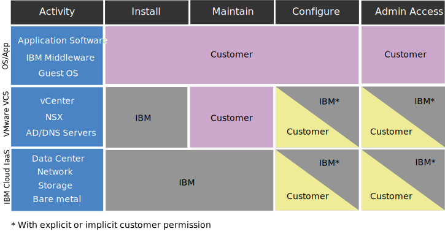

---

copyright:

  years:  2016, 2020

lastupdated: "2020-03-31"

keywords: vCenter Server Hybridity compliance, compliance info Hybridity, vCenter Server Hybridity policy

subcollection: vmware-solutions

---

{:external: target="_blank" .external}

# Compliance information for vCenter Server with Hybridity Bundle instances
{: #vc_hybrid_compl_info}

Review the following information for details about compliance for VMware vCenter Server with Hybridity Bundle instances.

## Customer versus IBM responsibility for vCenter Server IBM Cloud with Hybridity Bundle
{: #vc_hybrid_compl_info-responsibility}

The following diagram provides details about the customer (you) and {{site.data.keyword.IBM}} responsibilities for compliance activities.

{: caption="Figure 1. Customer versus IBM responsibility matrix for vCenter Server with Hybridity Bundle" caption-side="bottom"}

## Health data restrictions
{: #vc_hybrid_compl_info-health-data-restrictions}

The following terms apply to the entire {{site.data.keyword.vmwaresolutions_short}} portfolio.

### HIPAA
{: #vc_hybrid_compl_info-hipaa}

Notwithstanding information in the data sheet for this Cloud Service regarding the Health Information Portability and Accountability Act of 1996 ("HIPAA") and the permitted use of Health Information and Health data as Types of Personal Data and/or Special Categories of Personal Data (collectively, "Health Data") with this Cloud Service, use of Health Data with this Cloud Service is subject to the following limitations and conditions:

{{site.data.keyword.vmwaresolutions_short}}

Only the offerings that are previously listed can be provisioned to implement the HIPAA Privacy and Security Rule controls for use with Health Data if Client notifies IBM in advance that Client will use Health Data with the Cloud Service and IBM confirms in writing that the Cloud Service will be provisioned for Health Data usage. The Cloud Service cannot be used for the transmission, storage, or other usage of any Health Data protected under HIPAA unless (i) Client provides IBM such notification; (ii) IBM and Client have entered into an applicable Business Associate Agreement; and (iii) IBM provides Client with express written confirmation that the Cloud Service can be used with Health Data. In no event shall the Cloud Service be used for processing PHI as a healthcare clearinghouse within the meaning of HIPAA.

In the event of a system failure, a third-party service provider might request debugging artifacts from the client (logs, core memory dumps, and so on). It is the client’s sole responsibility to gather and transmit these artifacts to the third-party provider. The IBM support team might assist by providing links to documentation or providing direction through screen sharing sessions. However, the client is responsible for cleansing the data of any PHI and ensuring that it is properly encrypted before transmitting. It is also the client’s responsibility to evaluate whether they require a BAA to be executed with the third-party provider before sending data.

## Personal information and regulated data
{: #vc_hybrid_compl_info-personal-info-and-regulated-data}

This Cloud Service is not designed to any specific security requirements for regulated content, such as personal information or sensitive personal information. Client is responsible to determine whether this Cloud Service meets Clients needs regarding the type of content Client uses in connection with the Cloud Service.

## Policy for accessing clients instances
{: #vc_hybrid_compl_info-policy-for-access-client-inst}

VMware vCenter Server environments, which are delivered as {{site.data.keyword.vmwaresolutions_short}}, provide a VMware management platform layer for our clients to manage the virtualization capabilities. Throughout the lifecycle of IBM Cloud for VMware products and services, IBM Support might be required to help guarantee their success. Usually, intervention by IBM Support is the result of a client request (that is, a support ticket). However, on rare occasions, IBM Support might assist proactively and without a client–written support ticket to prevent future issues. This access is through the IBM Cloud internal support network and is documented through a support ticket that is opened by IBM Support and continuously monitored by IBM Cloud SOC. At no time will IBM Support modify instance configuration without prior consent from the client. Access is to VMware management components and/or IBM Cloud management components and never to the client virtual machines or applications.

## Proactive support
{: #vc_hybrid_compl_info-proactive-support}

### Proactive support for initial provisioning
{: #vc_hybrid_compl_info-proactive-support-for-initial-provision}

* During the initial ordering and provisioning of an instance or service, IBM Support can access client instances and information without prior notification of the client to ensure that orders are properly fulfilled.
* IBM Support actively monitors instance lifecycle operations such as adding new hosts, in addition to the ordering, provisioning, and installation processes.
* To fix issues that have arisen or might arise in the future, IBM Support might take a number of actions including but not limited to: reviewing client order details, restarting automation jobs, performing Operating System reload operations, or opening IBM Cloud tickets using the provided client IBM Cloud user ID and API key.

### Proactive support for steady-state operations
{: #vc_hybrid_compl_info-proactive-support-for-steady-state-operations}

* On rare occasions, IBM Support might require access to client instances during steady-state operations to proactively troubleshoot an instance issue or to verify function of provisioned services or components.
* This access is through the IBM Cloud internal support network. IBM Support will not modify instance configuration without prior consent from the client.
* Access is to VMware management components and/or IBM Cloud management components and never to the client virtual machines or applications.

### Support tickets
{: #vc_hybrid_compl_info-support-tickets}

* vCenter Server environments are not actively monitored by IBM, and IBM Support will not enter the VMware management layer under normal operations without a client–written support ticket.
* When a client opens a support ticket for an instance, service, or provisioning issue, the ticket is quickly assigned to the appropriate IBM Support team, who will be the primary party responsible for resolving the issue.
* Due to the level of specialization that is required to maintain superior technical expertise at the team level, it is sometimes necessary to involve more than one support team in resolving a particular software problem. This is easily handled, as our support teams are all networked together and work as one to resolve whatever problems or issues arise.
* In order to investigate the issue, IBM might need to access information on your system relative to the failure or might need to re-create the failure to get additional information.
* A client–generated support ticket serves as acknowledgment that IBM Support can access the VMware management layer for investigation, debugging, and triage. If maintenance outage or changes to the environment are required, IBM Support will request additional documented confirmation from the client through tickets as part of our change management process.
* For more information about support tickets, see [IBM Support Guide](https://www-01.ibm.com/support/docview.wss?uid=ibm10733923){:external} and [Contacting IBM Support](/docs/vmwaresolutions?topic=vmware-solutions-trbl_support).

## Client responsibilities
{: #vc_hybrid_compl_info-client-responsibilities}

* While we commend clients taking steps to make their environments more secure, it should be noted that some practices might have adverse effects on the effectiveness of IBM Cloud for VMware.
* Clients are accountable for the firewalls they create and the resulting limitations that are imposed on communications between IBM Cloud for VMware components. The firewalls might also hinder the ability of IBM Support to access client instances and resolve issues.
* Clients are fully responsible for encrypting the data in their system.
* Upon initial deployment, the offering’s automation and client’s account are separate. The client is allowed and encouraged to change all passwords that IBM provides in the portal.
* vCenter access and credentials are created during initial deployments and provided to the client. As part of the requirement of our offering, IBM Support must retain full access to the management layer to provide life–cycle management and support to our clients.
* If credentials such as passwords are changed at any time, IBM Support may no longer be able to help the client recover lost or forgotten credentials or even troubleshoot client environments.
* For more information about this issue and related concerns, see [Considerations when changing passwords for NSX components](/docs/vmwaresolutions?topic=vmware-solutions-vc_networkingonvcenterserver#vc_networkingonvcenterserver-change-nsx-component-password-considerations) and [Considerations about changing vCenter Server artifacts](/docs/vmwaresolutions?topic=vmware-solutions-vcenter_chg_impact).

### Communication and troubleshooting
{: #vc_hybrid_compl_info-communication-troubleshooting}

* IBM does not warrant that our products are defect free, however we do endeavor to fix them to work as designed. Clients play a large role in this effort.
* While IBM Support is available to provide assistance throughout the lifecycle of the product, support might be limited by the information and access provided by the client.
* The client is responsible for providing in–depth documentation at the time of a failure and responding timely to IBM Support when further clarification is needed.
* Clients are also responsible for following the guidelines set forth in this document to grant consent to proactive support.
* By declining consent or failing to abide by the guidelines provided, the client assumes the responsibility of possible lag in problem resolution caused by communication delays between the client and support team.
* The client should be prepared to perform more technical troubleshooting that would otherwise be done by IBM Support. IBM will provide appropriate documentation and assistance where necessary.

### Security measures
{: #vc_hybrid_compl_info-security-measures}

* Management of Cloud Service: Client is responsible for managing administration, operation, maintenance, and security of the applications, including underlying middleware.
* Service Integrity and Availability: IBM will forward to the Client all network intrusion notifications detected for this Cloud Service. It is the Client’s responsibility to ascertain the impact of each notification reported. Client will be notified of hardware failures. Monitoring and responding to OS or software failures is the responsibility of the Client, engaging IBM support as required.
* Activity Logging: Client is responsible for activity logging of OS/System and Database/Applications, as needed.
* Encryption: Client is responsible for configuring and managing all encryption (for both data at rest and in transit), as needed.
* Business Continuity and Disaster Recovery: Client is responsible for configuring and managing all business continuity and disaster recovery processes, as needed.

### Third-party services
{: #vc_hybrid_compl_info-third-party-services}

* Third-Party software or code is included or bundled with some of our IBM offerings. This code is included for your convenience but is not considered part of the IBM program.
* These non–IBM programs are licensed directly by their providers. Client agrees to use the non–IBM programs under the provider’s terms and conditions. These are provided in the IBM licensing agreement that accompanies the IBM offering at time of purchase.
* IBM does testing to ensure that the third-party products work with IBM programs and that they function correctly.
* IBM Software support will diagnose problems concerning client problems using the knowledge of how IBM offerings work with the Third-Party software. After it has been concluded that the IBM program is working correctly, but the issue still exists, IBM must refer the client to the Third-Party vendor for further diagnosis.
* Further information on client responsibilities with regards to Third-Party software or code can be found in the [IBM Support Guide](https://www-01.ibm.com/support/docview.wss?uid=ibm10733923){:external}.

## Consent to accessing client environments
{: #vc_hybrid_compl_info-consent-to-access-client-environment}

* IBM Support requires access to client instances to ensure their proper provisioning and upkeep. Clients are responsible for controlling and providing the access that is required.
* A client–written support ticket serves as acknowledgment of and consent to IBM Support accessing a client instance to address the concerns that are described in said support ticket.
* Clients are responsible for following the guidelines in this document to grant consent to proactive support. By declining consent or failing to abide by the guidelines provided, the client assumes the responsibility of delays in problem determination and solution that is caused by communication delays between the client and support team and possible additional technical troubleshooting.

## Initial provisioning
{: #vc_hybrid_compl_info-initial-provision}

* At the time of initial provisioning and ordering, the client will be presented with this document.
* By submitting the order, the client agrees to these terms and thus grants consent to IBM Support to access their instances at any time without prior notification to swiftly resolve issues that pertain to the environment or to prevent future failures.
* This consent applies to all instances currently being ordered throughout their lifecycle. Instances and instance components that are provisioned in the future might require additional consent.

## Steady-state operations
{: #vc_hybrid_compl_info-steady-state-operations}

If the client has not granted consent to proactive support for an instance in the initial provisioning and ordering, they must include explicit consent in any future service tickets, if wanted. Statements of consent must follow the set guidelines or will be considered void.

## Related links
{: #vc_hybrid_compl_info-related}

* [vCenter Server with Hybridity Bundle overview](/docs/vmwaresolutions?topic=vmware-solutions-vc_hybrid_overview)
* [Contacting IBM Support](/docs/vmwaresolutions?topic=vmware-solutions-trbl_support)
