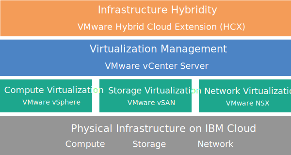

---

copyright:

  years:  2016, 2019

lastupdated: "2019-03-11"

subcollection: vmwaresolutions

---

{:tip: .tip}
{:note: .note}
{:important: .important}

# vCenter Server with Hybridity Bundle overview
{: #vc_hybrid_overview}

VMware vCenter Server on {{site.data.keyword.cloud}} with Hybridity Bundle is an instance available in V2.3 and later releases. Beginning with V2.6, the vCenter Server with Hybridity Bundle instance is available to Business Partners.

The vCenter Server with Hybridity Bundle is a hosted private cloud that delivers the VMware vSphere stack as a service. The VMware environment is built on top of four {{site.data.keyword.cloud_notm}} {{site.data.keyword.baremetal_short}}, includes VMware vSAN as dedicated storage, provides automatic deployment and configuration of an easy-to-manage logical edge firewall that is powered by VMware NSX, and includes the VMware HCX on {{site.data.keyword.cloud_notm}} service.

In many cases, the entire environment can be provisioned in less than a day and the bare metal infrastructure can rapidly and elastically scale the compute capacity up and down as needed.

To increase the vSAN-based storage capacity of a vSAN cluster, you can add more ESXi servers post-deployment.

You can upgrade the VMware NSX Advanced edition to the Enterprise edition, and you can purchase more VMware components, such as VMware vRealize Operations.

You can add IBM-Managed Services if you want to offload the day-to-day operations and maintenance of the virtualization, guest OS, or application layers. The {{site.data.keyword.cloud_notm}} Professional Services team is also available to help you accelerate your journey to the cloud with migration, implementation, planning, and onboarding services.

## vCenter Server with Hybridity Bundle architecture
{: #vc_hybrid_overview-archi}

The following graphic depicts the high-level architecture and components of a three-node vCenter Server with Hybridity Bundle deployment.

Figure 1. vCenter Server with Hybridity Bundle high-level architecture

### Physical infrastructure
{: #vc_hybrid_overview-physical-infras}

This layer provides the physical infrastructure (compute, storage, and network resources) to be used by the virtual infrastructure.

### Virtualization infrastructure (Compute, Storage, and Network)
{: #vc_hybrid_overview-virtualization-infras}

This layer virtualizes the physical infrastructure through different VMware products:
* VMware vSphere virtualizes the physical compute resources.
* VMware Virtual SAN (vSAN) provides software-defined shared storage, based on the storage in the physical servers.
* VMware NSX is the network virtualization platform that provides logical networking components and virtual networks.

### Virtualization management
{: #vc_hybrid_overview-virtualization-mgmt}

This layer consists of vCenter Server Appliance (vCSA) with embedded Platform Services Controller (PSC), NSX Manager, two NSX ESGs, three NSX Controllers, and the IBM CloudDriver virtual server instance (VSI). The CloudDriver VSI is deployed on demand as needed for certain operations such as adding hosts to the environment.

The base offering is deployed with a vCenter Server appliance that is sized to support an environment with up to 400 hosts and up to 4000 VMs. The same vSphere API-compatible tools and scripts can be used to manage the IBM-hosted VMware environment.

In total, the base offering requires 38 vCPU and 67 GB vRAM that are reserved for the virtualization management layer. The remaining host capacity for your VMs depends on several factors, such as oversubscription rate, VM sizing, and workload performance requirements.

For additional management resource requirements when deploying the HCX on {{site.data.keyword.cloud_notm}} service, see [VMware HCX on {{site.data.keyword.cloud_notm}} overview](/docs/services/vmwaresolutions/services?topic=vmware-solutions-vmware-hcx-on-ibm-cloud-overview).

### Infrastructure hybridity
{: #vc_hybrid_overview-infras-hybrid}

This layer provides an abstraction of resources between the on-premises sites and {{site.data.keyword.cloud_notm}} sites so that you can move workloads back and forth securely and easily without the need to change VMs characteristics such as their IP addresses.

Based on VMware Hybrid Cloud Extension (HCX), you can create loosely coupled interconnects among on-premises and {{site.data.keyword.cloud_notm}} sites to enable bulk migration of VMs or live vMotion of VMs without downtime.

## Technical specifications for vCenter Server with Hybridity Bundle instances
{: #vc_hybrid_overview-specs}

The following components are included in your vCenter Server with Hybridity Bundle instance:

The availability and pricing of standardized hardware configurations might vary based on the {{site.data.keyword.CloudDataCent_notm}} that is selected for deployment.
{:note}

### Bare Metal Server
{: #vc_hybrid_overview-bare-metal}

Four {{site.data.keyword.baremetal_short}} come with your vCenter Server with Hybridity Bundle instance order. The following configurations are available:
  * **Skylake**: 2-CPU Intel Skylake generation servers (Intel Xeon 4100/5100/6100 series) with your selected CPU model and RAM size.
  * **Broadwell**: 2-CPU Intel Broadwell generation servers (Intel Xeon E5-2600/E7-4800 series) with your selected CPU model and RAM size.

### Networking
{: #vc_hybrid_overview-networking}

The following networking components are ordered:
*  10 Gbps dual public and private network uplinks
*  Three VLANs (Virtual LANs): one public VLAN and two private VLANs
*  One VXLAN (Virtual eXtensible LAN) with DLR (Distributed Logical Router) for potential east-west communication between local workloads that are connected to layer 2 (L2) networks. The VXLAN is deployed as a sample routing topology, which you can modify, build on it, or remove it. You can also add security zones by attaching additional VXLANs to new logical interfaces on the DLR.
*  Two VMware NSX Edge Services Gateways:
  * A secure management services VMware NSX Edge Services Gateway (ESG) for outbound HTTPS management traffic, which is deployed by IBM as part of the management networking typology. This ESG is used by the IBM management VMs to communicate with specific external IBM management components that are related to automation. For more information, see [Configuring your network to use the customer-managed ESG](/docs/services/vmwaresolutions/vcenter?topic=vmware-solutions-vc_esg_config#configuring-your-network-to-use-the-customer-managed-nsx-esg-with-your-vms).

    This ESG is not accessible to you and you cannot use it. If you modify it, you might not be able to manage the vCenter Server with Hybridity Bundle instance from the {{site.data.keyword.vmwaresolutions_short}} console. In addition, note that using a firewall or disabling the ESG communications to the external IBM management components will cause {{site.data.keyword.vmwaresolutions_short}} to become unusable.
    {:important}
  * A secure customer-managed VMware NSX Edge Services Gateway for outbound and inbound HTTPS workload traffic, which is deployed by IBM as a template that can be modified by you to provide VPN access or public access. For more information, see [Does the customer-managed NSX Edge pose a security risk?](/docs/services/vmwaresolutions/vmonic?topic=vmware-solutions-faq#does-the-customer-managed-nsx-edge-pose-a-security-risk-)

For more information on networking components ordered when deploying the HCX on {{site.data.keyword.cloud_notm}} service, see [HCX on {{site.data.keyword.cloud_notm}} overview](/docs/services/vmwaresolutions/services?topic=vmware-solutions-vmware-hcx-on-ibm-cloud-overview).

### Virtual Server Instances
{: #vc_hybrid_overview-vsi}

The following virtual server instances (VSIs) are ordered:
* A VSI for IBM CloudBuilder, which is cancelled after the instance deployment is completed.
* You can choose to deploy a single Microsoft Windows Server VSI for Microsoft Active Directory (AD) or two high availability Microsoft Windows VMs in the management cluster to help enhance security and robustness.

### vSAN storage
{: #vc_hybrid_overview-vsan-storage}

vSAN storage offers customized configurations, with various options for disk type and quantity:
* Disk quantity: 2, 4, 6, or 8.
* Storage disk: 960 GB SSD SED, 1.9 TB SSD SED, or 3.8 TB SSD SED.

  In addition, two cache disks of 960 GB are ordered per host.
* High-Performance Intel Optane option, which provides two extra capacity disk bays for a total of 10 capacity disks. This option depends on the CPU model.

### IBM-provided licenses and fees
{: #vc_hybrid_overview-license-and-fee}

The following licenses are included with your vCenter Server with Hybridity Bundle instance order.

* VMware vSphere Enterprise Plus 6.5u2 or 6.7u1
* VMware vCenter Server 6.5
* VMware NSX Service Providers Edition (Advanced or Enterprise) 6.4
* VMware vSAN (Advanced or Enterprise) 6.6

Additional support and services fees can apply.

## Technical specifications for vCenter Server with Hybridity Bundle expansion nodes
{: #vc_hybrid_overview-expansion-node-specs}

Each vCenter Server with Hybridity Bundle expansion node will deploy and incur charges for the following components in your {{site.data.keyword.cloud_notm}} account.

### Hardware for expansion nodes
{: #vc_hybrid_overview-expansion-node-hardware}

One Bare Metal Server with the configuration presented in [Technical specifications for vCenter Server with Hybridity Bundle instances](/docs/services/vmwaresolutions/vcenter?topic=vmware-solutions-vc_hybrid_overview#technical-specifications-for-vcenter-server-with-hybridity-bundle-instances).

### Licenses and fees for expansion nodes
{: #vc_hybrid_overview-expansion-node-license-and-fee}

* One VMware vSphere Enterprise Plus 6.5u2 or 6.7u1
* One VMware NSX Service Providers Edition (Advanced or Enterprise) 6.4
* One Support and Services fee
* VMware vSAN (Advanced or Enterprise) 6.6

You must manage the {{site.data.keyword.vmwaresolutions_short}} components that are created in your {{site.data.keyword.cloud_notm}} account only from the {{site.data.keyword.vmwaresolutions_short}} console, not the {{site.data.keyword.slportal}}, or any other means outside of the console. If you change these components outside of the {{site.data.keyword.vmwaresolutions_short}} console, the changes are not synchronized with the console.
{:important}

**CAUTION:** Managing any {{site.data.keyword.vmwaresolutions_short}} components, which were installed into your {{site.data.keyword.cloud_notm}} account when you ordered the instance, from outside the {{site.data.keyword.vmwaresolutions_short}} console can make your environment unstable. These management activities include:
*  Adding, modifying, returning, or removing components
*  Expanding or contracting instance capacity through adding or removing ESXi servers
*  Powering off components
*  Restarting services

   Exceptions to these activities include managing the shared storage file shares from the {{site.data.keyword.slportal}}. Such activities include: ordering, deleting (which might impact data stores if mounted), authorizing, and mounting shared storage file shares.

## Related links
{: #vc_hybrid_overview-related}

* [vCenter Server Software Bill of Materials](/docs/services/vmwaresolutions/vcenter?topic=vmware-solutions-vc_bom)
* [Requirements and planning for vCenter Server with Hybridity Bundle instances](/docs/services/vmwaresolutions/vcenter?topic=vmware-solutions-vc_hybrid_planning)
* [Ordering vCenter Server with Hybridity Bundle instances](/docs/services/vmwaresolutions/vcenter?topic=vmware-solutions-vc_hybrid_orderinginstance)
* [HCX on {{site.data.keyword.cloud_notm}} overview](/docs/services/vmwaresolutions/services?topic=vmware-solutions-vmware-hcx-on-ibm-cloud-overview)
* [Contacting IBM Support](/docs/services/vmwaresolutions/vmonic?topic=vmware-solutions-trbl_support)
