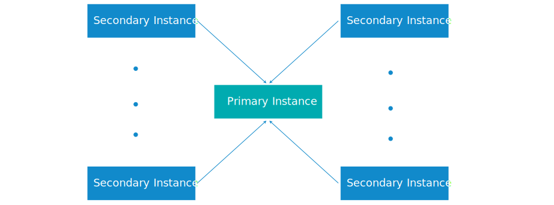

---

copyright:

  years:  2016, 2023

lastupdated: "2023-02-22"

keywords: vCenter Server multisite, multisite configuration, multisite deployment vCenter Server

subcollection: vmwaresolutions

---

{{site.data.keyword.attribute-definition-list}}

# Multisite configuration for vCenter Server instances
{: #vc_multisite}

{{site.data.keyword.vmwaresolutions_full}} allows instances to be deployed across different locations and have them up and running in a short time.

## Multisite deployment components
{: #vc_multisite-deployment-components}

A multisite deployment consists of the following components.

* **Primary instance** - The primary VMware vCenter Server® instance has the following configuration:
   * Microsoft® Active Directory™ (AD) and DNS (Domain Name System) root domain
   * vCenter Server located in domain with instance-specific name
   * SSO (single sign-on) domain
   * SSO site name
   * vCenter Server Appliance with embedded Platform Services Controller (PSC)
* **Secondary instance or instances** - One or more secondary vCenter Server instances, linked to the primary instance, with the following configuration:
   * SSO site name
   * Same DNS domain as primary instance
   * DNS and AD replication setup between the AD virtual machines on the primary and secondary instances
   * VMware vCenter Server® on the secondary instances is set up with Enhanced Linked Mode (ELM) to the vCenter Server on the primary instance

## vCenter Server multisite deployment
{: #vc_multisite-deployment}

The multisite configuration feature uses a hub and spoke topology with a primary site and a maximum of seven secondary sites. A single layer of sites is supported, that is, you cannot configure subsequent sites that are linked to other secondary sites. You can have a total of 128 VMware ESXi™ servers in a multisite configuration across all instances.

If your configuration requires a multisite deployment with more than 128 ESXi servers, open an IBM Support ticket by following the steps in [Contacting IBM Support](/docs/vmwaresolutions?topic=vmwaresolutions-trbl_support).
{: note}

The following graphic depicts the overall view of the vCenter Server multisite deployment.

{: caption="Figure 1. vCenter Server multisite deployment" caption-side="bottom"}

The model contains the following layers:

* **Primary instance** - To deploy the first instance in a multisite configuration, you define that instance as primary during the instance order process.
* **Secondary instances** - In a multisite configuration, you define the instances that are attached to the primary instance as secondary instances during the order process.

You can assign only one secondary instance to a primary instance at a time. You cannot assign multiple secondary instances to a primary instance at the same time. To do that, you must go through the order process again and select the previously defined primary instance as a primary instance for the secondary instance. You must repeat the process for all secondary instances that you want to create.

You can have a maximum of 15 (one primary and 14 secondary) instances that are deployed in a multisite configuration.

Deleting vCenter Server instances that are part of a multisite configuration requires special planning. For more information, see [Deleting vCenter Server instances in a multisite configuration](/docs/vmwaresolutions?topic=vmwaresolutions-vc_deletinginstance_multi).
{: note}

## Related links
{: #vc_multisite-related}

* [Microsoft Active Directory Trusts supported with VMware vCenter single sign-on](https://kb.vmware.com/s/article/2064250){: external}
