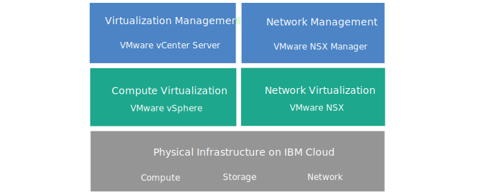

---

copyright:

  years:  2016, 2023

lastupdated: "2023-06-21"

keywords: vCenter Server, vCenter Server architecture, tech specs vCenter Server

subcollection: vmwaresolutions

---

{{site.data.keyword.attribute-definition-list}}

# vCenter Server overview
{: #vc_vcenterserveroverview}

VMware vCenter Server® is a hosted private cloud that delivers the VMware vSphere® stack as a service. The VMware® environment is built in addition to a minimum of three {{site.data.keyword.cloud}} bare metal servers and it offers shared network-attached storage and dedicated software-defined storage options. It also includes the automatic deployment and configuration of an easy-to-manage logical edge firewall, which VMware NSX® powers.
{: shortdesc}

In many cases, the entire environment can be provisioned in less than a day and the bare metal infrastructure can rapidly and elastically scale the compute capacity up and down as needed.

After initial instance deployment, you can increase shared storage by ordering more Network File System (NFS) file shares from the {{site.data.keyword.slportal}}. You can attach them manually to all VMware ESXi™ servers in a cluster. You can also take advantage of VMware vSAN™ as a storage option. To increase the vSAN-based storage capacity of a vSAN cluster, you can add more ESXi servers post-deployment.

## vCenter Server with NSX-T architecture
{: #vc_vcenterserveroverview-nsx-t-archi}

The following graphic depicts the high-level architecture and components of a three node vCenter Server with NSX-T deployment.

{: caption="Figure 1. vCenter Server with NSX-T high-level architecture for a three-node cluster" caption-side="bottom"}

For vCenter Server with NSX-T™ instances, applying license updates is not supported. Also, not all add-on services are supported for NSX-T instances.
{: important}

## vCenter Server with NSX-V architecture
{: #vc_vcenterserveroverview-archi}

The following graphic depicts the high-level architecture and components of a three node vCenter Server with NSX-V deployment.

vCenter Server with NSX-V instances is available for V4.7 and earlier.
{: note}

{: caption="Figure 2. vCenter Server with NSX-V high-level architecture for a three-node cluster" caption-side="bottom"}

For vCenter Server with NSX-V instances, if you purchased IBM-provided VMware licensing, you can upgrade the VMware NSX Base edition to Advanced or to Enterprise edition. Also, you can purchase more VMware components, such as VMware Aria® Operations™. You can also add IBM-Managed Services if you want to offload the day-to-day operations and maintenance of the virtualization, guest OS, or application layers. The {{site.data.keyword.cloud_notm}} Professional Services team is available to help you accelerate your journey to the cloud with migration, implementation, planning, and onboarding services.

## Physical infrastructure
{: #vc_vcenterserveroverview-physical-infras}

This layer provides the physical infrastructure (compute, storage, and network resources) to be used by the virtual infrastructure.

## Virtualization infrastructure (Compute and Network)
{: #vc_vcenterserveroverview-virtualization-infras}

This layer virtualizes the physical infrastructure through different VMware products:
* VMware vSphere virtualizes the physical compute resources.
* VMware NSX is the network virtualization platform that provides logical networking components and virtual networks.

## Virtualization management
{: #vc_vcenterserveroverview-virtualization-mgmt}

This layer consists of the following components:
* vCenter Server Appliance with embedded Platform Services Controller (PSC).
* For NSX-T - three NSX Manager or Controller nodes (total of three nodes).
* For NSX-V - one NSX Manager and three VMware NSX Controller™ nodes (total of four nodes).
* VMware NSX Edge™ Services Gateways (ESGs) - four for NSX-T (two on the management cluster and two on the workload cluster) and two for NSX-V.
* IBM CloudDriver virtual server instance (VSI). The CloudDriver VSI is deployed on demand as needed for certain operations such as adding hosts to the environment.

The base offering is deployed with a vCenter Server appliance that is sized to support an environment with up to 400 hosts and up to 4,000 VMs. The same vSphere API-compatible tools and scripts can be used to manage the IBM-hosted VMware environment.

In total, the base offering has the following requirements, which are reserved for the virtualization management layer.
* For NSX-T, 42 vCPU and 128 GB vRAM
* For NSX-V, 38 vCPU and 67 GB vRAM

The remaining host capacity for your virtual machines (VMs) depends on several factors, such as oversubscription rate, VM sizing, and workload performance requirements.

For more information about the architecture, see [Overview of VMware Solutions](/docs/vmwaresolutions?topic=vmwaresolutions-solution_overview).

## Technical specifications for vCenter Server instances
{: #vc_vcenterserveroverview-specs}

The availability and pricing of standardized hardware configurations might vary based on the {{site.data.keyword.cloud_notm}} data center that is selected for deployment.
{: note}

The following components are included in your vCenter Server instance.

### Bare metal server
{: #vc_vcenterserveroverview-bare-metal}

You can order three or more bare metal servers on the consolidated or management cluster, and optionally two or more bare metal servers on the workload cluster.

If you plan to use vSAN storage, the configuration requires a minimum of four bare metal servers.
{: note}

The following configurations are available:
* **Cascade Lake** - 4-CPU Intel® Cascade Lake generation servers (Quad Intel Xeon® 6200/8200 series) or 2-CPU Intel Cascade Lake generation servers (Dual Intel Xeon 4200/5200/6200/8200 series) with your selected RAM size.
* **SAP-certified Cascade Lake** - 2-CPU Intel Cascade Lake generation servers (Dual Intel Xeon 5200/6200/8200 series).

### Networking
{: #vc_vcenterserveroverview-networking}

The following networking components are ordered:
*  10 Gbps dual public and private network uplinks.
*  Three VLANs (Virtual LANs) - one public and two private.
* (NSX-T only) One overlay network with a T1 and T0 router for potential east-west communication between local workloads that are connected to layer 2 (L2) networks. This network is deployed as a sample routing topology, which you can modify, build on, or remove.
*  (NSX-V only) One VXLAN (Virtual eXtensible LAN) with DLR (Distributed Logical Router) for potential east-west communication between local workloads that are connected to layer 2 (L2) networks. The VXLAN is deployed as a sample routing topology, which you can modify, build on it, or remove it. You can also add security zones by attaching extra VXLANs to new logical interfaces on the DLR.
*  VMware NSX Edge Services Gateways (four for NSX-T and two for NSX-V):
   * One secure management services VMware NSX Edge Services Gateway (ESG) for outbound HTTPS management traffic, which is deployed by IBM as part of the management networking typology. This ESG is used by the IBM management VMs to communicate with specific external IBM management components that are related to automation. For more information, see [Configuring your network to use the customer-managed ESG](/docs/vmwaresolutions?topic=vmwaresolutions-vc_esg_config).

      This ESG is named **mgmt-nsx-edge**, it's not accessible to you and you can't use it. If you modify it, you might not be able to manage the vCenter Server instance from the {{site.data.keyword.vmwaresolutions_short}} console. In addition, by using a firewall or disabling the ESG communications to the external IBM management components might cause VMware Solutions to become unusable.
      {: important}

   * Secure customer-managed ESG for outbound and inbound HTTPS workload traffic. The ESG is deployed by IBM as a template that can be modified by you to provide VPN access or public access. For NSX-V, one ESG is deployed. For NSX-T, two ESGs are deployed on the datastore with the highest IOPS.

   For more information, see [Does the customer-managed NSX Edge pose a security risk?](/docs/vmwaresolutions?topic=vmwaresolutions-faq-vmwaresolutions#faq-customer-nsx)

### Virtual Server Instances
{: #vc_vcenterserveroverview-vsi}

The following virtual server instances (VSIs) are ordered:
* A VSI for IBM CloudDriver, which is deployed as needed for initial deployment and for Day 2 operations.
* Choose to deploy a single Microsoft® Windows® Server VSI for Microsoft Active Directory™ (AD) or two high availability Microsoft Windows VMs on the management cluster to help enhance security and robustness.

### Storage
{: #vc_vcenterserveroverview-storage}

During initial deployment, you can choose between NFS and vSAN storage options.

After deployment, you can add NFS storage shares to an existing NFS or vSAN cluster. For more information, see [Adding NFS storage to vCenter Server instances](/docs/vmwaresolutions?topic=vmwaresolutions-vc_addingnfs).
{: note}

#### NFS storage
{: #vc_vcenterserveroverview-nfs-storage}

The NFS option offers customized shared file-level storage for workloads with various options for size and performance:
* Size - 20 GB to 24 TB
* Performance - 0.25, 2, 4, or 10 IOPS/GB. The 10 IOPS/GB performance level is limited to a maximum capacity of 4 TB per file share.
* Individual configuration of file shares

   (NSX-V only) If you choose the NFS option, one 2 TB and four IOPS/GB file share for management components are ordered.
   {: note}

#### vSAN storage
{: #vc_vcenterserveroverview-vsan-storage}

The vSAN option offers customized configurations, with various options for disk type, size, and quantity:
* Disk quantity - 2, 4, 6, 8, or 10
* Storage disk - 960 GB SSD, 1.9 TB SSD, 3.8 TB SSD, or 7.68 TB SSD (SSD SED disks are supported for Skylake servers.)

   In addition, two cache disks of 960 GB are also ordered per host.

   3.8 TB SSD (solid-state disk) drives are supported when they are made generally available in a data center.
   {: note}

* High Performance with Intel Optane - this option provides two extra capacity disk bays for a total of 10 capacity disks. It's available only for vSphere 6 instances.

### Licenses (IBM-provided or BYOL) and fees
{: #vc_vcenterserveroverview-license-and-fee}

* VMware vSphere Enterprise Plus 7.0 (NSX-T only)
* VMware vCenter Server 7.0
* VMware NSX Service Providers Edition (Base, Advanced, or Enterprise) 6.4
* (For vSAN clusters) VMware vSAN Advanced or Enterprise 7.0
* Support and Services fee (one license per node)

## Technical specifications for vCenter Server expansion nodes
{: #vc_vcenterserveroverview-expansion-node-specs}

Each vCenter Server expansion node deploys and incurs charges for the following components in your {{site.data.keyword.cloud_notm}} account.

### Hardware for expansion nodes
{: #vc_vcenterserveroverview-expansion-node-hardware}

One bare metal server with the configuration presented in [Technical specifications for vCenter Server instances](/docs/vmwaresolutions?topic=vmwaresolutions-vc_vcenterserveroverview#vc_vcenterserveroverview-specs).

### Licenses and fees for expansion nodes
{: #vc_vcenterserveroverview-expansion-node-license-and-fee}

* One vSphere Enterprise Plus 7.0 (NSX-T only)
* One NSX Service Providers Edition (Base, Advanced, or Enterprise) 6.4
* (For vSAN clusters) vSAN Advanced or Enterprise 6.6
* One Support and Services fee

You must manage the {{site.data.keyword.vmwaresolutions_short}} components that are created in your {{site.data.keyword.cloud_notm}} account only from the {{site.data.keyword.vmwaresolutions_short}} console, not the {{site.data.keyword.slportal}}, or any other means outside of the console. If you change these components outside of the {{site.data.keyword.vmwaresolutions_short}} console, the changes are not synchronized with the console.
Managing any {{site.data.keyword.vmwaresolutions_short}} components, which were installed into your {{site.data.keyword.cloud_notm}} account when you ordered the instance, from outside the {{site.data.keyword.vmwaresolutions_short}} console can make your environment unstable. These management activities include:
*  Adding, modifying, returning, or removing components
*  Expanding or contracting instance capacity through adding or removing ESXi servers
*  Powering off components
*  Restarting services
   Exceptions to these activities include managing the shared storage file shares from the {{site.data.keyword.slportal}}. Such activities include - ordering, deleting (which might impact data stores if mounted), authorizing, and mounting shared storage file shares.
   {: important}

## Support and Services fee
{: #vc_vcenterserveroverview-support-services-fee}

VMware vCenter Server instances include a Support and Services fee that is charged per {{site.data.keyword.cloud_notm}} bare metal server. This fee covers support from the {{site.data.keyword.vmwaresolutions_short}} Support and Level 2 Support teams for any issues that pertain to automation in the platform and VMware products that are included in the solution.

## Technical specifications for vCenter Server multizone instances
{: #vc_vcenterserveroverview-mcv-specs}

This information is provided as reference for existing vCenter Server multizone instances. New deployments of vCenter Server multizone instances are not supported.
{: deprecated}

The vCenter Server multizone architecture is an end-to-end reference architecture that provides automated failover for customer workloads. It uses an {{site.data.keyword.cloud_notm}} [multizone region](#x9774820){: term} with an IBM-managed service that covers the following components:
* Compute architecture (VMware vSphere®)
* Network architecture (NSX-T™)
* Storage architecture (VMware vSAN or NFS)
* Integration with IBM Services Platform with Watson to enable the consumption of services
* Tools for monitoring, troubleshooting, performance, and capacity management.
   * VMware Aria Suite pattern (VMware Aria Operations, VMware Aria Operations™ for Logs, and VMware Aria Operations™ for Networks)
   * Active Directory pattern
   * Integration with IBM Netcool and IBM Bluecare for auto-ticketing, alerting, and event enrichment
   * Resiliency patterns (backup and recovery)

vCenter Server multizone instances are available in the following regions:
* America - Washington DC, Dallas, Sao Paulo, and Toronto
* Europe - London and Frankfurt
* Asia-Pacific - Sydney, Tokyo, and Osaka

### Base infrastructure architecture specifications
{: #vc_vcenterserveroverview-mcv-base-specs}

The base infrastructure has the following specifications:
* Each site has its own dedicated gateway and management cluster.
* The resource cluster is a vSphere + vSAN stretched cluster.
* The witness site contains two VMware ESXi™ hosts that provide quorum for both vSAN and vCenter.
* Single vCenter Server and NSX Manager architecture.
* vCenter Server Appliance with embedded Platform Services Controller (PSC) that uses vCenter Server High Availability (HA) over an L3 network architecture.
* NSX Manager recovery is using a Hot Standby method that syncs up backup files.

### Tools and technology architecture specifications
{: #vc_vcenterserveroverview-mcv-tooling-specs}

The tools and technology architecture has the following specifications:
* VMware Aria Operations, VMware Aria Operations for Logs, and VMware Aria Operations for Networks to provide operations and management capabilities specific to the VMware products that are used, for example NSX, vSAN, and vSphere.
* IBM Software Defined Environment (SDE) automation tool health check for validating deployments against best practices and security policies.
* Optional Disaster Recovery (DR) to an out of Region {{site.data.keyword.cloud_notm}} site.
* FortiGate Security Appliance or similar to secure any internet access and to facilitate active-active network integration with the on-premises network.

### vSphere + vSAN stretched cluster architecture specifications
{: #vc_vcenterserveroverview-mcv-stretched-cluster-specs}

The vSphere + vSAN stretched cluster architecture has the following specifications:
* Provides storage and compute capabilities, which span two sites for enhanced availability.
* Write requests from VMs are synchronously written to both sites, which incur site-to-site network latency.
* Read requests from VMs are fulfilled locally to the physical location of where the VM is located, thus avoiding extra latency.
* The witness site and witness host act as the split brain or quorum.
* vSAN native encryption (for at rest encryption) can be used in combination with this architecture.

### Network architecture specifications
{: #vc_vcenterserveroverview-mcv-network-specs}

The network architecture has the following specifications:
* Edge/DLR/VXLANs in combination with BGP metric-based routing to facilitate an active-active site design with automated failover.
* Each site has the concept of their own set of Edges, DLRs, and VXLANs.
* Under normal circumstances, any VMs connected to DLR-A, for example VM-A, are in {{site.data.keyword.cloud_notm}} availability zone #1 and traffic is both ingress and egress locally.
* During a vMotion activity for VM-A, traffic still ingresses and egresses through the {{site.data.keyword.cloud_notm}} availability zone #1.
* During a site or edge failure, traffic routes out of the remaining available site.

## Related links
{: #vc_vcenterserveroverview-related}

* [vCenter Server BOM](/docs/vmwaresolutions?topic=vmwaresolutions-vc_bom)
* [Planning vCenter Server instances](/docs/vmwaresolutions?topic=vmwaresolutions-vc_planning)
* [Ordering vCenter Server instances](/docs/vmwaresolutions?topic=vmwaresolutions-vc_orderinginstance-req)
* [Attached storage for vCenter Server](/docs/vmwaresolutions?topic=vmwaresolutions-storage-benefits#storage-benefits)
* [Expanding File Share capacity](/docs/FileStorage?topic=FileStorage-expandCapacity#expandCapacity)
