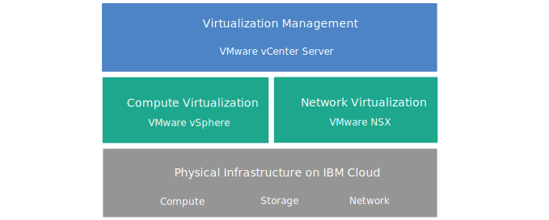

---

copyright:

  years:  2016, 2019

lastupdated: "2019-08-16"

keywords: vCenter Server, vCenter Server architecture, tech specs vCenter Server

subcollection: vmware-solutions

---

{:tip: .tip}
{:note: .note}
{:important: .important}

# vCenter Server overview
{: #vc_vcenterserveroverview}

VMware vCenter Server on {{site.data.keyword.cloud}} is a hosted private cloud that delivers the VMware vSphere stack as a service. The VMware environment is built on top of {{site.data.keyword.cloud_notm}} {{site.data.keyword.baremetal_short}}, offers shared network-attached storage and dedicated software-defined storage options, and it includes the automatic deployment and configuration of an easy-to-manage logical edge firewall that is powered by VMware NSX.

In many cases, the entire environment can be provisioned in less than a day and the bare metal infrastructure can rapidly and elastically scale the compute capacity up and down as needed.

Post-deployment, you can increase shared storage by ordering more Network File System (NFS) file shares from the {{site.data.keyword.slportal}} and by manually attaching them to all ESXi servers in a cluster. If you require dedicated storage, [NetApp ONTAP Select on {{site.data.keyword.cloud_notm}}](/docs/services/vmwaresolutions/netapp?topic=vmware-solutions-np_netappoverview) is offered in both high-performance (all SSD) and high-capacity (all SATA) configurations.

VMware vSAN is also available as a dedicated storage option. To increase the vSAN-based storage capacity of a vSAN cluster, you can add more ESXi servers post-deployment.

If you purchased IBM-provided VMware licensing, you can upgrade the VMware NSX Base edition to Advanced or to Enterprise edition, and you can purchase more VMware components, such as VMware vRealize Operations.

You can add IBM-Managed Services if you want to offload the day-to-day operations and maintenance of the virtualization, guest OS, or application layers. The {{site.data.keyword.cloud_notm}} Professional Services team is also available to help you accelerate your journey to the cloud with migration, implementation, planning, and onboarding services.

## vCenter Server architecture
{: #vc_vcenterserveroverview-archi}

The following graphic depicts the high-level architecture and components of a three-node vCenter Server deployment.

{: caption="Figure 1. vCenter Server high-level architecture for a three-node cluster" caption-side="bottom"}

### Physical infrastructure
{: #vc_vcenterserveroverview-physical-infras}

This layer provides the physical infrastructure (compute, storage, and network resources) to be used by the virtual infrastructure.

### Virtualization infrastructure (Compute and Network)
{: #vc_vcenterserveroverview-virtualization-infras}

This layer virtualizes the physical infrastructure through different VMware products:
* VMware vSphere virtualizes the physical compute resources.
* VMware NSX is the network virtualization platform that provides logical networking components and virtual networks.

### Virtualization management
{: #vc_vcenterserveroverview-virtualization-mgmt}

This layer consists of vCenter Server Appliance (vCSA) with embedded Platform Services Controller (PSC), NSX Manager, two NSX ESGs, three NSX Controllers, and the IBM CloudDriver virtual server instance (VSI). The CloudDriver VSI is deployed on demand as needed for certain operations such as adding hosts to the environment.

The base offering is deployed with a vCenter Server appliance that is sized to support an environment with up to 400 hosts and up to 4000 VMs. The same vSphere API-compatible tools and scripts can be used to manage the IBM-hosted VMware environment.

In total, the base offering requires 38 vCPU and 67 GB vRAM that are reserved for the virtualization management layer. The remaining host capacity for your VMs depends on several factors, such as oversubscription rate, VM sizing, and workload performance requirements.

For more information about the architecture, see [{{site.data.keyword.vmwaresolutions_short}} architecture reference](/docs/services/vmwaresolutions/archiref/solution?topic=vmware-solutions-solution_overview).

## Technical specifications for vCenter Server instances
{: #vc_vcenterserveroverview-specs}

The following components are included in your vCenter Server instance.

The availability and pricing of standardized hardware configurations might vary based on the {{site.data.keyword.CloudDataCent_notm}} that is selected for deployment.
{:note}

### Bare Metal Server
{: #vc_vcenterserveroverview-bare-metal}

You can order three or more {{site.data.keyword.baremetal_short}} with one of the following configurations:
* **Skylake**: 2-CPU Intel Skylake generation servers (Intel Xeon 4100/5100/6100 series) with your selected CPU model and RAM size.
* **Cascade**: 2-CPU Intel Cascade generation servers (Intel Xeon 4200/5200/6200 series) with your selected CPU model and RAM size.
* **SAP-certified**: Intel Skylake or Intel Broadwell generation servers (Intel Xeon 6140/E5-2690/E7-8890 series) with your selected CPU model.
* **Broadwell**: 4-CPU Intel Broadwell generation servers (Intel Xeon E7-4800 series) with your selected CPU model and RAM size.

If you plan to use vSAN storage, the configuration requires a minimum of four {{site.data.keyword.baremetal_short}}.
{:note}

### Networking
{: #vc_vcenterserveroverview-networking}

The following networking components are ordered:
*  10 Gbps dual public and private network uplinks.
*  Three VLANs (Virtual LANs): one public VLAN and two private VLANs.
*  One VXLAN (Virtual eXtensible LAN) with DLR (Distributed Logical Router) for potential east-west communication between local workloads that are connected to layer 2 (L2) networks. The VXLAN is deployed as a sample routing topology, which you can modify, build on it, or remove it. You can also add security zones by attaching extra VXLANs to new logical interfaces on the DLR.
*  Two VMware NSX Edge Services Gateways:
  * A secure management services VMware NSX Edge Services Gateway (ESG) for outbound HTTPS management traffic, which is deployed by IBM as part of the management networking typology. This ESG is used by the IBM management virtual machines to communicate with specific external IBM management components that are related to automation. For more information, see [Configuring your network to use the customer-managed ESG](/docs/services/vmwaresolutions/vcenter?topic=vmware-solutions-vc_esg_config#configuring-your-network-to-use-the-customer-managed-nsx-esg-with-your-vms).

    This ESG is named **mgmt-nsx-edge**, it's not accessible to you and you can't use it. If you modify it, you might not be able to manage the vCenter Server instance from the {{site.data.keyword.vmwaresolutions_short}} console. In addition, by using a firewall or disabling the ESG communications to the external IBM management components might cause {{site.data.keyword.vmwaresolutions_short}} to become unusable.
    {:important}
  * A secure customer-managed VMware NSX Edge Services Gateway for outbound and inbound HTTPS workload traffic. This gateway is deployed by IBM as a template that can be modified by you to provide VPN access or public access. For more information, see [Does the customer-managed NSX Edge pose a security risk?](/docs/services/vmwaresolutions/vmonic?topic=vmware-solutions-faq#faq-customer-nsx).

### Virtual Server Instances
{: #vc_vcenterserveroverview-vsi}

The following virtual server instances (VSIs) are ordered:
* A VSI for IBM CloudBuilder, which is shut down after the instance deployment is completed.
* (For instances V2.2 and later) You can choose to deploy a single Microsoft Windows Server VSI for Microsoft Active Directory (AD) or two high availability Microsoft Windows VMs in the management cluster to help enhance security and robustness.
* (For instances V1.9 to V2.1) A Microsoft Windows Server VSI for Microsoft Active Directory (AD) is deployed and can be looked up. The VSI functions as the DNS for the instance where the hosts and virtual machines are registered.
* (For instances V1.8 and earlier) A VSI for the snapshot-based backup of the management components, which keeps running after the instance deployment is completed.

### Storage
{: #vc_vcenterserveroverview-storage}

During initial deployment, you can choose between vSAN and NFS storage options.

For instances V2.8 and later, you can add NFS storage shares to an existing NFS or vSAN cluster. For more information, see the *Adding NFS storage to vCenter Server instances* section in [Expanding and contracting capacity for vCenter Server instances](/docs/services/vmwaresolutions/vcenter?topic=vmware-solutions-vc_addingremovingservers#adding-nfs-storage-to-vcenter-server-instances).
{:note}

#### vSAN storage
{: #vc_vcenterserveroverview-vsan-storage}

The vSAN option offers customized configurations, with various options for disk type, size, and quantity:
* Disk quantity: 2, 4, 6, or 8
* Storage disk: 960 GB SSD SED, 1.9 TB SSD SED, or 3.8 TB SSD SED

  In addition, two cache disks of 960 GB are also ordered per host.

  3.8 TB SSD (Solid State Disk) drives will be supported when they are made generally available in a data center.
  {:note}
* High-Performance Intel Optane option, which provides two extra capacity disk bays for a total of 12 capacity disks. This option depends on the CPU model.

#### NFS storage
{: #vc_vcenterserveroverview-nfs-storage}

The NFS option offers customized shared file-level storage for workloads with various options for size and performance:
* Size: 20 GB to 24 TB
* Performance: 0.25, 2, 4, or 10 IOPS/GB
* Individual configuration of file shares

  The 10 IOPS/GB performance level is limited to a maximum capacity of 4 TB per file share.
  {:note}

If you choose the NFS option, one 2 TB and 4 IOPS/GB file share for management components are ordered.

#### Local disk storage
{: #vc_vcenterserveroverview-local-disk-storage}

The local disks option, available to the **SAP-certified** Quad Intel Xeon E7-8890 v4 processor Bare Metal configuration only, offers customized configurations with various options for disk count and disk type.

### Licenses (IBM-provided or BYOL) and fees
{: #vc_vcenterserveroverview-license-and-fee}

* VMware vSphere Enterprise Plus 6.5u2 or 6.7u2
* VMware vCenter Server 6.5
* VMware NSX Service Providers Edition (Base, Advanced, or Enterprise) 6.4
* (For vSAN clusters) VMware vSAN Advanced or Enterprise 6.6
* Support and Services fee (one license per node)

## Technical specifications for vCenter Server expansion nodes
{: #vc_vcenterserveroverview-expansion-node-specs}

Each vCenter Server expansion node deploys and incurs charges for the following components in your {{site.data.keyword.cloud_notm}} account.

### Hardware for expansion nodes
{: #vc_vcenterserveroverview-expansion-node-hardware}

One Bare Metal Server with the configuration presented in [Technical specifications for vCenter Server instances](/docs/services/vmwaresolutions/vcenter?topic=vmware-solutions-vc_vcenterserveroverview#vc_vcenterserveroverview-specs).

### Licenses and fees for expansion nodes
{: #vc_vcenterserveroverview-expansion-node-license-and-fee}

* One VMware vSphere Enterprise Plus 6.5u2 or 6.7u2
* One VMware NSX Service Providers Edition (Base, Advanced, or Enterprise) 6.4
* One Support and Services fee
* (For vSAN clusters) VMware vSAN Advanced or Enterprise 6.6

You must manage the {{site.data.keyword.vmwaresolutions_short}} components that are created in your {{site.data.keyword.cloud_notm}} account only from the {{site.data.keyword.vmwaresolutions_short}} console, not the {{site.data.keyword.slportal}}, or any other means outside of the console. If you change these components outside of the {{site.data.keyword.vmwaresolutions_short}} console, the changes are not synchronized with the console.
Managing any {{site.data.keyword.vmwaresolutions_short}} components, which were installed into your {{site.data.keyword.cloud_notm}} account when you ordered the instance, from outside the {{site.data.keyword.vmwaresolutions_short}} console can make your environment unstable. These management activities include:
*  Adding, modifying, returning, or removing components
*  Expanding or contracting instance capacity through adding or removing ESXi servers
*  Powering off components
*  Restarting services
   Exceptions to these activities include managing the shared storage file shares from the {{site.data.keyword.slportal}}. Such activities include: ordering, deleting (which might impact data stores if mounted), authorizing, and mounting shared storage file shares.
   {:important}

## Related links
{: #vc_vcenterserveroverview-related}

* [vCenter Server Software Bill of Materials](/docs/services/vmwaresolutions/vcenter?topic=vmware-solutions-vc_bom)
* [Planning vCenter Server instances](/docs/services/vmwaresolutions/vcenter?topic=vmware-solutions-vc_planning)
* [Ordering vCenter Server instances](/docs/services/vmwaresolutions/vcenter?topic=vmware-solutions-vc_orderinginstance)
* [Attached storage for vCenter Server](/docs/services/vmwaresolutions/services?topic=vmware-solutions-storage-benefits#storage-benefits)
* [Expanding File Share capacity](/docs/infrastructure/FileStorage?topic=FileStorage-expandCapacity#expandCapacity)
