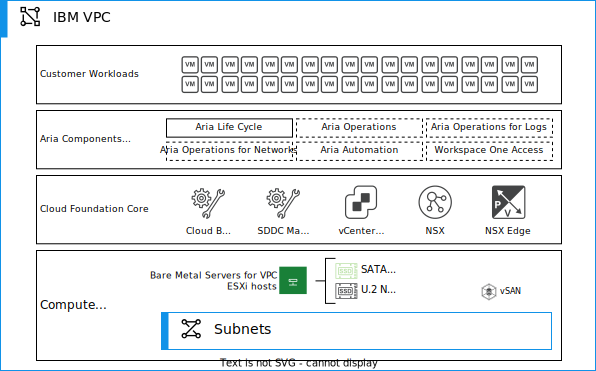

---

copyright:

  years:  2023, 2025

lastupdated: "2025-10-24"

keywords: vmware cloud foundation, IBM Cloud, vpc

subcollection: vmwaresolutions

---

{{site.data.keyword.attribute-definition-list}}

# {{site.data.keyword.vcf-vpc-short}} overview
{: #vpc-vcf-ovw}

{{site.data.content.vms-deprecated-note}}

{{site.data.keyword.vcf-vpc}} provides a ubiquitous hybrid cloud platform for both traditional enterprise apps and modern apps. {{site.data.keyword.vcf-vpc-short}} is based on a comprehensive software-defined stack, which includes VMware vSphere® with VMware Tanzu™, VMware vSAN™, VMware NSX-T™ Data Center, and VMware Aria® Suite (formerly VMware vRealize® Suite). It provides a complete set of software-defined services for compute, storage, network security, Kubernetes management, and cloud management. The VMware Cloud Builder automates the initial deployment of the entire software-defined stack, and after the initial deployment it is managed with SDDC Manager. The result is agile, reliable, and efficient. The cloud infrastructure offers consistent operations across private and public clouds.

The {{site.data.keyword.vpc_full}} provides the underlying infrastructure for running {{site.data.keyword.vcf-vpc-short}} in {{site.data.keyword.cloud_notm}}. {{site.data.keyword.cloud_notm}} Bare Metal Servers on {{site.data.keyword.vpc_short}} provide you with compute capacity provisioned in minutes for your {{site.data.keyword.vcf-vpc-short}} deployment. The {{site.data.keyword.vcf-vpc-short}} provisioning is done in a similar way that you deploy on-premises. However, it happens in a much more agile way in a secure and isolated virtual network inside your {{site.data.keyword.vpc_short}}.

{: caption="{{site.data.keyword.vcf-vpc-short}} overview" caption-side="bottom"}

## Key benefits
{: #vpc-vcf-ovw-benefits}

The {{site.data.keyword.vcf-vpc-short}} architecture provides you with the fundamental building blocks, which include vSphere, VMware vCenter Server®, NSX-T, vSAN, and SDDC Manager. The VMware Cloud Builder appliance automates the {{site.data.keyword.vcf-vpc-short}} deployment, including the entire VMware software-defined stack. After the initial provisioning, you have the same architecture and user experience as in on-premises {{site.data.keyword.vcf-vpc-short}} deployments. Using Aria® Suite Lifecycle Manager (formerly vRealize Suite Lifecycle Manager), you can deploy more Aria Suite components, depending on the selected {{site.data.keyword.vcf-vpc-short}} edition.

VMware Solutions on {{site.data.keyword.vpc_short}} has the following key benefits:

* {{site.data.keyword.vpc_short}} gives you the ability to easily and rapidly define and control a virtual network, which is logically isolated from all other tenants. The logical isolation is implemented by using virtual network functions and security that is built into the platform.
* Provisioning the {{site.data.keyword.cloud_notm}} bare metal servers on {{site.data.keyword.vpc_short}} takes minutes instead of hours when compared to {{site.data.keyword.cloud_notm}} bare metal servers on {{site.data.keyword.cloud_notm}} classic.
* VMware workloads by running in {{site.data.keyword.vpc_short}} can take advantage of all original functions for {{site.data.keyword.vpc_full}} ({{site.data.keyword.vpc_short}}) networking capabilities and other {{site.data.keyword.cloud_notm}} interconnectivity services.

With this single-tenant {{site.data.keyword.cloud_notm}} bare metal server infrastructure that is provided in {{site.data.keyword.vpc_short}}, you can quickly deploy network, compute, and storage capacity for your {{site.data.keyword.vcf-vpc-short}} to the {{site.data.keyword.cloud_notm}}.

Unlike the managed service offerings, {{site.data.keyword.vcf-vpc-short}} on {{site.data.keyword.vpc_short}} gives you flexibility to design a solution for your needs, and it provides you full and complete access to all components.

## {{site.data.keyword.vcf-vpc-short}} architecture model
{: #vpc-vcf-ovw-supported-arch}

{{site.data.keyword.vcf-vpc-short}} provides a consolidated architecture model for the specific requirements of your organization, such as the size of the deployment and the level of scalability needed. This architecture is recommended for smaller-scale deployments.

The {{site.data.keyword.vcf-vpc-short}} architecture combines the management and workload domains on a single set of physical servers. It provides a unified software-defined data center platform that includes vSphere, vSAN, NSX, and SDDC Manager.

The main benefit of using {{site.data.keyword.vcf-vpc-short}} is that it simplifies the deployment and management of the software-defined data center infrastructure by providing a single integrated solution that reduces the complexity of deploying and configuring multiple VMware products.

For more information, see [{{site.data.keyword.vcf-vpc-short}} architecture model](/docs/vmwaresolutions?topic=vmwaresolutions-vpc-vcf-architectures).

## Supported {{site.data.keyword.vcf-vpc-short}} products in {{site.data.keyword.vpc_short}}
{: #vpc-vcf-ovw-supported-edition}

The following components are installed by the {{site.data.keyword.IBM}} automation, and licenses for these components are provided by {{site.data.keyword.IBM_notm}}:

* vSphere Enterprise Plus
* vCenter Standard
* SDDC Manager
* vSAN Enterprise
* NSX Enterprise Plus
* Aria Suite Lifecycle

The following components are not installed by the {{site.data.keyword.IBM_notm}} automation, but licenses for these components are provided by {{site.data.keyword.IBM_notm}}. You can install these separately after the {{site.data.keyword.vcf-vpc-short}} instance is deployed. For more information, see [Deploying VMware validated solutions](/docs/vmwaresolutions?topic=vmwaresolutions-vpc-vcf-deploy-vvs).

* Aria Suite Enterprise (Aria Operations Enterprise, Aria Operations for Logs, and Aria Automation Enterprise)
* Aria Operations for Networks Enterprise
* VMware HCX™ Enterprise
* Tanzu Kubernetes Grid

The following components are not installed by the {{site.data.keyword.IBM_notm}} automation. These components are optional and require add-on licenses. You can order these from the {{site.data.keyword.cloud}} console. For more information, see [VMware add-ons for VMware Cloud Foundation](/docs/vmwaresolutions?topic=vmwaresolutions-vmware-add-ons).

* NSX Distributed Firewall
* NSX Gateway Firewall
* NSX Load Balancer

## Related links
{: #vpc-vcf-ovw-links}

* [Getting started with {{site.data.keyword.vpc_short}}](/docs/vpc?topic=vpc-getting-started)
* [{{site.data.keyword.vpc_short}} network design](/docs/vmwaresolutions?topic=vmwaresolutions-vpc-vcf-vpc-deployment)
* [{{site.data.keyword.vcf-vpc-short}} architecture overview](/docs/vmwaresolutions?topic=vmwaresolutions-vpc-vcf-arch-overview)
* [IaaS endpoints](/docs/vpc?topic=vpc-service-endpoints-for-vpc#infrastructure-as-a-service-iaas-endpoints)
