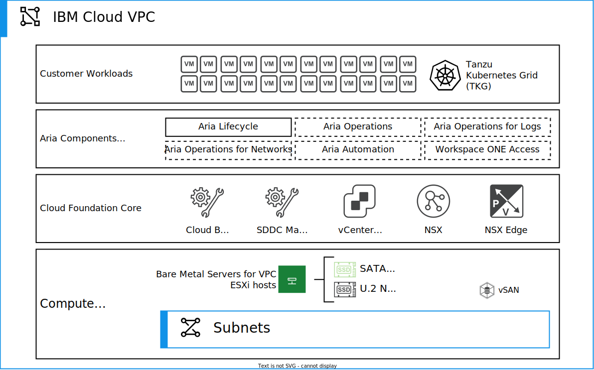

---

copyright:

  years:  2023

lastupdated: "2023-10-10"
  
keywords: vmware cloud foundation, IBM Cloud, vpc

subcollection: vmwaresolutions

---

{{site.data.keyword.attribute-definition-list}}

# VMware Cloud Foundation overview
{: #vpc-vcf-ovw}

VMware Cloud Foundation™ provides a ubiquitous hybrid cloud platform for both traditional enterprise apps and modern apps. VMware Cloud Foundation is based on a comprehensive software-defined stack, which includes VMware vSphere® with VMware Tanzu™, VMware vSAN™, VMware NSX-T™ Data Center, and VMware Aria® Suite (formerly known as VMware vRealize® Suite). It provides a complete set of software-defined services for compute, storage, network security, Kubernetes management, and cloud management. The VMware Cloud Builder automates the initial deployment of the entire software-defined stack, and after the initial deployment it is managed with SDDC manager. The result is agile, reliable, and efficient. The cloud infrastructure offers consistent operations across private and public clouds.

The {{site.data.keyword.vpc_full}} provides the underlying infrastructure for running VMware Cloud Foundation in {{site.data.keyword.cloud_notm}}. {{site.data.keyword.cloud_notm}} Bare Metal Servers on {{site.data.keyword.vpc_short}} provide you with compute capacity provisioned in minutes for your VMware Cloud Foundation deployment. The VMware Cloud Foundation provisioning is done in a similar way that you deploy on-premises. However, it happens in a much more agile way in a secure and isolated virtual network inside your {{site.data.keyword.vpc_short}}.

{: caption="Figure 1. VMware Cloud Foundation overview" caption-side="bottom"}

## Key benefits
{: #vpc-vcf-ovw-benefits}

The VMware Cloud Foundation architecture provides you with the fundamental building blocks, which include vSphere, VMware vCenter Server, NSX-T, vSAN, and SDDC manager. The VMware Cloud Builder appliance automates the VMware Cloud Foundation deployment, including the entire VMware software-defined stack. After the initial provisioning, you have the same architecture and user experience as in on-premises VMware Cloud Foundation deployments. Using Aria® Suite Lifecycle Manager (formerly known as vRealize Suite Lifecycle Manager), you can deploy more Aria Suite components, depending on the selected VMware Cloud Foundation edition.

VMware Solutions on {{site.data.keyword.vpc_short}} has the following key benefits:

* {{site.data.keyword.vpc_short}} gives you the ability to easily and rapidly define and control a virtual network, which is logically isolated from all other tenants. The logical isolation is implemented by using virtual network functions and security that is built into the platform.
* Provisioning the {{site.data.keyword.cloud_notm}} bare metal servers on {{site.data.keyword.vpc_short}} takes minutes instead of hours when compared to {{site.data.keyword.cloud_notm}} bare metal servers on {{site.data.keyword.cloud_notm}} classic.
* VMware workloads by running in {{site.data.keyword.vpc_short}} can take advantage of all original functions for {{site.data.keyword.vpc_full}} ({{site.data.keyword.vpc_short}}) networking capabilities and other {{site.data.keyword.cloud_notm}} interconnectivity services.

With this single-tenant {{site.data.keyword.cloud_notm}} bare metal server infrastructure that is provided in {{site.data.keyword.vpc_short}}, you can quickly deploy network, compute, and storage capacity for your VMware Cloud Foundation to the {{site.data.keyword.cloud_notm}}.

Unlike the managed service offerings, VMware Cloud Foundation on {{site.data.keyword.vpc_short}} gives you flexibility to design a solution for your needs, and it provides you full and complete access to all components.

## Supported VMware Cloud Foundation architectures in {{site.data.keyword.vpc_short}}
{: #vpc-vcf-ovw-supported-arch}

VMware Cloud Foundation supports two architecture models - Standard and Consolidated. You can select your preferred architecture according to the specific requirements of your organization, such as the size of the deployment, the level of scalability needed. Both architecture models are supported for VMware Cloud Foundation on {{site.data.keyword.cloud_notm}}.

In VMware Cloud Foundation Standard, the management and workload domains are deployed on separate sets of physical servers. This architecture is recommended for larger-scale deployments that require more capacity and scalability. The management domain is responsible for managing the overall infrastructure, while the workload domain is used to run specific workloads. 

VMware Cloud Foundation Consolidated Architecture combines the management and workload domains on a single set of physical servers. This architecture is recommended for smaller-scale deployments.

In both architectures, VMware Cloud Foundation provides a unified software-defined data center platform that includes vSphere, vSAN, NSX, and SDDC Manager. The main benefit of using VMware Cloud Foundation is that it simplifies the deployment and management of the software-defined data center infrastructure by providing a single integrated solution that reduces the complexity of deploying and configuring multiple VMware products.

For more information, see [Supported VMware Cloud Foundation architectures models](/docs/vmwaresolutions?topic=vmwaresolutions-vpc-vcf-architectures).

## Supported VMware Cloud Foundation editions in {{site.data.keyword.vpc_short}}
{: #vpc-vcf-ovw-supported-edition}

VMware Cloud Foundation on {{site.data.keyword.cloud_notm}} supports two VMware Cloud Foundation editions - Advanced and Enterprise. The choice between the Advanced and Enterprise editions depends on the specific needs and requirements of the organization, such as the level of automation, management, and scalability needed for their environment.

The following table shows the differences between the Advanced and Enterprise editions.

| Advanced edition | Enterprise edition |
| ---------------- | ------------------ |
| vSphere Enterprise Plus | vSphere Enterprise Plus |
| vCenter Standard | vCenter Standard |
| SDDC Manager | SDDC Manager |
| vSAN Advanced | vSAN Enterprise |
| NSX Advanced | NSX Enterprise Plus |
| NSX Advanced Load Balancer | NSX Advanced Load Balancer |
| NSX Distributed Firewall | NSX Distributed Firewall |
| Aria Suite Lifecycle | Aria Suite Lifecycle |
| Aria Suite Advanced: \n * Aria Operations Advanced \n * Aria Operations for Logs \n * Aria Automation Advanced | Aria Suite Enterprise: \n * Aria Operations Enterprise \n * Aria Operations for Logs \n * Aria Automation Enterprise |
| Aria Operations for Networks Enterprise | Aria Operations for Networks Enterprise |
| VMware HCX Enterprise | VMware HCX Enterprise |
| Tanzu Kubernetes Grid | Tanzu Kubernetes Grid |
{: caption="Table 1. Differences between the Advanced and Enterprise editions for VMware Cloud Foundation" caption-side="bottom"}

In the previous table, the following components:

* NSX Distributed Firewall
* Aria Suite Advanced
* Aria Operations Advanced
* Aria Operations for Logs
* Aria Suite Enterprise
* Aria Operations Enterprise
* Aria Operations for Networks Enterprise
* VMware HCX Enterprise
* Tanzu Kubernetes Grid

are not installed by the VMware Solutions automation. However, you can install them separately after the VMware Cloud Foundation instance is deployed. 

## Related links
{: #vpc-vcf-ovw-links}

* [Getting started with {{site.data.keyword.vpc_short}}](/docs/vpc?topic=vpc-getting-started)
* [{{site.data.keyword.vpc_short}} network design](/docs/vmwaresolutions?topic=vmwaresolutions-vpc-vcf-vpc-deployment)
* [VMware Cloud Foundation architecture overview](/docs/vmwaresolutions?topic=vmwaresolutions-vpc-vcf-arch-overview)
* [IaaS endpoints](/docs/vpc?topic=vpc-service-endpoints-for-vpc#infrastructure-as-a-service-iaas-endpoints)
* [VMware Cloud Foundation edition matrix](https://www.vmware.com/content/dam/digitalmarketing/vmware/en/pdf/products/cloud-foundation/vmw-vcf-4-edition-matrix.pdf){: external}
